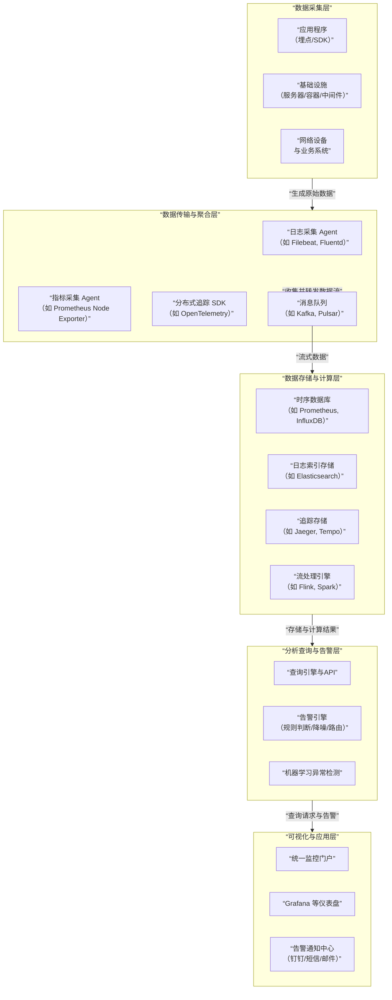

# 业务监控平台底层实现

我们将对**业务监控平台**的底层实现进行全面深入的分析。业务监控平台是现代软件系统的"神经系统"，它持续感知系统状态，在故障发生前预警，在故障发生时快速定位，是保障业务稳定性的基石。

---

### 一、 业务监控平台的核心价值与架构概览

#### 1. 核心价值主张
*   **可观测性**：从外部输出（日志、指标、追踪）推断系统内部状态的能力，而不仅仅是简单的监控。
*   **主动预警**：在用户感知到问题之前，提前发现异常并告警。
*   **快速排障**：当问题发生时，能快速定位到故障点和根本原因。
*   **数据驱动**：为容量规划、性能优化和业务决策提供数据支持。

#### 2. 核心架构分层
一个成熟的业务监控平台是一个典型的数据处理管道，其核心架构与数据流可以通过下图清晰地展示：

---

### 二、 各层实现逻辑深度解析

#### 1. 数据采集层
这是监控的"传感器网络"，负责从各个目标收集数据。

**A. 采集方式**
*   **Push vs. Pull**：
    *   **Pull（拉取）**：监控服务器主动从目标拉取数据（如Prometheus）。优点：集中控制，避免雪崩；缺点：无法感知瞬时短生命周期对象（如容器）。
    *   **Push（推送）**：客户端主动将数据推送到监控服务器（如StatsD, 日志采集）。优点：实时性好，适合动态环境；缺点：可能对服务器造成冲击。
*   **Agent（代理）模式**：
    *   在被监控主机上部署一个轻量级代理（如Telegraf, Filebeat），负责采集本地数据并统一上报。这是最主流的方式。

**B. 数据类型与采集技术**
*   **指标**：
    *   **内容**：数值型的、随时间变化的点，如CPU使用率、QPS、错误数。
    *   **技术**：
        *   **Prometheus Node Exporter**：采集主机指标。
        *   **JMX Exporter**：采集Java应用指标。
        *   **OpenTelemetry SDK**：在应用代码中埋点，采集自定义业务指标。
*   **日志**：
    *   **内容**：应用程序、系统产生的文本记录。
    *   **技术**：
        *   **Filebeat/Fluentd**：跟踪日志文件的变化，实时收集并转发。
        *   **日志框架Appender**：通过Logback、Log4j2等框架的Appender直接发送到日志中心，避免写磁盘。
*   **分布式追踪**：
    *   **内容**：记录一个请求在分布式系统中流经的所有服务的完整路径、耗时和上下文。
    *   **技术**：
        *   **OpenTelemetry SDK**：业界标准，自动或手动在代码中注入追踪代码。
        *   **Service Mesh**：通过Sidecar代理（如Envoy）实现无侵入的追踪。
*   **事件**：
    *   **内容**：离散的、有意义的状态变化，如部署、扩容、配置变更。
    *   **技术**：通过API直接上报到监控系统。

#### 2. 数据传输与聚合层
此层负责将分散的数据可靠、高效地传输到后端。

*   **消息队列**：
    *   **作用**：**解耦**采集与处理、**缓冲**峰值流量、**保证**数据不丢失。
    *   **技术选型**：**Kafka**（高吞吐、持久化）、**Pulsar**（云原生、更好扩展性）、**RabbitMQ**（低延迟、高可用）。
*   **数据格式**：
    *   **协议**：常用JSON、Protobuf（更高效）。
    *   **标准化**：**OpenTelemetry** 正成为可观测性数据的统一标准，它定义了指标、日志和追踪的统一数据模型和API。

#### 3. 数据存储与计算层
这是监控平台的"大脑"，负责海量数据的存储和实时/批量计算。

**A. 存储选型（核心决策）**
*   **时序数据库**：
    *   **适用场景**：存储和查询指标数据。
    *   **特点**：为时间序列数据优化，高压缩比，高效的时间范围查询。
    *   **代表**：
        *   **Prometheus**：单机能力强，生态好，是云原生领域的标配。
        *   **InfluxDB**：功能丰富，支持类SQL语言。
        *   **TDengine**：国产高性能TSDB。
        *   **VictoriaMetrics**：Prometheus的兼容替代品，性能更好。
*   **日志索引存储**：
    *   **适用场景**：存储和全文检索日志数据。
    *   **特点**：倒排索引，支持复杂的文本搜索。
    *   **代表**：**Elasticsearch** 是绝对主流，配合**Kibana**提供可视化。
*   **追踪存储**：
    *   **适用场景**：存储分布式追踪数据。
    *   **特点**：数据量大，需要高效的依赖关系查询和TraceID查询。
    *   **代表**：**Jaeger**（CNCF毕业项目）、**Tempo**（Grafana Labs出品，与Prometheus生态集成好）。

**B. 流处理引擎**
*   **作用**：对数据进行实时清洗、聚合、富化和复杂事件处理。
    *   **例如**：实时计算某个API的每分钟错误率；将日志中的IP地址富化为地理信息。
*   **技术**：**Apache Flink**（低延迟、高吞吐、精确一次语义）、**Apache Spark Streaming**（微批处理）。

#### 4. 分析查询与告警层
此层是监控平台的价值最终体现。

**A. 查询引擎**
*   **目的**：为用户提供一个统一、便捷的方式来查询和分析所有监控数据。
*   **实现**：
    *   **PromQL**：Prometheus的查询语言，已成为监控指标查询的事实标准。
    *   **SQL**：一些平台（如Doris, ClickHouse）支持用SQL查询指标，降低了学习成本。
    *   **统一查询网关**：构建一个网关，背后对接多种存储（TSDB, ES, 追踪DB），对前端提供统一的查询API。

**B. 告警引擎（核心中的核心）**
这是平台的"决策中心"。

1.  **规则配置**：
    *   用户配置告警规则，例如：`api_error_rate > 0.05`。
2.  **规则计算**：
    *   告警引擎周期性地（如每15秒）执行所有告警规则的查询表达式，判断是否触发。
3.  **告警生命周期管理**：
    *   **触发**：当条件满足时，生成一条告警事件，状态为 **`Firing`**。
    *   **持续**：持续判断，只要条件满足，告警就持续存在。
    *   **恢复**：当条件不再满足时，将告警状态置为 **`Resolved`**，并发送恢复通知。
4.  **降噪与聚合**：
    *   **防抖动**：设置`FOR`子句，要求异常状态持续一段时间才触发，避免毛刺。
    *   **分组**：将同一业务、同一集群的多个实例的告警聚合成一条通知，避免告警风暴。
5.  **路由与通知**：
    *   根据标签将告警路由到不同的接收组（如数据库告警发给DBA组，应用告警发给业务开发组）。
    *   通过多种渠道发送通知：**钉钉**、**企业微信**、**Slack**、**短信**、**电话**、**PagerDuty**等。

**C. 智能检测**
*   **目的**：弥补阈值告警的不足，发现未知的、潜在的异常模式。
*   **技术**：
    *   **无监督学习**：自动识别指标的异常波动，无需预设阈值。
    *   **趋势预测**：基于历史数据预测未来趋势，在达到容量瓶颈前预警。

#### 5. 可视化与应用层
这是用户与监控平台交互的界面。

*   **统一门户**：
    *   提供一个集中的页面，展示所有核心业务的健康状态（红绿灯模型）。
*   **仪表盘**：
    *   **Grafana**：是监控可视化领域的绝对领导者，支持多种数据源，具有强大的图表和仪表盘编排能力。
*   **告警通知中心**：
    *   提供一个界面，让用户能看到所有正在触发的告警、告警历史、处理人和处理进度。

---

### 三、 关键设计模式与挑战

#### 1. 核心技术挑战
*   **数据海量与成本**：监控数据量巨大，需要平衡存储成本与查询性能。解决方案：数据降精度（如只保留原始数据1个月，之后只保留按小时聚合的数据）、冷热分层存储。
*   **高基数问题**：
    *   **问题**：当指标的标签（如`user_id`）取值非常多时，会严重拖慢时序数据库的性能。
    *   **解决方案**：避免将高基数字段作为标签，而是放在日志中；使用更强大的TSDB（如VictoriaMetrics）。
*   **可靠性**：监控平台自身必须高可用。解决方案：监控系统自身也需要被监控，关键组件（如告警网关）需要多副本部署。

#### 2. 现代最佳实践：云原生与可观测性
*   **Sidecar模式**：在Kubernetes中，通过Sidecar容器（如Fluentd）来采集业务容器的日志，实现采集与业务的解耦。
*   **Operator模式**：使用Prometheus Operator来管理Prometheus的部署和配置，实现声明式的监控管理。
*   **OpenTelemetry**：作为可观测性的新标准，它统一了数据采集和传输的规范，是未来技术栈的必然选择。

### 总结

业务监控平台的底层实现本质是：**一个专门为处理可观测性数据而设计的大规模、实时、可靠的数据流水线系统，它通过集成的采集、存储、分析和告警能力，将原始的系统噪音转化为清晰的业务洞察和 actionable 的警报。**

其核心价值在于：
*   **数据层**：通过**多模态数据采集**和**专用存储**，构建了系统的"全景数字孪生"。
*   **分析层**：通过**灵活的查询**和**智能的告警引擎**，实现了从"看到"到"看透"的跨越。
*   **应用层**：通过**统一的可视化**和**精准的通知**，将洞察转化为**高效的协同行动**。

一个优秀的监控平台，其核心竞争力不仅在于技术的先进，更在于**与业务场景的深度融合**、**极致的用户体验**和**稳定的可靠性**。它不再是一个被动应对故障的工具，而是成为了保障业务连续性、驱动技术卓越的主动式战略平台。