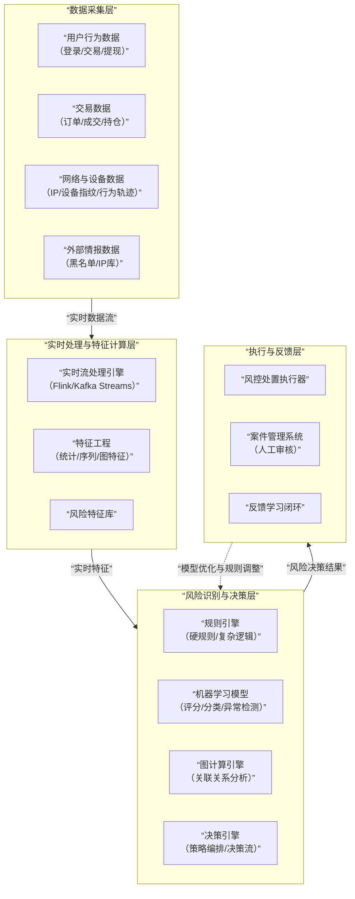

# 交易所风控平台底层实现

我们将对**交易所风控平台**的底层实现进行全面深入的分析。风控平台是交易所的"免疫系统"和"防火墙"，是保障用户资产安全、平台稳健运行的生命线。

---

### 一、 交易所风控平台的核心价值与架构概览

#### 1. 核心价值主张
*   **资产安全**：防止盗币、欺诈、洗钱等行为导致的资产损失。
*   **业务安全**：防范黑产刷单、薅羊毛、市场操纵等损害平台利益的行为。
*   **合规性**：满足全球各地日益严格的KYC、AML、CTF等金融监管要求。
*   **稳定性**：通过流量控制和防攻击措施，保障系统稳定运行。
*   **用户体验**：在安全与便捷之间取得平衡，减少对正常用户的干扰。

#### 2. 核心架构分层
一个成熟的交易所风控平台是一个多层次、全链路的实时决策系统，其核心架构可以通过下图清晰地展示：

---

### 二、 各层实现逻辑深度解析

#### 1. 数据采集层
这是风控的"感官系统"，负责收集一切可能与风险相关的信号。

*   **用户行为数据**：
    *   **内容**：登录地点/时间/频率、密码错误次数、修改安全设置、API密钥创建、访问模式等。
    *   **技术**：前端埋点、后端日志、移动端SDK。
*   **交易数据**：
    *   **内容**：下单价格/数量/频率、撤单率、成交记录、杠杆使用、仓位变化等。
    *   **技术**：直接从交易库、撮合引擎、清算系统中实时捕获数据流。
*   **网络与设备数据**：
    *   **设备指纹**：通过浏览器或App收集设备唯一标识（如Canvas指纹、字体列表、硬件配置），即使更换IP或账号也能关联到同一设备。
    *   **IP情报**：IP的地理位置、是否为代理/VPN/数据中心IP。
    *   **行为生物特征**：鼠标移动轨迹、打字速度与节奏（仅在需要极高安全等级时使用）。
*   **外部数据**：
    *   **黑名单**：已知的恶意IP、设备、地址、钓鱼域名。
    *   **链上数据**：与链上追踪系统（如Chainalysis）集成，标记与暗网、混币器、黑客地址有关的充值行为。

#### 2. 实时处理与特征计算层
这是风控的"短期记忆"，负责将原始数据转化为有风险辨别能力的特征。

*   **实时流处理引擎**：
    *   **技术选型**：**Apache Flink**（主流选择，低延迟、高吞吐、状态管理强大）、**Kafka Streams**（轻量级，与Kafka生态无缝集成）。
    *   **作用**：实时消费数据流，进行窗口聚合、关联和过滤。
*   **特征工程**：
    *   **统计特征**：
        *   `最近1分钟同一IP的登录失败次数`
        *   `过去1小时该用户的提现USDT总额`
        *   `当前会话内的下单/撤单比率`
    *   **序列特征**：
        *   用户操作序列的模式（如：`登录 -> 修改密码 -> 立即提现` 是一个高风险序列）。
    *   **图特征**：
        *   基于用户-设备-IP关系图，计算节点的度中心性（判断是否为中介设备）、识别紧密连接的子图（判断是否为黑产团伙）。

#### 3. 风险识别与决策层
这是风控的"大脑"，负责综合所有信息进行风险评估并做出决策。

**A. 规则引擎**
*   **实现**：使用**Drools**, **Easy Rules** 或自研的高性能引擎。
*   **规则类型**：
    *   **硬规则（强拦截）**：条件明确，违反即拦截。例如：
        *   `IF 提现地址 IN (黑名单地址) THEN 拒绝并报警`
        *   `IF 单笔提现金额 > 用户等级限额 THEN 拒绝`
    *   **评分规则（软拦截）**：为风险事件赋予权重，累计积分。
        *   `使用VPN登录: +10分`
        *   `登录后5分钟内发起提现: +20分`
        *   `总评分 > 50分` 则触发人工审核。

**B. 机器学习模型**
*   **有监督模型**：
    *   **场景**：欺诈交易识别、洗钱行为识别。
    *   **流程**：使用历史已标记数据（"正常"/"欺诈"）训练分类模型（如XGBoost、LightGBM）。
    *   **特征**：使用特征计算层产出的成千上万维特征。
    *   **输出**：一个0-1的**风险概率分数**。
*   **无监督学习**：
    *   **场景**：发现未知的新型攻击模式。
    *   **技术**：聚类、异常检测。
    *   **例如**：通过用户行为聚类，发现一个与所有正常用户行为模式都截然不同的"小众群体"，他们可能就是黑产。
*   **图神经网络**：
    *   **场景**：识别有组织的犯罪团伙。
    *   **原理**：GNN能学习图中节点的表示，从而发现隐藏在复杂关系中的风险。例如，即使A和B没有直接交易，但通过C、D、E形成了紧密的关联，GNN可以识别出他们属于同一个团伙。

**C. 决策引擎**
*   **作用**：将规则、模型分数、图分析结果进行策略编排，得出最终处置决策。
*   **策略流**：通常是一个决策树。
    1.  先执行**硬规则**，直接拦截已知高危行为。
    2.  再计算**模型评分**和**规则评分**。
    3.  根据总分落入的区间，决定处置方式：`[0, 20): 通过`、`[20, 60): 人工审核`、`[60, 100]: 拒绝`。
*   **特性**：支持灰度发布、热更新，以便快速调整风控策略应对新型攻击。

#### 4. 执行与反馈层
这是风控的"手脚"，负责执行决策并形成闭环。

*   **风控处置执行器**：
    *   **处置动作**：
        *   **放行**：正常通过。
        *   **挑战**：要求进行2FA验证、滑块验证码、人脸识别等。
        *   **挂起**：暂停当前操作，进入人工审核队列。
        *   **限制**：限制账户部分功能（如禁止提现、降低杠杆倍数）。
        *   **拦截**：直接拒绝请求。
        *   **封禁**：冻结账户。
*   **案件管理系统**：
    *   **功能**：为审核人员提供工作台，集中处理所有"挂起"的案件。
    *   **信息展示**：聚合展示用户的所有相关信息（KYC资料、历史行为、设备信息、关联图谱），辅助人工判断。
    *   **闭环**：审核员做出"通过"或"拒绝"的最终决定，该结果会作为标签反馈给机器学习模型，用于模型优化。
*   **反馈学习闭环**：
    *   人工审核结果、事后发现的误报/漏报，都会作为新的标注数据，回流到数据平台。
    *   定期使用新数据重新训练模型，使风控系统具备自我进化能力。

---

### 三、 核心风控场景与应对策略

#### 1. 账户安全
*   **风险点**：账号被盗、撞库、钓鱼。
*   **策略**：
    *   异常登录检测（新设备、新地点、VPN）。
    *   行为序列分析（登录后敏感操作）。
    *   多因子认证强制触发。

#### 2. 交易与市场风控
*   **风险点**：市场操纵（对敲、拉盘砸盘）、恶意API调用、高频交易攻击。
*   **策略**：
    *   **API流量限制**：基于令牌桶算法限制调用频率。
    *   **交易行为规则**：限制自买自卖、高撤单率、异常价格偏离。
    *   **实时监控大额订单**对盘口的影响。

#### 3. 充值提现风控
*   **风险点**：洗钱、黑币充值、提现欺诈。
*   **策略**：
    *   **充值**：集成链上追踪系统，标记可疑地址；监控充值地址的"共同输入"关系。
    *   **提现**：规则校验（地址白名单、限额）；提现行为异常检测（突然大额、提光所有资产）。

#### 4. 反洗钱
*   **策略**：
    *   **交易网络分析**：利用图计算识别结构化交易（如多个账户向一个账户汇集资金，或一个账户向多个账户分散资金）。
    *   **行为模式识别**：识别"放置-分层-整合"的经典洗钱阶段。

#### 5. 反欺诈（羊毛党）
*   **策略**：
    *   **设备指纹**：识别并限制同一设备注册/领取奖励。
    *   **图关联**：识别通过邀请裂变形成的黑产网络。
    *   **活动策略设计**：从业务源头规避，如设置合理的奖励门槛和有效期。

---

### 四、 关键技术挑战与未来趋势

#### 1. 核心挑战
*   **平衡用户体验与安全**：过于严格的风控会导致误报，赶走正常用户。
*   **对抗性进化**：黑产会不断研究风控规则并寻找漏洞，攻防是动态博弈的过程。
*   **数据隐私与合规**：收集和使用用户数据需严格遵守GDPR等法规。
*   **系统性能**：风控决策必须在毫秒内完成，不能影响核心交易流程。

#### 2. 未来趋势
*   **AI Native风控**：更大规模、更复杂的深度学习模型和图神经网络将成为标准配置。
*   **端云协同风控**：在设备端进行初步的风险感知和计算，与云端联动。
*   **联盟学习**：多个交易所在不共享原始数据的前提下，联合训练风控模型，共同提升防御能力。
*   **DeFi风控**：为智能合约和DeFi协议提供实时风险监控和预警服务。
*   **可解释AI**：让机器学习模型的决策过程变得可解释、可审计，以满足合规要求。

### 总结

交易所风控平台的底层实现本质是：**一个融合了实时计算、大数据、规则引擎、机器学习和图论的综合型决策系统，它通过在业务关键路径上部署的无数个"风险检测点"，构建了一道从业务前端的账户安全，到核心的交易市场风控，再到资金出口的反洗钱的全方位、立体化防御网络。**

其核心竞争力在于：
*   **数据层**：通过**全链路、多维度数据采集**，形成了对用户和环境的立体感知。
*   **算法层**：通过**规则+模型+图计算**的融合判断，实现了从"单点防御"到"智能关联分析"的跨越。
*   **运营层**：通过**高效的案件管理和反馈闭环**，形成了风控策略持续优化的"飞轮效应"。

一个优秀的风控平台，不仅是一个技术产品，更是一个需要**持续运营、不断调优**的动态过程。它既是交易所的"成本中心"，更是其赖以生存和发展的"安全底座"。在加密货币这个高风险领域，风控能力本身就是最核心的竞争力之一。