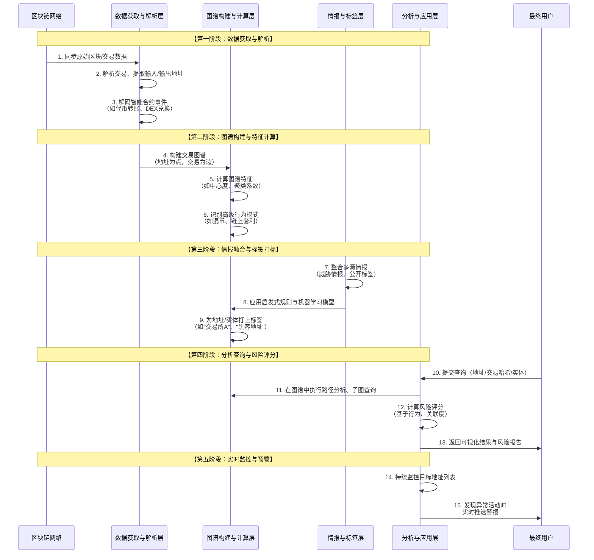

# 数字货币追踪系统底层实现

我们将对**数字货币追踪系统**的底层实现进行全面深入的分析。这类系统是链上世界的"天眼"，主要用于合规、风控、调查和投资分析，其技术核心是**将匿名的区块链交易转化为可理解的行为图谱**。

---

### 一、 数字货币追踪系统的核心价值与分类

#### 1. 核心价值主张
*   **合规与反洗钱**：帮助交易所、金融机构和监管机构识别非法资金流向，满足KYC/AML/CFT监管要求。
*   **链上调查**：为执法部门提供追踪黑客、勒索软件、诈骗资金的技术手段。
*   **风险管理**：帮助项目方、VC监控自身或投资组合地址的资金动向，及时发现风险。
*   **投资分析**：追踪"聪明钱"和巨鲸地址的动向，作为投资决策的参考。
*   **资产追回**：在发生盗币事件时，追踪资金路径，并尝试与交易所合作冻结资产。

#### 2. 系统分类
*   **合规风控型**：集成到交易所或金融机构的业务流程中，实时扫描和评分地址与交易（如 **Chainalysis, Elliptic**）。
*   **调查分析型**：为执法部门和调查人员提供深度取证和可视化分析工具（如 **CipherTrace, TRM Labs**）。
*   **开放数据分析型**：为普通用户和研究者提供开放的链上数据查询和标签服务（如 **Arkham, Nansen** 的部分功能）。

---

### 二、 数字货币追踪系统全生命周期业务流分析

一个成熟的追踪系统是一个复杂的数据处理和分析管道，其核心架构与工作流程可以通过下图清晰地展示：

---

### 三、 各阶段底层实现逻辑深度解析

#### 1. 数据获取与解析层
这是系统的基础，目标是将非结构化的链上数据转化为结构化的、可分析的数据。

*   **区块链数据同步**：
    *   **实现**：运行比特币、以太坊等主流区块链的**全节点**或**归档节点**。通过节点的RPC接口获取最原始的区块和交易数据。
    *   **挑战**：数据量巨大，存储和同步成本高。以太坊全节点需要数TB存储。
*   **交易解析**：
    *   **基础解析**：提取每笔交易的`from`、`to`、`value`、`input data`等字段。
    *   **智能合约解析**：这是关键且复杂的一步。
        *   **ABI解码**：通过与合约源代码匹配的ABI接口，将`input data`解码为具体的函数调用（如`transfer(addr, amount)`）和参数。
        *   **事件日志解析**：解析交易收据中的日志，捕获代币转账、DEX兑换、质押等关键事件。
*   **数据标准化**：
    *   将不同区块链的数据（如比特币的UTXO模型和以太坊的账户模型）转化为统一的内部数据模型，便于后续处理。

#### 2. 图谱构建与计算层
这是追踪系统的"大脑"，核心是将线性的交易记录转化为网络图谱。

*   **交易图谱构建**：
    *   **节点**：通常是**地址**。更高级的系统会将多个地址聚类为**实体**。
    *   **边**：代表**交易**或**资金流动**。边上可以附加属性，如交易时间、金额、资产类型。
    *   **存储**：使用**图数据库** 来存储和查询这种关联数据，如 **Neo4j, Amazon Neptune, TigerGraph**。图数据库在查询"多度关系"时远比传统SQL数据库高效。
*   **图谱特征计算**：
    *   利用图论算法计算每个节点的特征，这些特征是后续分析的基础：
        *   **中心度**：识别在网络中处于核心位置的地址（如交易所热钱包、混币服务）。
        *   **聚类系数**：衡量地址所在社群的紧密程度。
        *   **路径分析**：找到两个地址之间的最短资金路径或所有路径。
*   **高级行为模式识别**：
    *   **混币器识别**：识别出具有特定行为模式的地址簇，例如：
        *   大量地址向少数地址转入固定金额的BTC。
        *   经过一段延迟后，资金从输出地址以不同的面额汇出。
    *   **链上套利识别**：识别通过跨DEX价差套利的交易行为（通常在单笔交易中涉及多个DEX的调用）。

#### 3. 情报与标签层
这是系统从"看到"进化到"看懂"的关键，为匿名地址赋予商业意义。

*   **数据源**：
    *   **公开数据**：从互联网抓取交易所公布的冷热钱包地址、项目方地址、基金地址。
    *   **合作伙伴数据**：与交易所、执法部门合作，共享已知的恶意地址库。
    *   **社区贡献**：用户提交的标签。
    *   **链上行为分析**：通过聚类算法将同一实体控制的多个地址归并在一起（称为**地址聚类**）。
*   **打标技术**：
    *   **启发式规则**：
        *   **存款地址识别**：如果一个地址从数千个不同地址收到小额资金，并定期将大额资金归集到一个地址，它很可能是一个**交易所的热钱包**。
        *   **找零地址识别**：在比特币UTXO交易中，创建的新输出通常是找零地址，通过分析交易输入输出的所有权可以识别。
    *   **机器学习模型**：
        *   将地址的交易行为（如交易频率、时间、对手方数量、金额分布）作为特征，训练分类模型来识别地址类型（如交易所、矿工、赌博网站）。
*   **实体解析**：
    *   将属于同一个控制者的多个地址聚类为一个**实体**。例如，一个用户可能拥有数百个地址，但追踪系统会将其视为一个"巨鲸"实体。

#### 4. 分析查询与风险评分层
此层是用户直接交互的部分，将底层能力封装成易用的功能。

*   **风险评分模型**：
    *   为一个地址或交易计算综合风险分数（如0-100分）。
    *   **输入特征**：地址标签（是否与黑名单关联）、交易行为（是否与混币器交互）、图谱特征（与恶意地址的关联度）。
    *   **模型**：通常使用逻辑回归、随机森林或梯度提升树等可解释性较强的模型。
*   **交易行为分析**：
    *   **资金流分析**：追踪一笔资金经过多轮转移后的最终去向。
    *   **时间线分析**：按时间顺序展示一个地址的所有活动，形成行为叙事。
*   **可视化引擎**：
    *   使用力导向图等可视化技术，将复杂的交易图谱直观地展现出来，让用户一目了然地看清资金流向和关联关系。

#### 5. 实时监控与预警层
为主动防御提供支持。

*   **监控列表**：用户可以创建需要重点监控的地址列表。
*   **预警规则**：设置规则，如"当监控地址发生大于10 BTC的转出时"或"当任何地址与已知黑客地址发生交互时"。
*   **实时流处理**：利用**Apache Kafka**、**Flink**等流处理技术，对新区块进行实时分析，匹配预警规则，并立即通过API、邮件、短信等方式通知用户。

---

### 四、 关键技术挑战与解决方案

1.  **隐私增强技术的挑战**：
    *   **挑战**：**混币器**、**隐私币**、**跨链桥** 和 **DeFi** 的复杂交互，极大地增加了追踪难度。
    *   **解决方案**：持续研究新型混币模式的行为特征，利用时序分析和模式识别，即使在混币后也能进行概率性的关联推断。

2.  **数据规模与性能**：
    *   **挑战**：比特币和以太坊的图谱包含数十亿节点和边，查询性能是巨大挑战。
    *   **解决方案**：使用分布式图数据库，对图进行分片；采用增量计算，只对新区块产生的子图进行分析。

3.  **标签准确性**：
    *   **挑战**：错误标签会导致误报，损害系统信誉。
    *   **解决方案**：多源情报交叉验证，建立标签置信度体系，对低置信度标签进行标注。

4.  **跨链追踪**：
    *   **挑战**：资金通过跨链桥在不同链间转移，形成数据孤岛。
    *   **解决方案**：集成多条主流区块链的数据，识别跨链桥的存款和取款事件，将它们映射为同一笔"跨链交易"。

### 总结

数字货币追踪系统的底层实现本质是：**一个集大数据、图计算、机器学习与威胁情报于一体的复杂分析系统，它通过将区块链的公开账本数据转化为动态的、可解释的行为知识图谱，从而穿透匿名性，揭示其背后的行为主体和意图。**

其核心竞争力在于：
*   **数据层**：通过**全链数据解析**和**多源情报融合**，构建了最全面的链上数据底座。
*   **算法层**：通过**图计算**和**机器学习模型**，实现了从数据到**洞察**的跨越。
*   **产品层**：通过**风险评分**和**可视化叙事**，将复杂的分析结果转化为**可操作的 intelligence**。

未来，随着ZK-Rollups等更高级隐私技术的普及，追踪系统将面临更大挑战，其技术也需要从"确定性追踪"向"概率性推断"和"行为画像"演进。无论如何，在数字货币生态走向主流和合规的道路上，追踪系统作为"链上守护者"的角色将愈发重要。