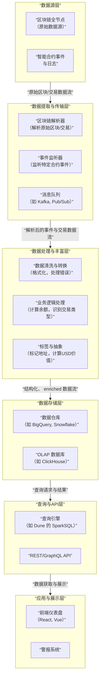

# 数据分析平台底层实现

我们将对 **Web3 数据分析平台**（如 Nansen, Dune Analytics, DeFiLlama）的底层实现进行深入解析。这些平台是将链上原始数据转化为可操作洞察的“炼金术士”，其技术栈是现代数据工程与区块链技术的复杂结合。

---

### 一、 Web3 数据分析平台的核心价值与分类

#### 1. 核心价值主张
*   **数据民主化**：将复杂的、非结构化的链上数据转化为人类可读的图表和洞察，降低认知门槛。
*   **赋能决策**：为投资者、交易员、开发者和项目方提供数据驱动的决策依据。
*   **透明性与监督**：使链上活动（如巨鲸动向、智能合约交互）变得可追踪和可审计。

#### 2. 平台分类
*   **通用看板型**：提供标准化的仪表盘，如巨鲸追踪、Gas 追踪、NFT 市场概览（如 **Nansen, DeFiLlama**）。
*   **代码即分析型**：允许用户通过编写类SQL查询来创建自定义看板，极度灵活（如 **Dune Analytics**）。
*   **API 驱动型**：专注于为开发者提供结构化的链上数据API，作为其应用的后端（如 **The Graph, Alchemy**）。

---

### 二、 Web3 数据分析平台核心架构与数据流

一个成熟的Web3数据分析平台是一个复杂的多层系统，其核心架构与数据流动可以通过下图清晰地展示：

---

### 三、 各层实现逻辑深度解析

#### 1. 数据源层
这是整个系统的根基，直接从区块链网络获取数据。

*   **实现方式**：
    *   **自托管节点**：平台运行自己的区块链全节点/归档节点。这提供了最大的控制权和数据独立性，但成本高昂（硬件、存储、带宽）。
    *   **节点服务商**：使用 **Infura, Alchemy, QuickNode** 等提供的节点API。这降低了运维复杂度，但可能引入延迟和依赖。
*   **数据内容**：
    *   **区块**：区块头、交易列表、叔块。
    *   **交易**：发送方、接收方、金额、输入数据、Gas信息。
    *   **事件日志**：智能合约执行过程中发出的日志，是DeFi和NFT活动的主要数据来源。
    *   **内部调用**：通过`debug_traceTransaction`等方法获取的合约内部调用轨迹，数据量极大但信息最全。

#### 2. 数据提取与传输层
目标是将链上数据实时、可靠地摄入到数据处理系统中。

*   **区块链解析器**：
    *   **工作流程**：监听新区块 -> 通过JSON-RPC从节点获取完整区块数据 -> 解析区块内的每笔交易和事件。
    *   **技术挑战**：需要处理区块链重组（孤块），确保数据的最终一致性。
*   **事件监听器**：
    *   专门针对热门合约（如Uniswap, Aave）进行监听，一旦有相关事件（如`Swap`, `Mint`）发生，立即捕获。
*   **消息队列**：
    *   使用 **Kafka** 或 **Google Pub/Sub** 等作为数据总线。解析后的数据被发布到消息队列中，实现了**生产者和消费者的解耦**，保证了系统在高负载下的弹性和可扩展性。

#### 3. 数据处理与丰富层
这是将原始数据转化为“智能数据”的核心环节，价值主要在此产生。

*   **数据清洗与转换**：
    *   将十六进制的数据转换为人类可读的格式（如 `0x1` -> `true`）。
    *   将合约输入数据通过ABI解码为具体的函数调用和参数。
*   **业务逻辑处理**：
    *   **计算余额变化**：根据交易推断每个地址的余额变动。
    *   **识别交易类型**：判断一笔交易是简单的转账、DEX兑换、质押还是复杂的跨链交易。
    *   **计算手续费**：`Gas Used * Gas Price`。
*   **标签与抽象**：
    *   **这是Nansen等平台的核心竞争力**。
    *   **地址标签**：通过启发式规则和机器学习，为匿名地址打上标签，如：
        *   `Binance 14`（交易所热钱包）
        *   `Smart Money: DeFi Whale`（聪明的DeFi巨鲸）
        *   `NFT Flipper`（NFT刷子）
    *   **美元计价**：将代币数量转换为当时的美元价值，需要集成历史价格预言机。
    *   **抽象表**：创建高级别的、业务友好的数据表。例如，Dune的`dex.trades`表背后是聚合了所有DEX的Swap事件，并统一了格式。

#### 4. 数据存储层
选择合适的数据库来应对海量数据的写入和复杂查询。

*   **数据仓库**：
    *   如 **Google BigQuery** 或 **Snowflake**。它们是云原生的，擅长处理PB级数据，支持标准的SQL，非常适合Dune这种允许用户自定义查询的场景。**优势在于分析能力，而非实时性**。
*   **OLAP 数据库**：
    *   如 **ClickHouse**。它是开源的，专为在线分析处理而设计，具有极致的压缩比和查询速度，非常适合做实时仪表盘。**优势在于速度和效率**。
*   **混合模式**：
    *   大多数平台采用混合架构。用ClickHouse驱动前端的实时仪表盘，用BigQuery支撑后端的复杂分析和历史数据查询。

#### 5. 查询与API层
这是面向最终用户的数据出口。

*   **查询引擎**：
    *   **Dune**：将用户编写的SQL查询翻译成可在其数据仓库上执行的任务（如Spark SQL）。
    *   **The Graph**：使用 **GraphQL** 作为查询语言，用户通过定义子图来描述他们关心的数据和事件，索引器会据此建立索引并提供GraphQL端点。
*   **API 服务**：
    *   提供RESTful或GraphQL API，供开发者集成到自己的应用、机器人和网站中。这是平台货币化的重要途径。

#### 6. 应用与展示层
用户直接交互的界面。

*   **前端可视化**：使用React、Vue等框架构建交互式图表、表格和仪表盘。
*   **警报系统**：允许用户设置条件（如“某巨鲸地址转移超过1000 ETH”），当条件触发时通过邮件、Telegram或Discord通知用户。

---

### 四、 核心技术挑战与解决方案

1.  **数据量巨大**：
    *   **挑战**：以太坊每日产生数GB的原始数据，全年数据量达TB级别。
    *   **解决方案**：使用列式存储（BigQuery, ClickHouse）、高效的数据压缩算法、数据分区和分片。

2.  **数据模式不固定**：
    *   **挑战**：任何开发者都可以部署具有全新事件结构的智能合约。
    *   **解决方案**：采用灵活的Schema-on-Read模式（如BigQuery），或在数据处理层建立强大的ABI解码和适配器系统。

3.  **实时性要求高**：
    *   **挑战**：用户希望看到近乎实时的链上活动。
    *   **解决方案**：全链路流式处理，从节点到消息队列，再到流处理引擎（如Apache Flink），最后写入OLAP数据库。

4.  **数据正确性**：
    *   **挑战**：处理链重组、识别伪造事件、正确处理复杂的合约内部调用。
    *   **解决方案**：在数据管道中设置检查点和重试机制，使用多个节点源进行交叉验证。

---

### 五、 不同平台的实现侧重

*   **Dune Analytics**：
    *   **核心**：**查询引擎 + 数据抽象层**。其魔力在于将混乱的原始数据标准化为`dex.trades`, `nft.trades`等易于查询的表。
    *   **商业模式**：社区驱动的分析生态。

*   **Nansen**：
    *   **核心**：**地址标签系统 + 预构建分析看板**。其核心资产是耗费巨大人力物力构建的、高质量的地址标签数据库。
    *   **商业模式**：SaaS订阅。

*   **The Graph**：
    *   **核心**：**去中心化的索引协议**。它将数据索引和查询的服务去中心化，由索引人、策展人和委托人组成的网络共同维护。
    *   **商业模式**：协议查询费用。

### 总结

Web3数据分析平台的底层实现本质是：**一个专门为处理区块链数据特性而设计和优化的、大规模、高实时性的数据管道与计算系统。**

其核心创新在于：
*   **工程层**：通过**流批一体的架构**和**专门优化的存储**，解决了链上**数据海量、实时、非结构化**的难题。
*   **业务层**：通过**地址标签**和**数据抽象**，将密码学符号（地址）转化为**商业实体和行为**，赋予了原始数据真正的**洞察力**。
*   **生态层**：通过**查询语言**或**API**，实现了数据的**可组合性**和**民主化**，催生了庞大的分析开发生态。

未来，随着模块化区块链和L2的普及，数据分析平台将面临**多链数据聚合**、**隐私保护计算**（如零知识证明）和**更强大的预测性分析**等新的挑战与机遇。它们将继续作为Web3世界的“眼睛”，是生态系统中不可或缺的关键基础设施。