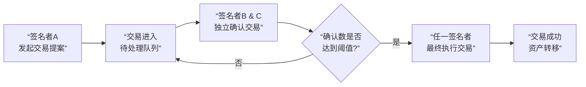

# Gnosis Safe 多签钱包产品分析

---

### 一、 产品定位与核心价值主张

**1. 产品定位：**
Safe 是一个基于智能合约的、非托管的**去中心化托管平台** 和 **集体资产管理解决方案**。它主要服务于**DAO、加密项目、金融机构和高净值个人**，用于安全、透明地管理共有的或需要复杂权限控制的资产。

**2. 核心价值主张：**
*   **共享资产的安全托管**：解决“一个人一把私钥”的单点故障问题，通过多签机制实现集体控制和决策。
*   **灵活的权限管理**：可配置的确认阈值，满足从简单共管到复杂组织治理的各种需求。
*   **可编程的账户功能**：作为智能合约账户，可以与整个DeFi生态无缝组合，实现自动化、条件化交易。
*   **交易透明与可审计性**：所有交易提案、确认和执行都在链上留有记录，可供所有参与者审计。

---

### 二、 核心功能与业务逻辑分析

#### 1. 多签管理与权限控制
*   **业务逻辑**：
    1.  **签名者与阈值**：在创建Safe时，用户定义一组签名者地址（公钥列表）和一个确认阈值（如 2/3，即3个签名者中需要2个确认）。
    2.  **交易提案**：任何签名者都可以发起一笔交易（如转账、合约调用）。
    3.  **交易确认**：其他签名者会收到通知，并对该笔交易进行独立确认。
    4.  **交易执行**：一旦确认数达到预设阈值，**任何签名者**（通常是最后一位确认者）都可以执行这笔交易，将其最终提交到链上。

#### 2. 模块化与可扩展性
这是 Safe 最强大的设计理念。其核心是一个轻量的代理合约，通过“模块”来扩展功能。
*   **守护模块**：可以在交易执行前或执行后插入自定义逻辑，实现：
    *   **白名单**：只允许向特定地址转账。
    *   **速率限制**：设置每日/每周转账限额。
    *   **时间锁**：交易提案后必须等待一定时间才能执行，防止恶意操作。
*   **功能模块**：添加复杂功能，如：
    *   **社会恢复模块**：允许一组“守护人”在您丢失密钥时投票恢复钱包访问权。
    *   **批量交易模块**：在单次交易中执行多个操作，节省Gas费。
    *   **离线签名中继器**：允许用户提交离线签名，由第三方支付Gas费来执行。

#### 3. 交易流程与用户体验
Safe 的交易流程通过清晰的步骤，在链上实现了透明的协作管理，其核心流程如下图所示：

所有提案、确认和执行操作均在链上进行，确保了过程的不可篡改和完全透明。

#### 4. 多链部署与互操作性
Safe 核心合约已部署在 **Ethereum, Polygon, Arbitrum, Optimism, BSC, Base** 等十多个主流网络上。用户可以在不同链上拥有相同地址的Safe账户，实现统一的资产管理体验。

---

### 三、 目标用户与市场分析

**1. DAOs**
*   **用例**：管理国库资产、支付贡献者薪酬、进行链上投票拨款。
*   **痛点解决**：避免了将国库资产控制在单个核心成员手中的风险，决策过程民主透明。DeepDAO数据显示，绝大多数顶级DAO的国库都通过Safe管理。

**2. 加密项目与初创公司**
*   **用例**：管理团队与投资者代币分配、支付运营费用。
*   **痛点解决**：实现资金的共同控制，增加投资者信任，防止团队单方面转移资产。

**3. 企业与金融机构**
*   **用例**：链上财库管理、数字资产托管。
*   **痛点解决**：满足企业内部风控和合规要求（如需要多个财务负责人授权才能动用资金）。

**4. 高净值个人与家庭**
*   **用例**：遗产规划、家庭资产共同管理。
*   **痛点解决**：防止因私钥丢失导致资产永久锁定，实现资产继承的平滑过渡。

---

### 四、 生态与商业模式分析

**1. 生态系统建设**
Safe 更像一个开放协议，其上构建了丰富的生态：
*   **前端界面**：官方 Safe{Wallet} 界面，以及许多第三方开发的替代界面。
*   **基础设施服务**：如 Gelato Network 提供中继服务，让用户无需持有主网ETH也能支付Gas费。
*   **DeFi 集成**：几乎所有主流DeFi应用都支持与Safe连接，用户可以直接从Safe内部进行借贷、交易等复杂操作。

**2. 商业模式**
*   **交易手续费**：用户通过Safe官方界面执行的每一笔成功交易，都需要支付少量费用（目前为0.1%或0.01%，取决于网络）。这是其核心收入来源。
*   **Safe{DAO} 与 $SAFE 代币**：
    *   **治理**：$SAFE 代币用于管理Safe生态财库和协议参数（如手续费分配）。
    *   **价值捕获**：未来，手续费收入可能会通过某种机制回馈给$SAFE的质押者或生态建设者，从而形成闭环经济。
*   **企业级解决方案**：为大型机构提供定制化的托管和白标解决方案，可能是未来的重要收入方向。

---

### 五、 优势与挑战

#### 优势：
1.  **市场领导者地位**：品牌认可度高，是DAO和项目国库管理的标准配置。
2.  **经过实战检验**：智能合约经过多次审计，管理着数百亿美元资产，多年来未发生核心合约被黑事件。
3.  **无与伦比的灵活性**：模块化设计使其能够适应不断变化的用户需求和监管环境。
4.  **强大的网络效应**：庞大的用户和开发者生态构成了坚实的护城河。

#### 挑战与竞争：
1.  **高Gas成本**：每笔交易都需要多个链上签名验证和合约交互，成本远高于普通EOA交易。Layer2解决方案正在缓解此问题。
2.  **用户体验复杂性**：对于非技术用户，理解多签、Gas、模块等概念仍有门槛。
3.  **激烈的竞争**：
    *   **MPC钱包**：如Fireblocks, Qredo。它们通过在链下进行多方计算来降低Gas费，但牺牲了部分链上透明性和可组合性。
    *   **新兴智能合约钱包**：基于 **ERC-4337（账户抽象）** 的钱包，如Argent。它们提供了类似的社会恢复功能，且用户体验可能更流畅，是未来强有力的竞争者。
4.  **治理速度**：作为一个去中心化项目，通过SafeDAO进行协议升级决策可能较慢。

---

### 总结

**Gnosis Safe 不仅仅是一个多签钱包，它已经成为链上组织和价值协作的关键基础设施。**

它的成功源于其**极致的安全设计、灵活的模块化架构和对集体托管需求的精准把握**。在从“Gnosis Safe”到“Safe”的品牌升级中，其愿景也变得更加清晰：成为**所有链上资产和身份的通用智能账户平台**。

未来，Safe 面临的挑战是如何在保持其安全性和去中心化核心的同时，通过账户抽象等技术简化用户体验，并抵御来自MPC和原生ERC-4337钱包的竞争。无论如何，Safe 已经在这个新兴的领域中占据了有利地形，并将在构建更加复杂和可信的链上经济中扮演核心角色。