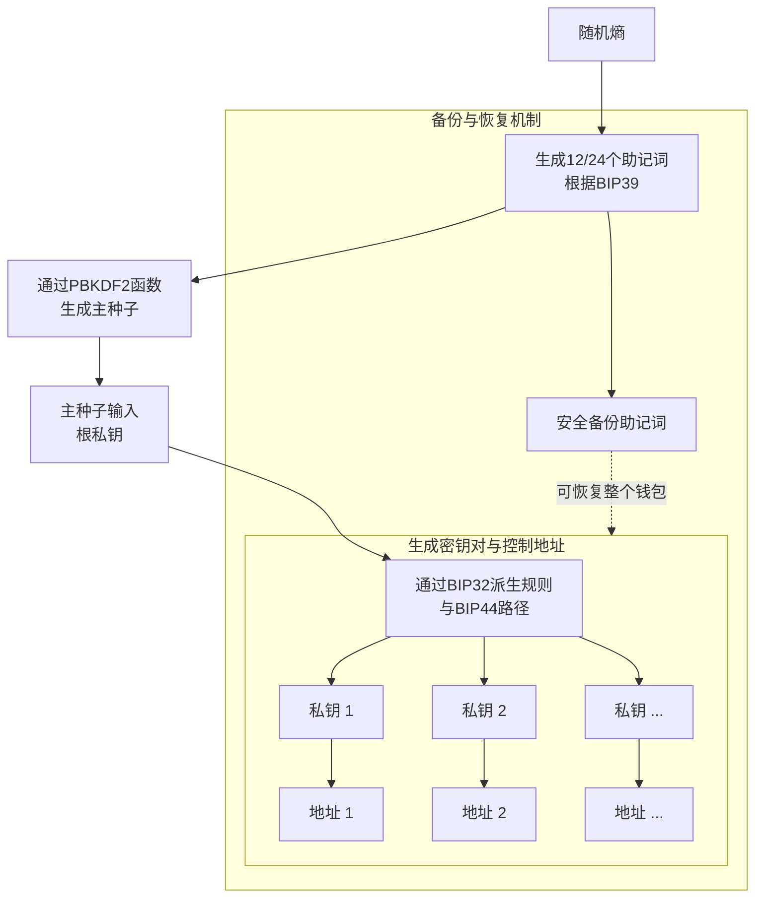

# 不同类型钱包的密钥管理机制

这是加密货币安全的核心，理解它们如何工作对保护您的资产至关重要。

首先，我们需要理解一个核心关系：

**私钥 → 公钥 → 地址**

*   **私钥**：最高权限。谁拥有私钥，谁就完全控制了该地址上的资产。**必须绝对保密！**
*   **公钥**：由私钥生成，可以公开，用于验证签名。
*   **地址**：由公钥生成，可以公开，用于接收资产。

钱包的本质就是一个**私钥管理工具**。

---

### 钱包的顶级分类：按私钥存储方式

根据私钥的生成和存储方式，钱包可以分为两大类：

#### 1. 非确定性钱包

*   **机制**：每个私钥都是独立、随机生成的。密钥之间**没有任何关联**。
*   **管理方式**：就像您有一个独立的钥匙串，每把钥匙开一把锁。备份时必须备份每一个私钥。
*   **优点**：结构简单。
*   **缺点**：备份和管理极其困难。如果生成100个地址，就需要备份100个私钥。极易出错和丢失。
*   **现状**：现已基本被淘汰，仅在非常早期的钱包中使用。

#### 2. 确定性钱包

*   **机制**：所有私钥都从一个共同的**主种子** 派生而来。只需要备份这个种子，就可以恢复出所有私钥。
*   **管理方式**：这是现代钱包的标准。最常见的是遵循 **BIP32、BIP39、BIP44** 等标准协议的**分层确定性钱包**。

---

### 分层确定性钱包的密钥管理机制

这是目前最主流、最科学的密钥管理方式。其核心机制如下：

**1. 助记词**
*   **作用**：**主种子的可读形式**。根据BIP39标准，通过随机熵生成一组（通常是12或24个）易于人类书写和记忆的单词。
*   **机制**：这组单词通过**密钥拉伸函数** 可以推导出唯一的、强力的**二进制种子**。**只要拥有了助记词，就等同于拥有了所有派生私钥的控制权。**

**2. 派生路径**
*   **作用**：定义从主种子如何派生出无数个密钥对的标准格式。
*   **机制**：遵循BIP44标准，路径格式为：`m/purpose'/coin_type'/account'/change/address_index`
    *   **例如**：`m/44'/60'/0'/0/0` 这是以太坊第一个账户的第一个接收地址的派生路径。
    *   通过改变路径末尾的 `address_index`，可以无限生成新地址，而无需备份新的私钥。

**可视化HD钱包的密钥派生流程**

从上图可知，**助记词是整个HD钱包的单一备份点**，通过标准的派生路径，可以确定性地重新生成所有地址和私钥。

---

### 不同类型钱包的具体管理机制

现在，我们来看具体的钱包产品是如何基于上述机制来管理密钥的。

#### 1. 软件钱包

*   **机制**：私钥在软件应用内部生成和存储。
*   **存储位置**：存储在设备操作系统的一个特定区域（如手机的安全存储区或电脑的文件系统中）。
*   **访问控制**：通常通过密码、PIN码或生物识别（指纹、面部）来加密和保护对私钥的访问。
*   **分类**：
    *   **托管钱包**：私钥由服务商（如交易所）掌管。你拥有的是账户名和密码。**Not your keys, not your coins.**
    *   **非托管钱包**：私钥由用户自己掌管。软件只是帮助你生成和管理私钥的工具。例如：MetaMask, Trust Wallet, Phantom。

#### 2. 硬件钱包

*   **机制**：**冷存储**的典范。私钥在一个专有的、离线的硬件设备中生成，并且**永不离开设备**。
*   **工作流程**：
    1.  设备离线生成助记词和私钥。
    2.  当你需要签名交易时，交易数据会被发送到硬件钱包。
    3.  硬件钱包在内部用私钥对交易进行签名。
    4.  已签名的交易被发送回联网的电脑，再广播到区块链网络。
*   **优点**：私钥与互联网完全隔离，极大降低了被黑客窃取的风险。即使连接了被病毒感染的电脑，私钥也是安全的。
*   **代表**：Ledger, Trezor, Keystone。

#### 3. 纸钱包/脑钱包

*   **纸钱包机制**：将私钥和公钥以二维码的形式打印在纸上，并从电脑中彻底删除。这是一种纯粹的物理存储。
    *   *风险*：纸张易损坏、丢失；如果生成密钥的电脑有病毒，可能被窃取。
*   **脑钱包机制**：试图通过记忆一个密码或短语来生成私钥。
    *   *风险*：**极度危险！** 人类选择的口令熵值很低，极易被暴力破解。**强烈不推荐！**

#### 4. 多方计算钱包

*   **机制**：一种先进的密钥管理方案。一个私钥被**拆分**成多个部分，由不同的人或设备持有。
*   **签名过程**：需要达到预设的阈值（如3个部分中的2个）才能共同生成一个有效的签名。在这个过程中，完整的私钥**从未在任何地方被重构出来**。
*   **优点**：
    *   **安全**：单一设备被攻破不会导致资产损失。
    *   **去信任化**：参与者无需完全信任彼此。
*   **应用**：企业级资金管理、个人高安全性存储。

#### 5. 智能合约钱包

*   **机制**：资产不由一个外部账户的私钥控制，而是由一个**智能合约**的代码逻辑控制。
*   **管理方式**：权限管理通过智能合约实现，非常灵活。
    *   **社交恢复**：设置一组可信的“守护人”，如果你丢失了密钥，可以由他们共同投票恢复钱包访问权。
    *   **多重签名**：需要多个密钥中的几个才能批准交易。
    *   **交易限制**：可以设置每日转账限额。
    *   **白名单**：只允许向特定地址转账。
*   **代表**：ERC-4337账户抽象钱包，如Safe。

---

### 总结与对比

| 钱包类型         | 密钥管理核心机制                       | 安全性                       | 便利性       | 适用场景                             |
| :--------------- | :------------------------------------- | :--------------------------- | :----------- | :----------------------------------- |
| **软件钱包**     | 私钥存储在联网设备上，由软件管理。     | 中                           | 高           | 日常小额支付、DeFi交互               |
| **硬件钱包**     | 私钥在离线设备内生成和签名，永不离开。 | 高                           | 中           | 大额资产长期存储、HODL               |
| **纸钱包**       | 私钥物理打印，完全离线。               | 中（依赖生成环境和物理安全） | 低           | 极长期冷存储（现已不常用）           |
| **MPC钱包**      | 私钥被分片，分布式签名。               | 极高                         | 中           | 企业财库、高净值个人                 |
| **智能合约钱包** | 通过智能合约代码规则管理访问权限。     | 高（可编程安全）             | 高（可恢复） | 所有用户，尤其是追求体验和安全的新手 |

**黄金法则**：

1.  **助记词 = 资产所有权**。备份并**离线、安全地**保管好你的助记词。
2.  **不要将助记词存储在联网设备上**（如云盘、笔记App、截屏）。
3.  根据你的资产规模和用途，选择合适的钱包类型。对于大额资产，**硬件钱包是首选**。
4.  对于非技术用户，**社交恢复型智能合约钱包**是未来大幅提升安全性和用户体验的方向。