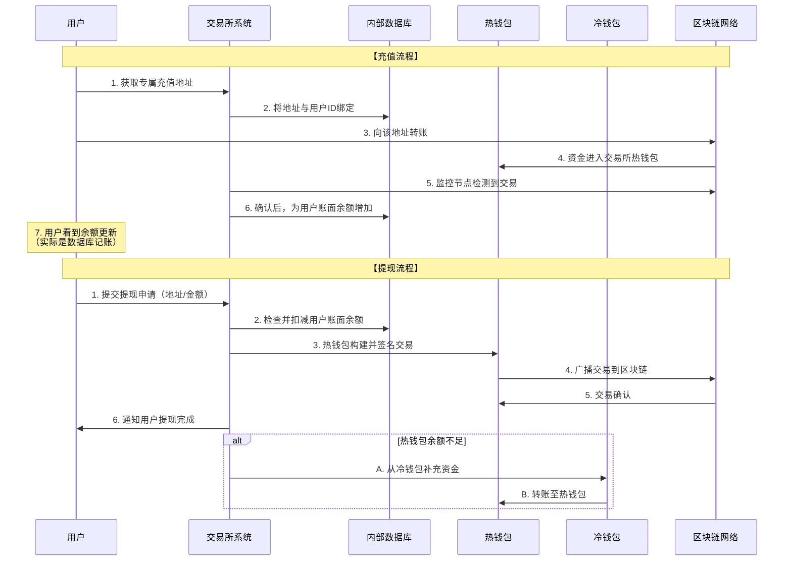

# 中心化钱包底层业务逻辑

这与用户自持私钥的去中心化钱包有根本性的不同。

核心一句话总结：**你在交易所看到的资产余额，实际上是交易所给你打的一张“欠条”，是其在内部数据库中为你记账的凭证。你并不直接拥有链上资产的私钥。**

---

### 核心业务逻辑：混合账户模型

交易所不会为每个用户创建独立的链上钱包，而是采用一种 **“总账-分户账”** 的混合账户模型。其底层逻辑可以分为以下几个关键部分：

#### 1. 资产存储结构：热钱包与冷钱包

交易所将用户资产集中管理，主要存放在两种地址中：

*   **冷钱包**
    *   **作用**：**资产储备库**。存放绝大部分用户资产，通常占总资产的95%以上。
    *   **特点**：私钥离线生成和存储，永不接触互联网。可能采用多重签名、物理隔离（如银行金库、保险箱）等方式，安全性极高。
    *   **操作**：仅用于处理从热钱包归集资金，或向热钱包补充资金，不直接处理用户提现。

*   **热钱包**
    *   **作用**：**日常营业厅**。存放少量用于日常用户提现的资产。
    *   **特点**：私钥在线，以便快速签署交易。由于在线，是黑客攻击的主要目标。
    *   **操作**：直接处理用户的提现请求。当余额不足时，会从冷钱包进行“充值”。

#### 2. 用户账户体系：内部数据库记账

这是中心化钱包逻辑的核心。交易所维护一个强大的中心化数据库（通常是SQL数据库）。

*   **用户表**：记录你的账号、密码、KYC信息等。
*   **资产余额表**：**这是最关键的表！** 它记录了每个用户拥有的每种加密货币的**账面余额**。
    *   例如：`用户A, BTC, 1.5`；`用户A, ETH, 10`。

**当发生以下行为时，交易所只在内部数据库更新你的余额，完全不涉及区块链操作：**
*   **用户充值**：交易所监控其充值地址，确认到账后，在数据库里给你的账户**加钱**。
*   **用户提现**：你在前台申请提现，交易所在数据库里**扣减**你的余额，然后从热钱包发起一笔真正的链上转账到你指定的地址。
*   **内部交易/转账**：你和用户B进行交易（比如你用BTC买他的ETH）。交易所只需要在数据库里同时更新你们两人的BTC和ETH余额。这完全是**内部轧差**，效率极高。

---

### 底层业务流程详解

为了更直观地展示这一过程，我们可以通过以下序列图来了解充值和提现这两个核心流程的业务逻辑：

从上图可以清晰地看到：
*   **充值**：本质是用户向交易所控制的地址“存钱”，交易所随后在内部数据库中为你记账。
*   **提现**：本质是用户向交易所“要钱”，交易所从它控制的钱包中支付给你，并在内部数据库中扣减你的账目。

---

### 关键技术与风险控制

1.  **地址管理**
    *   **地址池**：交易所会预生成大量地址，并为每个用户分配一个或多个专属充值地址（通过标签/Memo区分），以便追踪谁充了值。
    *   **统一地址**：有些小交易所可能使用单一地址，要求用户填写Memo，风险较高。

2.  **资金归集**
    *   交易所会定期将各个热钱包中用户充值的小额资金**归集**到少数几个地址，然后大部分转入冷钱包。这节省了链上交易费，并提升了安全性。

3.  **风险控制与安全**
    *   **提现风控**：系统会自动检测提现地址是否在黑名单（如黑客地址、混币器地址）、行为是否异常（新地址、大额提现），可能会触发人工审核。
    *   **多重签名**：从冷钱包转账到热钱包通常需要多个授权人批准，防止单点作恶。
    *   **准备金证明**：为了自证清白，一些交易所会通过Merkle Tree等技术公开证明其冷钱包资产足以覆盖所有用户存款。

---

### 总结：优缺点分析

**优点（为何流行）：**
*   **用户体验极佳**：操作简单，速度飞快（内部转账即时确认），忘记密码可以找回。
*   **功能强大**：支持法币出入金、丰富的交易对、杠杆期货等复杂金融产品。
*   **成本较低**：内部交易无Gas费。

**缺点（根本性风险）：**
*   **托管风险**：你的资产实际在交易所手中。“Not your keys, not your coins.” 如果交易所被黑客攻击、内部人员盗取、或跑路，你的资产可能血本无归。
*   **审查风险**：交易所可能因为法律或政策原因冻结你的账户和资产。
*   **单点故障**：交易所数据库或服务器宕机，你将无法访问自己的资产。

**因此，一个常见的建议是：将交易所视为一个“证券交易所”或“银行大厅”，只存放用于短期交易的资产，而将大额、长期持有的资产转移到自己掌握私钥的非托管钱包中。**