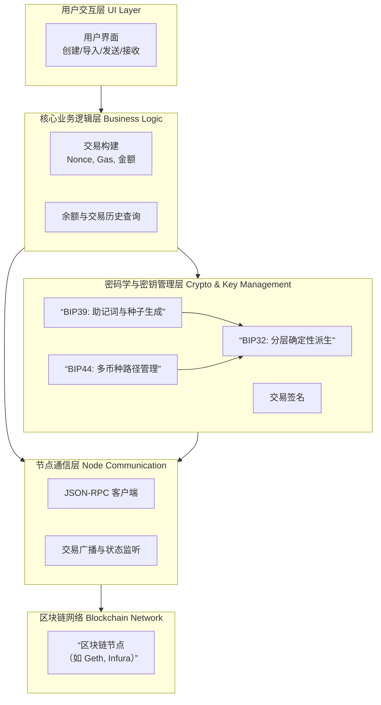

好的，我们来深入解析去中心化HD钱包的功能模块和底层实现。这是一个从用户交互到密码学底层的完整技术栈。

---

### 一、 核心功能模块（从用户视角）

一个典型的去中心化HD钱包通常包含以下四大功能模块：

#### 1. 身份与密钥管理模块
这是钱包的核心，负责一切与密钥相关的操作。
*   **钱包创建**：生成随机助记词和根种子。
*   **钱包导入/恢复**：通过助记词或私钥恢复整个钱包。
*   **密钥派生**：根据标准路径（如BIP44）派生出海量的地址和私钥。
*   **密码保护**：使用用户设置的密码对助记词和私钥进行本地加密存储。
*   **多链多账户管理**：使用不同的派生路径管理不同区块链（BTC, ETH, SOL等）的资产。

#### 2. 资产管理与查询模块
负责与区块链网络交互，获取和展示数据。
*   **余额查询**：通过连接节点查询各地址的资产余额。
*   **交易历史**：获取并展示地址的转入转出记录。
*   **Gas/费率估算**：动态获取当前网络状态，推荐合理的交易费用。
*   **代币管理**：自动识别并显示主流代币，支持自定义添加代币。

#### 3. 交易构建与签名模块
负责创建和签署交易，但不广播（这是节点的工作）。
*   **交易构建**：组装原始交易数据（如：输入、输出、金额、Gas Limit、Nonce）。
*   **交易签名**：在设备本地使用私钥对交易进行数字签名，生成签名后的交易数据。
*   **交易预览**：让用户在发送前确认所有细节。

#### 4. 节点通信与广播模块
作为钱包与区块链网络之间的桥梁。
*   **节点连接**：连接并交互远程或本地的区块链节点（JSON-RPC）。
*   **交易广播**：将已签名的交易数据发送到网络中的节点进行传播。
*   **状态监听**：监听内存池和区块，追踪交易状态（待确认、已确认、失败）。

---

### 二、 底层实现原理（技术栈剖析）

下面我们逐层深入，剖析每个功能模块背后的技术实现。

#### 模块1的底层实现：身份与密钥管理

**1. 助记词生成**
*   **遵循标准**：BIP39
*   **流程**：
    1.  **生成熵**：创建一个128~256位（通常是128或256）的加密学安全的随机数。
    2.  **计算校验和**：对熵进行SHA256哈希，取前（熵长度/32）位作为校验和。
    3.  **组合**：将校验和附加到熵的末尾。
    4.  **分组**：将组合后的二进制串按11位一组进行分割。
    5.  **映射为单词**：每组11位的数字（0-2047）作为索引，从BIP39标准单词表中找到对应的单词。

**2. 种子生成**
*   **遵循标准**：BIP39
*   **流程**：
    1.  **盐**：将用户提供的密码（可选）与字符串 "mnemonic" 拼接，形成盐。
    2.  **密钥拉伸**：使用**PBKDF2**函数，以助记词为密码，上述盐为盐，进行2048次HMAC-SHA512迭代，最终输出一个512位（64字节）的**根种子**。

**3. 主密钥与层级派生**
*   **遵循标准**：BIP32
*   **流程**：
    1.  **生成主密钥**：将根种子作为输入，使用HMAC-SHA512算法，"Bitcoin seed" 作为密钥进行计算。输出的512位中，前256位是**主私钥**，后256位是**主链码**。
    2.  **派生树结构**：BIP32定义了分层树状结构来派生密钥。
        *   **父密钥 + 链码 + 索引号 → 子密钥**
        *   使用HMAC-SHA512，以父链码为密钥，以（父公钥 + 索引号）为数据，生成子密钥和子链码。
    3.  **硬化派生**：为防止子私钥泄露导致主私钥被推导，在派生索引上增加一个很大的数（通常是2^31），表示硬化派生。此时使用父私钥而非父公钥进行派生。

**4. 多币种与账户管理**
*   **遵循标准**：BIP44
*   **路径格式**：`m / purpose' / coin_type' / account' / change / address_index`
    *   `purpose'`：固定为44'，代表遵循BIP44。
    *   `coin_type'`：币种类型。例如，0' 是比特币，60' 是以太坊。
    *   `account'`：账户索引，允许用户创建多个逻辑账户。
    *   `change`：0 用于外部接收地址，1 用于找零地址。
    *   `address_index`：地址索引，从0开始递增。

**可视化HD钱包的完整技术栈**

#### 模块2 & 3的底层实现：资产查询与交易

**1. 余额与交易历史查询**
*   **实现方式**：通过JSON-RPC调用连接到区块链节点。
    *   **余额查询**：调用 `eth_getBalance` (对于ETH) 或类似方法，传入地址和区块参数。
    *   **交易历史**：比较复杂。通常需要连接第三方索引服务（如The Graph, Etherscan API），因为大多数节点不直接提供按地址筛选交易的历史记录。

**2. 交易构建**
*   **关键字段**：
    *   `nonce`： 账户发出的交易序列号，防止重放攻击。通过 `eth_getTransactionCount` 查询。
    *   `gasPrice` / `maxFeePerGas`： 燃料单价（EIP-1559前后不同）。
    *   `gasLimit`： 交易执行所需燃料上限。
    *   `to`： 收款地址。
    *   `value`： 转账金额。
    *   `data`： 调用合约时的输入数据。
*   **流程**：钱包从网络获取当前推荐Gas价格，并计算Nonce，然后组装这些字段形成一个未签名的交易对象。

**3. 交易签名**
*   **算法**：ECDSA（椭圆曲线数字签名算法），具体为 `secp256k1` 曲线。
*   **流程**：
    1.  对未签名的交易数据进行RLP编码（以太坊）或类似序列化。
    2.  对序列化后的数据计算Keccak-256哈希。
    3.  使用派生出的私钥对这个哈希值进行签名，生成 `(r, s, v)` 签名数据。
    4.  将签名数据附在原始交易上，形成已签名的、可广播的交易。

#### 模块4的底层实现：节点通信

*   **协议**：JSON-RPC over HTTP/WebSocket。
*   **实现**：
    *   钱包内置一个轻量级的RPC客户端。
    *   当用户发送交易时，调用 `eth_sendRawTransaction` 方法，将已签名的交易数据广播出去。
    *   通过 WebSocket 订阅 `newHeads` 等事件，监听新区块，从而确认交易状态。

---

### 三、 安全架构要点

1.  **私钥永不离开设备**：所有签名操作均在用户设备（手机/电脑）内存中进行，完成后立即清除痕迹。
2.  **加密存储**：助记词和私钥使用用户密码通过 AES-256 等算法加密后存储在设备安全区域（如 iOS Keychain, Android Keystore）中。
3.  **安全的环境**：在安全环境中进行密钥派生和签名操作，防止恶意软件窃取。
4.  **透明的交易预览**：在签名前向用户完整展示交易细节，防止恶意DApp诱导签名。

### 总结

一个去中心化HD钱包是一个复杂而精密的密码学应用，它通过：
*   **BIP39** 实现用户友好的备份。
*   **BIP32/BIP44** 实现强大的密钥管理和多链支持。
*   **本地签名** 确保用户资产的绝对控制权。
*   **节点RPC** 实现与区块链世界的无缝连接。

理解其模块化和分层实现，对于开发钱包应用或仅仅是作为一名高级用户安全地管理自己的资产，都至关重要。