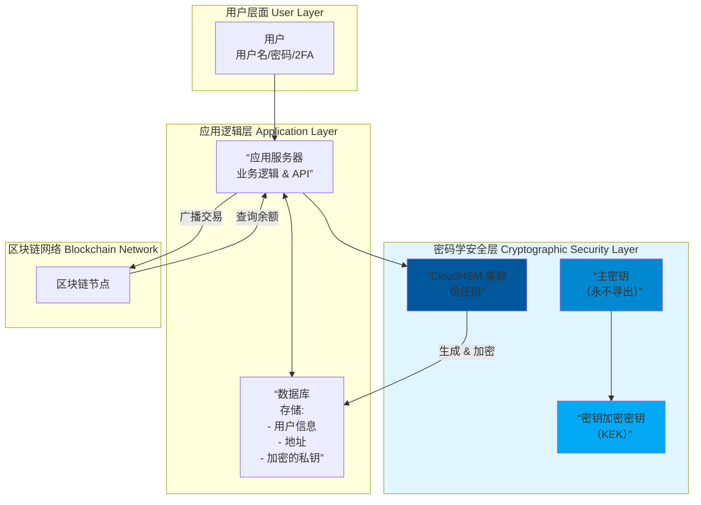

# 基于 CloudHSM 的托管钱包底层实现与业务逻辑

我们来深入分析基于 **CloudHSM** 的托管钱包的底层实现与业务逻辑。这是一种结合了中心化服务便利性和硬件级安全性的混合架构，常见于大型交易所、金融机构和托管服务商。

---

### 核心概念澄清

首先，我们需要明确这里的"托管钱包"指的是什么：

*   **服务模式**：**托管型**，即用户将资产的控制权交给服务商，服务商负责管理私钥。用户通过传统的用户名/密码或API密钥来访问。
*   **技术实现**：**基于CloudHSM**，即服务商使用云端的硬件安全模块来生成和存储根私钥，而非普通的云服务器。

**核心价值主张**：在提供中心化服务便利性的同时，通过硬件安全模块极大提升了私钥的存储安全性，降低了内部作恶和外部黑客攻击的风险。

---

### 底层架构与实现

一个基于CloudHSM的托管钱包系统是一个复杂的分层安全架构。

#### 1. 核心组件

*   **AWS CloudHSM 集群**：
    *   **角色**：整个系统的**信任根**和**密码学计算引擎**。
    *   **功能**：生成和安全存储**主密钥**；执行所有私钥相关的密码学操作（如签名、解密），但私钥永不离开HSM。

*   **应用服务器**：
    *   **角色**：处理业务逻辑的"大脑"。
    *   **功能**：运行钱包管理平台，处理用户请求，管理数据库，与区块链节点通信，并调用CloudHSM客户端进行密码学操作。

*   **数据库**：
    *   **角色**：记录账簿的"账本"。
    *   **功能**：存储用户信息、地址映射、**链上地址**、交易记录、**派生路径索引** 等。**注意：数据库中只存储公钥和地址，绝不存储明文私钥。**

*   **区块链节点**：
    *   **角色**：与区块链网络交互的"信使"。
    *   **功能**：查询余额、广播交易、监听网络状态。

#### 2. 密钥层次结构

这是实现安全性的核心。系统采用一种分层密钥模型，类似于HD钱包，但在HSM中实现。

*   **第1层：HSM 主密钥**
    *   在CloudHSM内部生成，永不导出。
    *   用于加密和保护下一层的密钥加密密钥。
    *   这是整个密钥体系的根。

*   **第2层：密钥加密密钥**
    *   同样在CloudHSM内生成和管理。
    *   用于在HSM外部安全地存储加密后的用户私钥。

*   **第3层：用户私钥**
    *   每个用户（或每个地址）对应一个独立的私钥。
    *   私钥在**CloudHSM内部生成**，然后使用KEK加密后，才被允许**导出到数据库**中存储。
    *   **关键**：数据库中存储的是**加密后的私钥**，且每次使用都必须送回CloudHSM内部解密和签名。

**可视化基于CloudHSM的托管钱包架构与流程**

---

### 核心业务逻辑流程

结合上述架构，我们来看关键的业务流程是如何实现的：

#### 1. 用户注册与钱包地址生成

1.  **用户** 在前端注册账号（邮箱/手机/密码）。
2.  **应用服务器** 在数据库为用户创建记录。
3.  **应用服务器** 调用 **CloudHSM**，请求生成一个新的密钥对。
4.  **CloudHSM** 在内部：
    *   生成一个新的私钥/公钥对。
    *   使用指定的 **KEK** 对该私钥进行加密。
    *   将加密后的私钥返回给应用服务器。
    *   导出对应的公钥。
5.  **应用服务器** 将公钥转换为区块链地址（如通过Keccak哈希），并将 `(用户ID, 地址, 加密的私钥)` 存入数据库。
6.  用户在前端看到自己的充值地址。

#### 2. 用户提现（最关键的流程）

1.  **用户** 提交提现申请（目标地址、金额、2FA验证）。
2.  **应用服务器** 执行风控检查（地址黑名单、提现限额、行为分析）。
3.  检查通过后，**应用服务器** 从数据库获取该用户的`加密私钥`和交易所需的Nonce等信息。
4.  **应用服务器** 在内存中构建未签名的原始交易数据。
5.  **应用服务器** 调用 **CloudHSM**，传入 `加密私钥` 和 `交易哈希`。
6.  **CloudHSM** 在内部：
    *   使用KEK解密，得到明文私钥（仅在HSM芯片的内存中短暂存在）。
    *   使用该私钥对交易哈希进行签名。
    *   销毁内存中的明文私钥。
    *   将签名结果返回给应用服务器。
7.  **应用服务器** 将签名附加到交易上，形成完整的已签名交易。
8.  **应用服务器** 将已签名交易通过区块链节点广播到网络。
9.  数据库更新用户余额和交易记录。

---

### 安全优势与设计要点

1.  **私钥永不以明文形式暴露**
    *   最大的优势。私钥在生成、存储、使用的整个生命周期中，仅在CloudHSM的硬件安全边界内以明文存在。即使应用服务器被攻破，黑客也只能拿到加密的私钥，无法解密和使用。

2.  **严格的访问控制与审计**
    *   通过AWS IAM和CloudHSM自身的CU（加密用户）机制实现**职责分离**。例如，需要多个管理员共同授权才能执行关键操作。
    *   CloudHSM提供完整的操作日志，所有密码学操作都可审计。

3.  **高可用性与可扩展性**
    *   CloudHSM集群支持跨可用区部署，实现高可用。如果一台HSM故障，其他节点可以接管。
    *   可以通过增加HSM节点来提升密码学运算的吞吐量。

4.  **密钥备份与恢复**
    *   CloudHSM支持将整个集群的密钥安全地备份到持久化存储（如S3）。可以快速在新区域恢复一个集群，实现灾难恢复。

---

### 潜在挑战与成本考量

1.  **成本高昂**：CloudHSM实例费用远高于普通EC2服务器，需要强大的业务需求来证明其合理性。
2.  **复杂性**：系统架构和运维比简单的软件钱包或纯数据库方案复杂得多。
3.  **性能瓶颈**：所有签名操作都必须经过HSM，在高频交易场景下可能成为瓶颈，需要进行良好的架构设计（如连接池、异步操作）。
4.  **供应商锁定**：虽然使用了标准API（如PKCS#11），但深度集成后迁移到其他云厂商或本地HSM仍有成本。
5.  **仍然存在操作风险**：虽然私钥安全了，但业务逻辑漏洞（如提现风控规则）、管理员作恶（多人串通）等风险依然存在。

### 总结

基于CloudHSM的托管钱包实现，其本质是：

**将中心化托管服务的业务效率，与硬件级的安全存储和密码学计算能力相结合。**

它通过一个分层的、模块化的安全架构，确保了最敏感的资产——私钥——始终处于最高级别的保护之下。这种方案非常适合对安全、合规和审计有严苛要求的金融机构、大型交易所和企业级加密货币托管服务商。它代表了当前行业内"机构级"托管解决方案的主流技术方向。