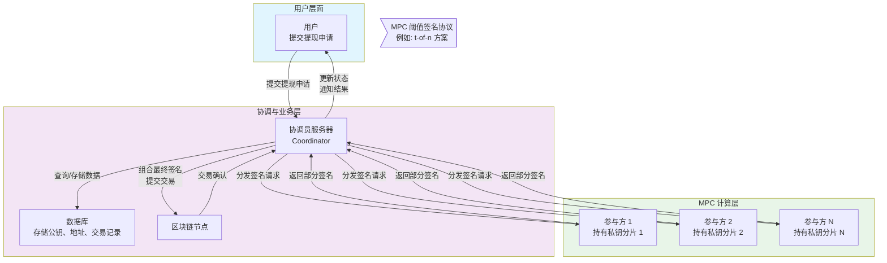

好的，我们来深入解析基于**MPC**的托管钱包的底层实现与业务逻辑。这是一种比传统HSM方案更现代化、更灵活的机构级安全解决方案。

---

### 核心范式转变：从"密钥存储"到"密钥计算"

首先，理解MPC的核心思想至关重要：

*   **传统方案**：存在一个完整的私钥，需要被存储和保护（在HSM或服务器中）。
*   **MPC方案**：**完整的私钥从未在任何地方、任何时间存在过。** 私钥被**拆分**成多个**分片**，由不同的参与方持有。当需要签名时，各方通过一个安全的计算协议，**共同协作生成一个有效的签名**，而无需重构出完整的私钥。

---

### 底层技术实现

基于MPC的托管钱包架构围绕几个核心密码学协议构建。

#### 1. 核心密码学协议

最常见的MPC方案是**阈值签名方案**，特别是针对ECDSA签名算法。

*   **阈值机制**：遵循 `(t, n)` 模型。
    *   `n`：总的私钥分片数量。
    *   `t`：进行签名所需的最小分片数量（阈值）。
    *   **例如**：一个 `(2, 3)` 方案表示：私钥被分成3个分片，由3个不同的参与方持有，只要其中任意2方合作，就能生成有效签名，而1方或0方则完全无法获取私钥的任何信息。

#### 2. 密钥生成

*   **分布式密钥生成**：这是MPC的第一个关键步骤。各方通过一个安全的MPC协议**共同生成**一个公共的公钥和各自持有的私钥分片。
    *   **优势**：在整个过程中，没有任何一方知道完整的私钥，甚至没有一个"可信设置方"。这彻底消除了单点信任风险。

#### 3. 签名过程

当需要为一笔交易 `m` 签名时，流程如下：

1.  **发起请求**：协调员收到用户合法的提现请求，并构建好待签名的交易哈希。
2.  **召集参与者**：协调员通知至少 `t` 个私钥分片的持有者参与签名。
3.  **执行MPC签名协议**：
    *   每个参与者使用自己的私钥分片和交易哈希作为输入。
    *   各方通过多轮通信，交换一些基于密码学的"证据"或"承诺"，但**绝不交换自己的私钥分片**。
    *   通过复杂的数学计算，最终由协调员（或其中一方）**组合出一个标准的、有效的ECDSA签名** `(r, s)`。
4.  **输出**：生成的签名与使用完整私钥生成的签名**完全无法区分**，可以被任何标准的区块链节点验证。

**可视化MPC托管钱包的架构与签名流程**

从上图可以看出，整个流程中，没有任何一个服务器或HSM持有完整的私钥。安全依赖于 `t` 个参与方不会被同时攻破。

---

### 业务逻辑与工作流程

#### 1. 系统初始化

1.  确定MPC方案的阈值 `(t, n)`，例如 `(3, 5)`。
2.  选择5个参与方。这些参与方可以是：
    *   跨不同云可用区的服务器。
    *   公司内不同部门的安全设备。
    *   甚至包括一个第三方公证机构。
3.  执行**分布式密钥生成**协议，为每个托管钱包地址生成一个**公钥**和5个**私钥分片**。公钥注册到区块链上，分片安全地分发给5个参与方。

#### 2. 用户提现流程

1.  **用户** 提交提现请求（目标地址、金额），并通过2FA等身份验证。
2.  **风控引擎** 对请求进行实时分析（金额、频率、地址信誉、行为模式）。对于大额或可疑交易，触发人工审批。
3.  **协调员服务器** 构建未签名的交易，并生成其哈希。
4.  **协调员** 根据预设策略，从 `n` 个参与方中选择 `t` 个可用的，发起MPC签名请求。
5.  **MPC签名协议** 在协调员和 `t` 个参与方之间运行。参与方可能会进行自身的二次授权（如需要操作员输入硬件token）。
6.  协调员收集并组合各方输入，最终生成有效签名。
7.  协调员将已签名交易广播到区块链网络，并更新数据库状态，通知用户提现完成。

#### 3. 私钥轮换与恢复

*   **私钥轮换**：MPC的一个强大功能是**主动安全轮换**。可以通过一个MPC协议，生成一套新的私钥分片，而对应的公钥和区块链地址**保持不变**。这样，即使某个旧分片在未来被泄露，攻击者也无法使用它（因为新分片已经生效）。
*   **分片备份与恢复**：私钥分片本身可以使用**链式秘密共享**等技术进行备份。例如，将一个分片加密后，再由多个管理员通过另一个 `(k, m)` 阈值方案持有解密密钥。

---

### 相对于CloudHSM方案的优势

1.  **消除单点故障**：没有HSM硬件设备这个单一攻击目标。攻击者必须同时攻破至少 `t` 个参与方才能盗取资产，难度呈指数级增加。
2.  **分布式信任**：无需完全信任任何一个实体、供应商或云服务商。参与方可以分布在不同的基础设施上。
3.  **无单点性能瓶颈**：密码学计算负载可以分布在多个参与方上，避免了HSM可能成为的性能瓶颈。
4.  **灵活的管控策略**：可以通过调整 `(t, n)` 阈值来实现灵活的审批策略。例如，小额提现用 `(2, 3)`，大额提现用 `(4, 5)`。
5.  **地理冗余与业务连续性**：参与方可以部署在全球不同地区。即使某个数据中心完全宕机，只要还能连通 `t` 个参与方，服务就能继续。
6.  **可审计性**：每个参与方的签名操作都可以被独立审计，提供更强的可追溯性。

---

### 挑战与考量

1.  **极高的复杂性**：MPC协议的实现和集成非常复杂，需要顶尖的密码学专业知识。自行实现极易出错，通常建议使用经过审计的商业MPC库（如Fireblocks, Curv, Unbound的技术）。
2.  **通信开销**：MPC协议需要在参与方之间进行多轮通信，可能会引入延迟。高效的网络连接至关重要。
3.  **成本**：虽然可能不需要购买昂贵的专用HSM硬件，但需要在多个节点上部署安全计算环境，并且商业MPC解决方案的授权费用可能很高。
4.  **新形态的风险**：
    *   **协调员风险**：虽然协调员没有私钥，但如果被攻破，可能会发起错误的签名请求（例如，将资金转到黑客地址）。
    *   **协议漏洞**：MPC协议本身的密码学实现漏洞可能导致私钥被推算出来。
    *   **木马攻击**：如果 `t` 个参与方同时被植入木马，虽然私钥未泄露，但攻击者可以操控它们共同签署一笔恶意交易。

### 总结

基于MPC的托管钱包代表数字资产托管技术的**前沿方向**。它通过密码学而非硬件物理安全来实现更高层级的安全和运营灵活性。

| 特性             | CloudHSM 方案   | MPC 方案               |
| :--------------- | :-------------- | :--------------------- |
| **私钥存在形式** | 完整存在于HSM中 | 从未完整存在，仅为分片 |
| **安全模型**     | 保护硬件边界    | 分布式信任，密码学安全 |
| **签名过程**     | 在HSM内部完成   | 多方协同计算生成       |
| **性能瓶颈**     | 可能集中在HSM   | 可分布式扩展           |
| **管控策略**     | 相对固定        | 极其灵活（阈值可调）   |

对于寻求最高级别安全、运营灵活性和业务连续性的金融机构和大型托管平台，MPC方案正在迅速成为首选架构。