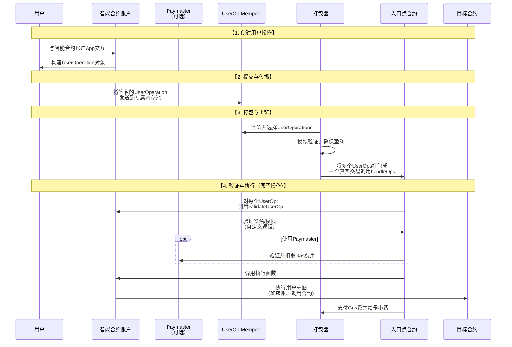

# 抽象账户（AA）钱包底层业务逻辑

被誉为智能合约钱包的下一代范式，旨在从根本上改善钱包的用户体验和安全性。

---

### 核心范式转变：从「谁」签名到「如何」授权

首先，理解AA带来的根本性变化至关重要：

*   **传统模式**：由**外部账户** 发起交易。EOA的特性是：
    1.  由私钥控制。
    2.  支付自身的Gas费。
    3.  签名逻辑固定（ECDSA）。
    4.  无法包含复杂的执行逻辑。
*   **AA模式**：由**智能合约账户** 作为主导账户。智能合约账户的特性是：
    1.  由代码逻辑控制。
    2.  支付逻辑可编程。
    3.  签名逻辑可自定义。
    4.  可以执行任意复杂的操作。

**简单比喻**：
*   **EOA钱包** 像一把**物理钥匙**：丢了就无法进门，功能单一。
*   **AA钱包** 像一整套**智能门禁系统**：可以用密码、指纹、手机APP、甚至远程授权开门，可以设置临时权限，功能丰富。

---

### 底层架构与核心组件

AA的实现，特别是以太坊的 **ERC-4337** 标准，引入了一套全新的、不依赖共识层改变的链下基础设施。其核心架构如下：

#### 1. 用户操作
这是AA世界的「交易」。
*   **结构**：一个包含所有执行意图的数据结构，如：
    *   `sender`：发起操作的智能合约账户地址。
    *   `nonce`：防重放攻击的序列号。
    *   `initCode`：如果账户尚未部署，用于创建账户的代码。
    *   `callData`：要执行的目标合约和函数调用。
    *   `signature`：自定义的验证数据（不一定是ECDSA签名）。

#### 2. 打包器
AA世界的「矿工/验证者」。
*   **角色**：监听**用户操作内存池**，将多个`UserOperation`打包成一个真实的以太坊交易。
*   **动机**：通过收取小费来盈利。
*   **职责**：会模拟执行`UserOperation`的验证阶段，确保自己能收回Gas成本，然后才将其打包。

#### 3. 入口点合约
一个全局的、标准化的、经过审计的单一合约。
*   **角色**：整个系统的信任锚点和调度中心。
*   **职责**：
    1.  接收来自打包器的交易。
    2.  为每个`UserOperation`调用相应智能合约账户的`validateUserOp`函数进行验证。
    3.  如果验证通过，则支付Gas费（可能由Paymaster支付）。
    4.  调用智能合约账户的执行函数，执行用户意图。

#### 4. 智能合约账户
用户拥有的实际账户，是一个智能合约。
*   **核心函数**：
    *   `validateUserOp`：**验证逻辑**。在此定义自定义的授权规则（例如：检查是否是多签、是否在有效期、签名是否有效等）。
    *   执行函数：**业务逻辑**。执行用户想要的操作，如转账、调用DeFi合约等。

#### 5. Paymaster
可选的「Gas费抽象」组件。
*   **角色**：为用户或特定操作支付Gas费。
*   **类型**：
    *   **赞助Paymaster**：项目方为用户支付费用以提升体验。
    *   **ERC-20 Paymaster**：用户使用ERC-20代币（如USDC）支付费用，合约内部兑换成ETH。
    *   **限制性Paymaster**：只为符合特定条件的操作（如与某个DApp交互）支付费用。

**可视化抽象账户（ERC-4337）的完整工作流程**

从上图可以看出，整个流程完全在智能合约层面运行，无需对以太坊核心协议进行任何修改。

---

### 核心业务逻辑与创新用例

AA钱包的可编程性催生了革命性的新业务逻辑：

#### 1. 社交恢复与无种子短语钱包
*   **逻辑**：在`validateUserOp`中设置：
    *   **主密钥**：你的手机安全芯片持有的密钥。
    *   **守护人**：你信任的设备或朋友持有的多个密钥。
    *   **恢复流程**：如果丢失主密钥，可以由足够数量的守护人（如3/5）共同发起一个恢复交易，将账户的控制权转移到一个新的主密钥上。**用户无需再备份晦涩的助记词。**

#### 2. 灵活的Gas费支付
*   **逻辑**：通过与Paymaster交互，实现：
    *   **免Gas交易**：DApp开发者可以赞助用户的交易费用，如同Web2世界提供免费服务。
    *   **用ERC-20代币支付**：用户在交易时，Paymaster会接受其USDC等代币，并在后台兑换成ETH来支付Gas，用户无需持有原生币。

#### 3. 交易批处理与自动化
*   **逻辑**：在智能合约账户的执行函数中，可以一次性调用多个合约。
    *   **用例**：一次签名即可完成「用ETH在Uniswap上购买USDC，然后将部分USDC存入Aave」等多个操作。
    *   **自动化**：可以设置条件交易，如「当ETH价格高于$3000时，自动卖出X个ETH」。

#### 4. 安全性与访问控制
*   **逻辑**：在`validateUserOp`中定义复杂的规则：
    *   **支出限额**：每日转账超过$1000需要二次确认（如通过邮箱）。
    *   **交易白名单**：只允许与经过验证的合约交互，防止钓鱼。
    *   **时间锁**：对于关键操作，提案后必须等待24小时才能执行，防止黑客瞬间盗取资产。

---

### 与传统/多签钱包的对比

| 特性         | EOA 钱包 （如MetaMask） | 传统多签钱包 （如Gnosis Safe） | AA 智能合约钱包 （如Argent） |
| :----------- | :------------------------- | :-------------------------------- | :------------------------------ |
| **控制逻辑** | 单一私钥                   | M-of-N 多签                       | **可编程**（多签、社交恢复等）  |
| **Gas支付**  | 必须用原生币               | 必须用原生币                      | **可抽象**（赞助、ERC-20支付）  |
| **交易体验** | 一次一签                   | 多次确认，流程繁琐                | **批量处理**，一次签名多笔操作  |
| **恢复方式** | 助记词（危险）             | 安全，但需守护人手动确认          | **社交恢复**，自动化、更安全    |
| **部署成本** | 免费                       | 需要部署合约（一次性的）          | 需要部署合约（一次性的）        |

### 总结

抽象账户钱包的底层业务逻辑，代表了一场从 **「密钥管理」到「权限管理」** 的范式革命。

*   **底层**：通过 **ERC-4337** 标准，构建了一个由**用户操作、打包器、入口点合约和智能合约账户**组成的新生态系统，在不改变区块链底层协议的情况下实现了账户抽象。
*   **业务逻辑**：将账户安全、Gas支付、交易执行等规则**代码化**，开启了**社交恢复、无Gas交易、批量操作和高级安全策略**等无限可能。

AA钱包最终的目标是**让区块链体验变得与Web2一样简单和安全**，甚至更好，从而为下一个十亿用户进入Web3铺平道路。目前，诸如Argent、Zerion等钱包正在此方向上快速迭代，而Vitalik Buterin也将其视为以太坊路线图中的关键一环。