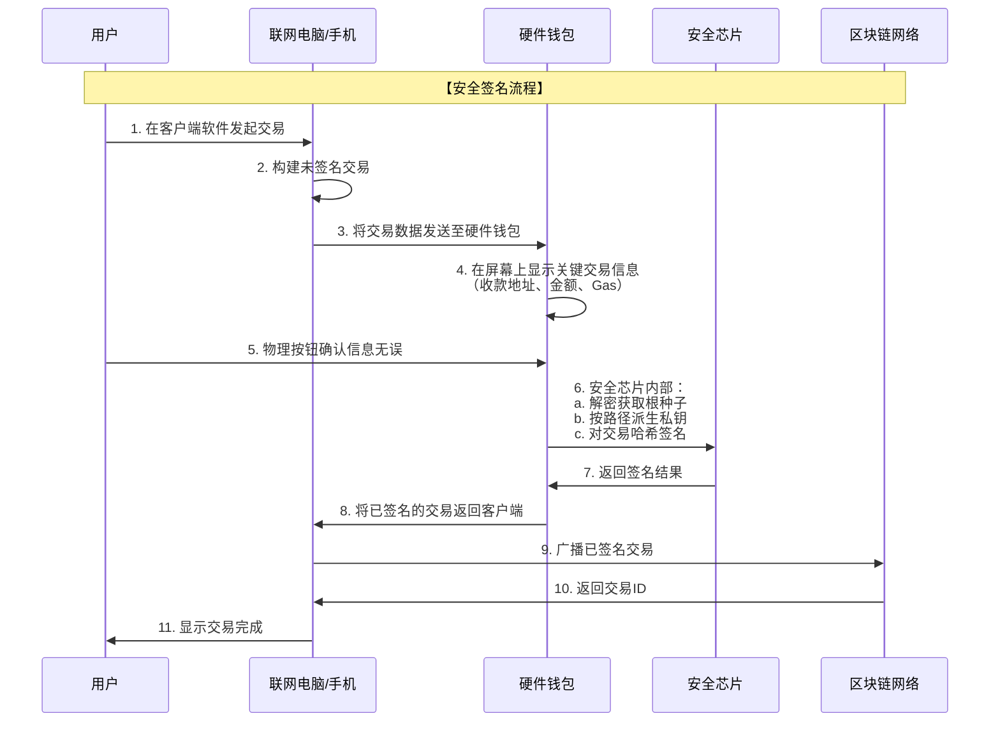

# 硬件钱包底层实现与产品设计

硬件钱包是加密货币安全领域的基石，其设计哲学是在便利性和安全性之间取得极致平衡，核心目标是**确保私钥永不接触联网设备**。

---

### 一、 底层实现

硬件钱包的本质是一个高度专用、功能精简的微型计算机。

#### 1. 核心硬件架构

**A. 安全芯片**
这是硬件钱包的“心脏”，与普通手机/电脑的CPU完全不同。
*   **种类**：
    *   **专用安全元件**：如银行芯片卡、iPhone中的Secure Enclave。为保护敏感数据而专门设计，通过国际通用标准（如CC EAL5+及以上）认证。
    *   **通用安全微控制器**：如STMicroelectronics、NXP等厂商生产的芯片，具备强大的安全特性，是多数硬件钱包的选择。
*   **核心安全特性**：
    *   **物理防篡改**：一旦检测到外壳被打开或物理探测，会自动擦除敏感数据。
    *   **侧信道攻击防护**：抵抗通过分析功耗、电磁辐射、时序等信息推导私钥的攻击。
    *   **安全存储**：芯片内部有独立的、隔离的存储区域（Flash/EEPROM），用于存储私钥和种子，外部无法直接读取。
    *   **真随机数生成器**：用于生成高熵的随机数，这是生成安全助记词的基石。

**B. 主控制器**
*   **作用**：负责运行钱包固件、管理显示屏、处理用户按钮操作、与外部设备通信等通用任务。
*   **与安全芯片的关系**：在高端设计中，主控制器和安全芯片是分离的。私钥相关操作（签名、种子派生）仅在安全芯片内完成，主控制器只负责传递需要签名的交易哈希和显示交易信息供用户确认。这种**隔离架构**更进一步提升了安全性。

**C. 外围组件**
*   **显示屏**：**最关键的安全组件之一**。用于显示接收地址、交易详情、助记词，让用户**独立验证**所有关键信息，不受可能被篡改的电脑屏幕欺骗。
*   **物理按钮**：用于确认交易、输入PIN码。物理按钮难以被软件远程模拟，提供了最终的用户确认权。
*   **连接接口**：
    *   **USB**：最常见，用于连接电脑。
    *   **蓝牙/NFC**：提供移动端便利，但扩大了无线攻击面，因此安全实现更复杂（通常会在特定时段自动关闭）。
    *   **Type-C**：现代标准。

#### 2. 核心软件与密码学实现

**A. 固件**
*   硬件钱包上运行的操作系统和应用软件。它必须是**极简、经过审计、开源为佳**。
*   **功能**：管理设备状态、提供用户界面、与客户端软件（如Ledger Live）通信、调用安全芯片的API执行密码学操作。

**B. 密钥管理**
*   **遵循BIP标准**：
    *   **BIP39**：生成助记词。
    *   **BIP32**：进行分层确定性派生。
    *   **BIP44**：定义多币种派生路径。
*   **种子与私钥的生成和存储**：
    1.  设备首次初始化时，安全芯片内的TRNG生成真随机数（熵）。
    2.  根据BIP39，熵被转换为12/24个助记词，并显示给用户备份。
    3.  助记词通过密钥拉伸（PBKDF2）生成根种子。
    4.  **根种子被安全芯片加密后，存储于其内部安全存储区中。** 完整助记词或种子一旦写入，就永不离开安全芯片。

**C. 交易签名流程**
这是硬件钱包安全模型的核心，其流程如下图所示，确保了私钥的绝对隔离：

请注意，在整个流程中，私钥始终被隔离在安全芯片内部，与联网设备完全隔绝。

---

### 二、 产品设计

硬件钱包的产品设计是安全哲学、用户体验和商业策略的结合。

#### 1. 安全第一的设计哲学

*   **零信任原则**：
    *   不信任连接的计算机。
    *   不信任网络。
    *   只信任设备自身的显示屏和物理按钮。
*   **功能最小化**：硬件钱包只做最关键的事——生成和存储私钥、签名交易。它不运行复杂的操作系统，没有浏览器，没有不必要的功能，这极大减少了被攻击的面。
*   **可验证的执行**：推动固件开源，让社区和安全专家可以审计代码，确保没有后门。

#### 2. 用户体验设计

*   **初始化与备份流程**：
    *   **引导清晰**：首次设置必须强制用户备份助记词，并通常要求用户按顺序点击单词以确认已正确记录。
    *   **隐私保护**：助记词在设备屏幕上显示，绝不通过USB传输。
*   **日常交互**：
    *   **屏幕与确认**：任何一笔交易，都必须让用户能在硬件钱包的屏幕上看到清晰的、未经篡改的交易信息（地址、金额、手续费），并通过物理按钮确认。
    *   **PIN码保护**：设备访问需要PIN码，连续输错会触发设备自锁或数据擦除，防止物理窃取。
*   **恢复流程**：通过输入助记词恢复钱包的流程必须简单可靠，这是用户在设备丢失或损坏后的生命线。

#### 3. 工业与交互设计

*   **坚固与便携**：设备需要小巧、耐用，便于保存和携带。材质选择往往考虑抗腐蚀和一定的抗物理冲击。
*   **屏幕与按键的权衡**：
    *   **基础款**：小屏幕，两个物理按钮（确认/取消），通过滚动浏览信息。成本低，但操作稍繁琐。
    *   **高级款**：更大的触摸屏，提供更丰富的交互和更佳的信息展示，如Ledger Stax、Trezor Model T。成本更高。
*   **连接性**：在安全允许的范围内提供多种连接方式（如USB-C、蓝牙），以满足桌面和移动用户的需求。

#### 4. 商业模式与生态建设

*   **设备销售**：一次性硬件销售是主要收入来源。
*   **配套软件**：提供官方的客户端软件（如Ledger Live, Trezor Suite），集成兑换、质押、DeFi入口等功能，提升用户粘性，并为未来服务收费创造可能。
*   **B2B与企业方案**：向交易所、基金、开发者提供更高级的硬件和SDK，用于机构托管和签名服务。

---

### 三、 不同产品的设计取舍

*   **Trezor (Model One)**：**开源透明性优先**。采用通用MCU而非专用安全元件，依赖软件实现安全。优点是社区信任度高；缺点是物理防篡改性稍弱。
*   **Ledger (Nano S/X)**：**硬件安全优先**。采用其定制开发的专用安全芯片（ST31, ST33）。优点是硬件级防护极强；缺点是“闭源”芯片引发部分极客的信任担忧。
*   **Coldcard**：**比特币极客与偏执安全**。专注比特币，设计上支持完全离线操作（通过MicroSD卡传输交易文件），支持PSBT，带有数字键盘，强调最大程度的空气隔离。

### 总结

一个成功的硬件钱包是其**底层实现**和**产品设计**的完美融合：

*   **底层实现** 提供了安全的基石，通过**安全芯片、隔离架构、极简固件和标准的密码学协议**，构建了一个可信的执行环境。
*   **产品设计** 将这种安全能力转化为用户可感知、可信任、易使用的产品，通过**屏幕、按钮、引导流程和工业设计**，在用户与冷冰冰的密码学之间搭建起一座安全可靠的桥梁。

最终，硬件钱包卖的不仅仅是一个硬件，而是**一种承诺——对用户资产安全至高无上的承诺**。