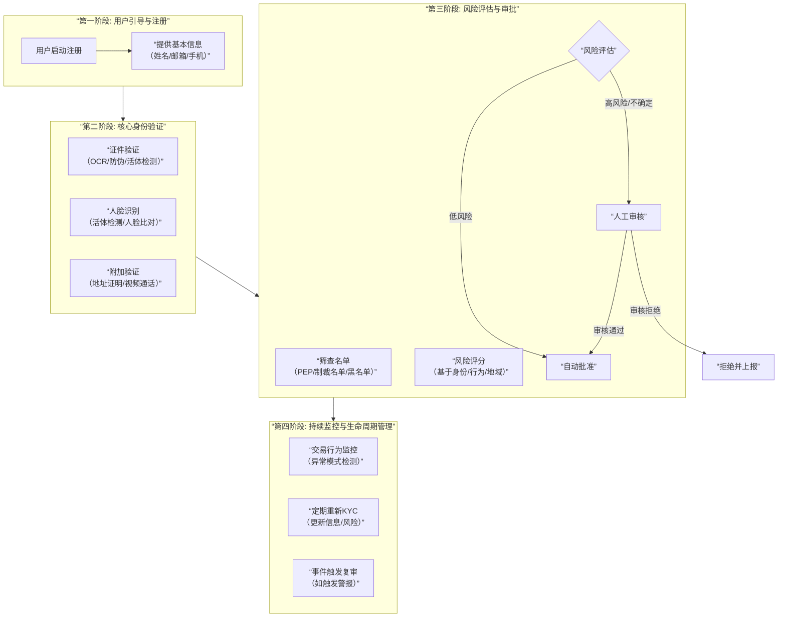

# KYC 产品业务流分析

我们将对 **KYC** 产品的业务流进行全面深入的分析。KYC 是连接传统金融监管与数字世界的关键环节，尤其在加密货币、金融科技和银行业中至关重要。

---

### 一、 KYC 的核心价值与监管背景

#### 1. 核心定义
**KYC** 意为“了解你的客户”。它是一系列流程和技术的集合，旨在**验证客户的身份、评估其风险状况，并持续监控其活动**，以防止金融犯罪。

#### 2. 核心价值与驱动力
*   **合规性与监管要求**：这是最直接的驱动力。全球法规如《银行保密法》、FATF建议、欧盟AMLD等，强制要求金融机构对客户进行尽职调查。
*   **风险管理**：识别和预防**洗钱**、**恐怖主义融资**、**欺诈** 和其他非法活动。
*   **建立信任**：在数字匿名时代，经过验证的身份可以建立更强的商业信任。
*   **业务洞察**：了解客户画像，为个性化服务和产品推荐提供数据支持。

---

### 二、 KYC 全生命周期业务流分析

一个完整的KYC流程远不止一次性的身份验证，而是一个覆盖用户全生命周期的持续过程。其核心业务流程可以通过下图清晰地展示：

---

### 三、 各阶段业务逻辑深度解析

#### 1. 用户引导与数据采集
*   **目标**：以尽可能友好的用户体验收集初始信息。
*   **实现**：
    *   **前端集成**：在网站或App中嵌入KYC SDK，引导用户进入流程。
    *   **数据预填**：利用第三方数据源（如社交账号登录）预填部分信息，减少用户输入。
    *   **清晰说明**：告知用户数据用途和安全保障，提升配合度。

#### 2. 核心身份验证
这是KYC的技术核心，涉及多种验证方式的组合。

*   **证件验证**：
    *   **技术**：用户通过手机摄像头拍摄身份证、护照或驾照。
    *   **后端流程**：
        1.  **OCR**：从证件图片中自动提取文本信息（姓名、身份证号、有效期等）。
        2.  **防伪检测**：通过分析证件上的**摩尔纹**、**紫外光特征**、**全息图**等，判断证件真伪。
        3.  **数据交叉验证**：将提取的信息与官方数据库（如征信机构、政府数据库）进行比对。

*   **生物特征验证 - 人脸识别**：
    *   **活体检测**：确保摄像头前是真人而非照片或视频。技术包括：
        *   **动作指令**：要求用户眨眼、张嘴、摇头。
        *   **静默活体**：通过分析屏幕反光、纹理、3D深度信息来判断。
    *   **人脸比对**：将实时拍摄的人脸照片与证件照进行1:1比对，计算相似度得分。

*   **地址验证**：
    *   要求用户提供最近的水电煤账单、银行对账单等作为证明。
    *   通过OCR技术提取地址信息，或通过API与数据提供商核对。

#### 3. 风险评估与审批
*   **筛查名单**：
    *   将客户信息与全球**制裁名单**、**政治公众人物名单**、**负面新闻**数据库进行比对。
    *   这是**反洗钱** 合规的关键一步。
*   **风险评分引擎**：
    *   基于规则和机器学习模型，为每个客户计算风险分数。
    *   **风险因子**包括：
        *   **身份风险**：证件质量、人脸比对分数。
        *   **地域风险**：来自高风险国家/地区。
        *   **行为风险**：职业、预期交易行为。
*   **审批工作流**：
    *   **自动批准**：风险分数极低的客户，系统自动通过。
    *   **人工审核**：高风险、信息模糊或系统无法判断的案例，会路由到人工审核台。审核员可以要求补充材料或进行视频通话核实。

#### 4. 持续监控与生命周期管理
KYC不是一次性的。法规要求对客户进行持续监控。
*   **交易监控**：
    *   实时分析用户交易行为，检测异常模式（如突然的大额转账、与高风险地区的交易）。
    *   触发警报的案件会由合规团队进行调查。
*   **定期复审**：
    *   对高风险客户进行更频繁的复审（如每年一次），对普通客户也可能有周期性复审（如每3-5年）。
*   **事件触发复审**：
    *   当客户信息更新、交易行为突变或上了新的制裁名单时，系统会自动触发重新KYC。

---

### 四、 KYC 产品的技术架构与关键服务

一个成熟的KYC产品背后是复杂的技术集成。

*   **前端SDK**：提供易于集成的UI组件，处理证件拍摄、人脸捕获等，并保障数据传输安全。
*   **后端微服务**：
    *   **工作流引擎**：定义和驱动KYC流程的各个步骤。
    *   **规则引擎**：执行风险评估规则。
*   **第三方服务集成**：
    *   **身份验证提供商**：如 Jumio, Onfido, Shufti Pro。
    *   **数据提供商**：用于地址验证、PEP和制裁名单筛查（如 LexisNexis, Refinitiv）。
    *   **欺诈检测服务**：用于设备指纹、网络风险分析。
*   **数据安全与隐私**：
    *   **加密**：数据传输和静态数据均需加密。
    *   **匿名化**：在不需要时对个人身份信息进行匿名化处理。
    *   **合规**：严格遵守GDPR、CCPA等数据隐私法规。

---

### 五、 挑战与未来趋势

#### 1. 核心挑战
*   **用户体验与安全性的平衡**：流程过于繁琐会导致用户流失；过于简单则无法满足合规要求。
*   **欺诈技术演进**：深伪技术、高仿真假证等给防伪带来巨大挑战。
*   **全球化合规**：不同司法管辖区的KYC要求差异巨大，产品需要极高的灵活性。
*   **成本**：尤其是人工审核和第三方数据服务的成本高昂。

#### 2. 未来趋势
*   **数字身份**：基于区块链或政府背书的**自我主权身份**（SSI），用户可控制并选择性披露自己的身份信息，无需重复KYC。
*   **无密码认证**：采用**生物识别** 和行为特征进行持续、隐形的身份验证。
*   **AI与自动化的深化**：
    *   更精准的风险评分模型。
    *   AI驱动的文档防伪，能够识别最新的伪造技术。
*   **DeFi与KYC的融合**：
    *   通过**零知识证明** 等技术，实现“验证但不暴露信息”的KYC，满足DeFi世界的隐私和合规需求。

### 总结

KYC产品的业务流本质是：**一个在严格的监管框架下，通过多层次的技术手段，将匿名的用户转化为可信的、风险可量化的数字身份，并对其进行持续管理的复杂系统。**

它不仅是合规的“成本中心”，更是构建**数字信任经济**的基石。未来的KYC将越来越**无缝化、智能化**，从一项令人厌烦的检查，演变为一种保障所有参与者安全与权益的基础服务。