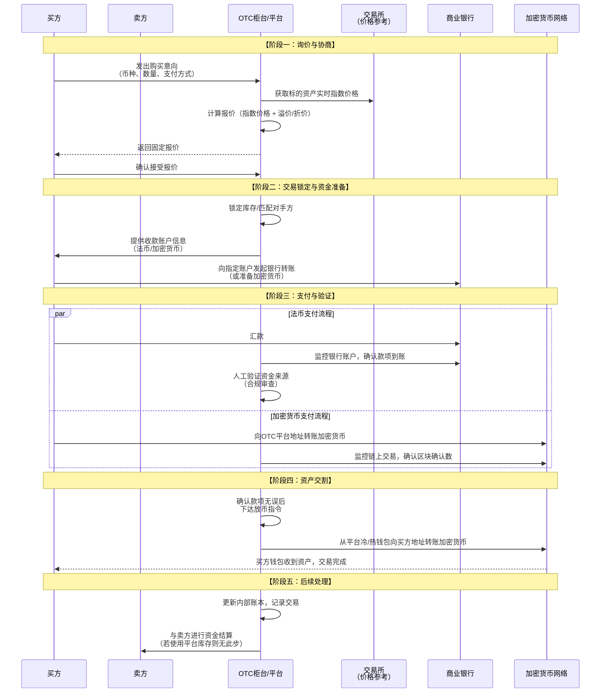

# OTC 产品业务流分析

我们将对**场外交易**（OTC）产品进行深入的业务流分析。OTC市场是加密货币生态中一个巨大但相对隐秘的角落，它服务于那些在订单簿上难以完成的大宗交易。

---

### 一、 OTC 的核心定义与价值主张

#### 1. 核心定义
**场外交易** 是指交易双方**不通过集中的公开订单簿**，而是**直接协商**，一对一达成的交易。在加密货币领域，它通常指通过**OTC柜台**或**OTC平台**进行的大额数字资产买卖。

#### 2. 核心价值主张
*   **避免滑点**：大宗订单在交易所执行会产生巨大的市场冲击成本，导致成交均价远差于预期。OTC通过直接匹配买卖双方，完美解决了这个问题。
*   **价格确定性强**：交易在协商环节就已锁定价格和数量，结果可预测。
*   **隐私保护**：交易细节（如大额买卖方身份、精确数量）不会暴露给公众，符合机构投资者的隐私需求。
*   **法币通道**：许多OTC平台提供丰富的法币支付选项（如银行转账、支付宝、微信支付），是连接传统金融与加密货币世界的重要桥梁。
*   **个性化服务**：OTC柜台提供7x24小时的人工客服，支持复杂交易结构和定制化需求。

---

### 二、 OTC 交易全生命周期业务流分析

一个典型的OTC交易流程，从寻找对手方到最终资金清算，高度依赖人工服务和信用体系。其核心业务流程可以通过下图清晰地展示：

---

### 三、 各阶段业务逻辑深度解析

#### 1. 询价与协商阶段

这是交易的起点，核心是**价格发现**。

*   **业务流程**：
    1.  买方（或卖方）联系OTC平台，提出交易意向，包括：**交易对**（如BTC/USDT）、**数量**（如100 BTC）、**支付方式**（银行转账、支付宝等）。
    2.  OTC交易员根据当前市场情况提供**固定报价**。
*   **底层实现与逻辑**：
    *   **价格基准**：报价通常基于一个或多个主流交易所的**指数价格**（如Bitstamp, Coinbase, Binance的加权平均价）。
    *   **价差**：OTC报价会在指数价格基础上加上一个**溢价**（买方）或减去一个**折价**（卖方）。这个价差是OTC平台的主要利润来源。
    *   **影响因素**：价差大小取决于：
        *   **交易规模**：金额越大，价差可能越优惠。
        *   **市场波动性**：波动越大，价差越宽，以补偿库存风险。
        *   **流动性**：交易币种的流动性越差，价差越宽。
        *   **支付方式**：法币支付（尤其是跨境）的合规成本高，价差可能更宽。

#### 2. 交易锁定与资金准备阶段

一旦价格被接受，交易进入执行准备阶段。

*   **业务流程**：
    1.  OTC交易员在内部系统中**锁定**这笔交易，确保资产或资金不被挪用。
    2.  平台向买方提供**收款账户信息**（可能是对公银行账户、第三方支付账户或加密货币地址）。
*   **底层实现与逻辑**：
    *   **库存管理**：大型OTC平台会持有大量加密货币和法币库存，以即时满足客户需求。交易员需要精准管理库存，避免风险暴露。
    *   **对手方匹配**：如果平台自身库存不足，交易员会在其网络内寻找合适的卖方来匹配这个买方订单。
    *   **信用交易**：对于信誉良好的老客户，平台可能允许**先币后款**（T+1结算），这引入了信用风险。

#### 3. 支付与验证阶段

这是**风险最高**的环节，核心是**防止欺诈和确保资金安全**。

*   **业务流程**：买方按照指示进行付款。
*   **底层实现与逻辑**：
    *   **法币支付**：
        *   **银行转账**：是最主流的方式。OTC平台有多个遍布全球的银行账户，以方便不同地区的客户。
        *   **支付监控**：平台有专人实时监控银行账户，通过API或网银手动查看入账情况。
        *   **合规审查**：**这是关键步骤**。平台会严格核查汇款人姓名是否与OTC账户实名信息一致，以防止洗钱。来自不明第三方的付款会被拒绝。
    *   **加密货币支付**：
        *   **链上监控**：平台监控指定的充值地址，等待交易被区块链网络确认。
        *   **确认数要求**：通常需要达到一定数量的区块确认（如BTC需要3-6个确认）后才视为到账，防止双花攻击。

#### 4. 资产交割阶段

这是交易的收官环节，核心是**履行合约**。

*   **业务流程**：平台确认收到全额款项后，向买方释放加密货币。
*   **底层实现与逻辑**：
    *   **人工审核**：在自动化程度不高的平台，由交易员人工核对所有信息无误后，才从平台钱包发起转账。
    *   **自动化执行**：一些先进的平台实现了**“链上原子交换”** 或与合规支付网关的API直连，可以在确认法币到账后自动放币，提升效率和安全性。
    *   **钱包安全**：放币通常从**热钱包**（小额）或经过人工审批从**冷钱包**（大额）发出。

#### 5. 后续处理阶段

交易完成后的后台工作。

*   **结算对账**：平台财务更新内部账本，确保资产和法币的准确记录。
*   **与对手方结算**：如果交易动用了外部流动性提供商，平台需要与该提供商进行资金结算。
*   **客户关系管理**：记录客户偏好和交易历史，以便提供更好的服务。

---

### 四、 OTC 的不同模式

#### 1. OTC 柜台模式
*   **描述**：如Coinbase、Binance、Huobi等大型交易所旗下的OTC服务。平台自身作为交易对手方或直接匹配双方。
*   **特点**：提供标准化的流程和担保，安全性高。

#### 2. 点对点平台模式
*   **描述**：如LocalBitcoins、Paxful。平台作为信息发布和仲裁的中介，交易在用户间直接进行。
*   **特点**：更自由，支付方式多样，但风险较高，需要仔细筛选交易对手的信誉。

---

### 五、 关键风险与挑战

1.  **交易对手风险**：
    *   **欺诈**：买方支付了伪造的银行回单；卖方收到法币后不释放加密货币。
    *   **解决方案**：严格的KYC/AML、使用托管服务、与信誉良好的机构合作。

2.  **合规与监管风险**：
    *   OTC是反洗钱和反恐怖主义融资监管的重点。平台必须投入巨大资源进行合规审查。

3.  **资金安全风险**：
    *   平台持有的法币和加密货币库存都是黑客攻击的目标。
    *   **解决方案**：绝大多数资产存放在冷钱包，与多家银行合作分散法币风险。

4.  **信用风险**：
    *   在T+1结算中，客户可能违约。
    *   **解决方案**：仅对经过严格审查的机构客户开放信用额度。

### 总结

OTC产品的业务流本质是：**一个以信用为基础、以人工服务为核心、通过非公开协商方式，为大宗交易提供流动性并管理复杂线下流程的金融服务。**

其核心价值在于：
*   **业务层**：通过**规避滑点**和**提供隐私**，服务于**机构和高净值客户**的大额交易需求。
*   **操作层**：通过**精细化的法币与加密货币支付处理**和**严格的合规风控**，构建了连接传统金融与加密世界的**信任桥梁**。
*   **经济层**：通过**买卖价差**和**手续费**盈利，同时承担着**库存管理**和**信用风险**。

OTC市场是加密货币生态系统走向成熟和机构化不可或缺的基石，它处理着远比公开订单簿更大的交易量，其稳定运作对整个行业的健康发展至关重要。