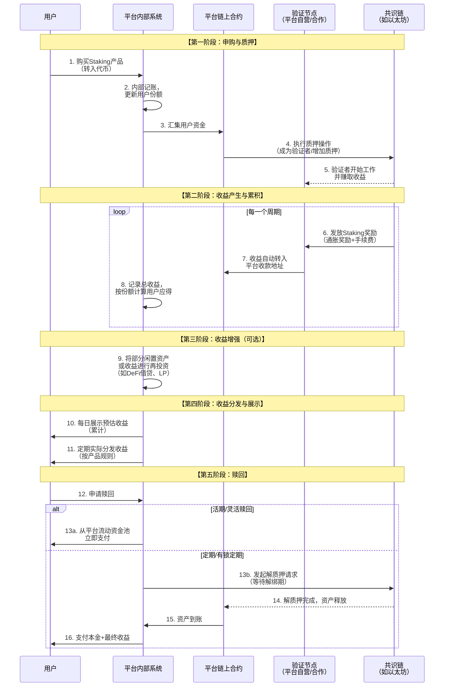

# Staking 理财产品业务流分析

我们将对 **Staking 理财产品** 进行深入的业务流分析。这不仅仅是简单的“存币生息”，其背后是一套连接用户、平台、公链和节点运营商的复杂金融系统。

---

### 一、 Staking 理财的核心定义与价值主张

#### 1. 核心定义
Staking 理财是一种**托管式**或**半托管式**的金融服务。用户将持有的、支持权益证明共识机制的代币（如 ETH, SOL, DOT）委托给一个理财平台，由平台代表用户进行 **Staking（质押）** 操作，并将获得的**质押收益**（以及可能的其他额外收益）分配给用户。

#### 2. 核心价值主张
*   **对用户**：
    *   **零技术门槛**：无需自己运行节点，无需理解复杂的私钥管理和命令行操作。
    *   **高灵活性**：提供“活期”或“定期”等多种产品，解决原生Staking的资产锁定期问题。
    *   **更高收益潜力**：平台可能通过再投资、DeFi组合等策略提升综合收益。
*   **对平台**：
    *   **管理费收入**：从用户收益中抽取一定比例作为服务费。
    *   **聚集流动性**：管理大量资产，增强其在生态中的影响力和议价能力。

---

### 二、 Staking 理财产品全生命周期业务流分析

一个完整的Staking理财业务流程，涉及用户、平台、节点和区块链网络多个参与方，其核心生命周期可以通过下图清晰地展示：

---

### 三、 各阶段业务逻辑深度解析

#### 1. 申购与质押阶段

此阶段的目标是汇集用户资金并参与链上质押。

**A. 用户申购**
*   **业务流程**：用户在平台选择特定的Staking理财产品（如“ETH灵活质押”），输入金额并确认。
*   **底层实现**：
    *   用户授权平台从其交易账户中划转资产至平台的**托管地址**。
    *   平台在内部数据库为用户创建一条记录，记为用户持有的“产品份额”。这类似于购买了一份基金。

**B. 资金汇集与质押**
*   **业务流程**：平台将众多用户的零散资金汇集起来，达到公链要求的最低质押门槛（如以太坊需要32 ETH），然后代表用户进行质押。
*   **底层实现**：
    *   **平台自营节点**：平台使用汇集的资金运行自己的验证者节点。这是最主流的模式。
    *   **委托给节点服务商**：平台将资金委托给专业的节点服务商（如Figment, Chorus One），由后者负责技术运维。
    *   **链上操作**：无论是哪种模式，最终都需要在PoS公链上发起一笔质押交易，将ETH等资产存入官方的质押合约。

#### 2. 收益产生与累积阶段

这是价值创造的核心环节。

**A. Staking 基础收益**
*   **来源**：
    *   **通胀奖励**：区块链网络为激励质押行为而新发行的代币。
    *   **交易手续费**：验证者打包交易获得的手续费分成。
*   **底层实现**：
    *   验证者节点正常履行职责（出块、 attestation），网络会自动将奖励发放到验证者对应的收款地址。
    *   平台需要监控所有自己运营或合作的验证者节点的**在线率和表现**，因为节点掉线或作恶会导致**罚没**，减少甚至扣减本金。

**B. 收益计算与归属**
*   **业务流程**：平台需要公平地将总收益分配给每个用户。
*   **底层实现**：
    *   **份额法**：这是最主流和公平的方法。平台将整个资金池视为一个基金，每个用户拥有一定的“份额”。
    *   **每日收益计算**：`用户当日收益 = (总资金池当日总收益 / 总份额) * 用户持有份额`
    *   **年化收益率展示**：`APY = (近七日年化总收益 / 总质押价值) * 365 * 100%`。这是一个预估值。

#### 3. 收益增强阶段

为了提供更具竞争力的收益率，许多平台会进行收益增强操作。

*   **策略**：
    *   **流动性Staking代币**：平台将质押后获得的LST（如stETH）投入到其他DeFi协议中赚取额外收益，例如：
        *   将stETH存入Aave/Compound进行借贷。
        *   为stETH-ETH交易对提供流动性，赚取手续费。
    *   **再投资**：将产生的Staking收益自动进行复投，实现利滚利。
*   **风险**：此环节引入了**智能合约风险**和**DeFi协议风险**。如果使用的DeFi协议被黑客攻击或出现故障，可能导致资金损失。

#### 4. 收益分发与展示阶段

*   **业务流程**：用户在前端实时看到自己的累计收益，并定期收到实际分发。
*   **底层实现**：
    *   **展示**：前端通过API从平台数据库获取用户的最新份额和累计收益数据，进行可视化展示。这部分是“预估”收益。
    *   **分发**：
        *   **每日分发**：最常见的方式，每天固定时间将前一天的收益直接发放到用户的平台账户。
        *   **复投**：部分产品提供“收益复投”选项，将每日收益自动转换为新的产品份额。

#### 5. 赎回阶段

这是用户体验的关键，核心是解决**原生Staking锁定期**与**理财产品灵活性**之间的矛盾。

*   **业务流程**：用户发起赎回申请，取回本金和收益。
*   **底层实现与两种模式**：
    *   **灵活赎回（活期）模式**：
        *   **逻辑**：平台建立一个**流动资金池**。当用户赎回时，并不需要真正从链上解质押，而是直接从资金池中支付给用户。
        *   **实现**：后来的用户申购资金可以补充这个资金池。这本质上是一种“资金池”模式，依赖于平台的兑付能力和良好的风控。
        *   **优势**：用户体验极佳，即时到账。
        *   **风险**：如果发生大规模挤兑，平台流动资金枯竭，会引发流动性危机。

    *   **定期赎回（有锁定期）模式**：
        *   **逻辑**：更贴近链上现实。用户赎回时，平台真正在链上发起解质押操作。
        *   **实现**：用户需要等待公链的**解绑期**。例如，以太坊验证者退出后需要等待数小时至数天才能取回资金。
        *   **优势**：模式真实，无挤兑风险。
        *   **劣势**：用户体验差，资金流动性受限。

---

### 四、 关键风险与风控措施

1.  **智能合约风险**：平台合约或使用的DeFi协议可能存在漏洞。
    *   **风控**：代码审计、资金保险、多签管理。

2.  **节点运营风险**：节点掉线或作恶导致罚没。
    *   **风控**：自建多节点、分散地理分布、选择信誉良好的节点服务商、设立保险基金。

3.  **流动性风险**：在灵活赎回模式下，遭遇挤兑。
    *   **风控**：保持充足的准备金率、设置单日赎回限额、在极端情况下启用“延迟赎回”条款。

4.  **中心化风险**：资金和权力集中在平台手中。
    *   **风控**：选择透明度高的平台，查看其质押地址和资金流。

5.  **监管风险**：Staking服务可能被认定为证券发行。

### 总结

Staking理财产品的业务流本质是：**一个通过中心化或半中心化的方式，将零散的PoS资产汇集起来，通过规模效应和专业运营参与区块链网络共识，并将产生的收益（及通过金融工程增强的收益）分配给用户，同时通过资金池或链上操作管理流动性需求的金融创新产品。**

其核心价值在于：
*   **用户层**：通过**极致简化**和**流动性创新**，解决了普通用户参与Staking的**高门槛**和**低流动性**痛点。
*   **平台层**：通过**规模效应**和**收益增强策略**，创造了高于普通Staking的**价值空间**，并从中获利。
*   **生态层**：为PoS公链带来了**更稳定的验证者集**和**更广泛的社区参与**。

未来，随着监管的明确和技术的成熟，Staking理财产品将朝着**更透明、更去信任化**（如基于LST）、以及**与DeFi更深度结合**的方向演进。