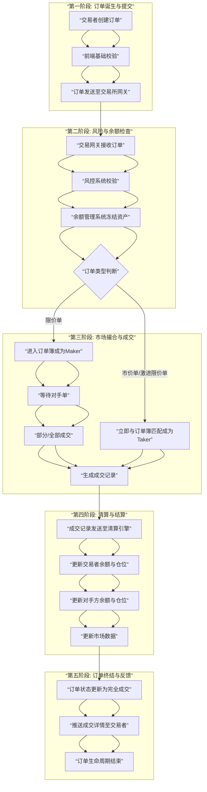

# 一笔交易在交易所中的完整生命周期

我们来深入解析**一笔交易在交易所中的完整生命周期**。这个过程犹如一场精密的交响乐，涉及前端、风控、撮合、清算等多个系统的协同工作。

为了更直观地展示这一复杂流程，我们可以通过下图一览交易生命的全景：

---

### **各阶段深度解析**

#### **第一阶段：订单诞生与提交 (Order Creation & Submission)**

1.  **订单创建**：
    *   交易者在交易所的前端界面（网站/App）或通过API设置订单参数：**交易对**（如BTC/USDT）、**方向**（买入/卖出）、**类型**（限价单/市价单）、**价格**、**数量**、**杠杆**（如是合约交易）。

2.  **前端校验**：
    *   进行最基本的检查，例如价格和数量是否为正数、格式是否正确。这是一个快速的前端过滤层。

3.  **提交至网关**：
    *   订单被加密后，通过WebSocket或REST API发送到交易所的**交易网关**。

#### **第二阶段：风险与余额检查 (Risk & Balance Check)**

1.  **网关接收**：
    *   交易网关是订单进入交易所核心系统的第一入口。它进行反垃圾处理，并对API用户进行身份验证。

2.  **风控系统校验**：
    *   订单被传递到**风险控制系统**，进行一系列关键检查：
        *   **频率限制**：防止DDoS攻击和API滥用。
        *   **价格合理性**：检查限价单价格是否偏离当前市场价格过远（例如，低于市价50%的买单）。
        *   **黑名单检查**：检查用户或IP地址是否在黑名单中。
        *   **合约风险检查**：对于杠杆或合约交易，检查杠杆倍数是否合规、仓位是否超限。

3.  **余额检查与冻结**：
    *   订单通过风控后，进入**账户管理系统**。
    *   系统检查用户相应账户是否有**足够的可用余额**。
        *   **卖出BTC**：检查BTC现货账户余额。
        *   **买入BTC**：检查USDT现货账户余额。
        *   **开多仓合约**：检查保证金账户的可用保证金。
    *   **关键步骤**：如果余额充足，系统会**立即冻结**订单所需的资产。这确保了“同一笔钱不会被花两次”，是保证财务完整性的核心。

4.  **路由至撮合引擎**：
    *   所有检查通过后，订单被赋予一个唯一的`orderId`和时间戳，然后被发送到**撮合引擎**。

#### **第三阶段：市场撮合与成交 (Matching & Execution)**

这是订单生命的核心阶段，在**撮合引擎**中完成。

1.  **进入订单簿**：
    *   **如果是一个限价单，且其价格无法立即成交**（例如，一个买单价低于当前最低卖单价），它会被录入**订单簿**。此时，它作为一个**Maker**订单，为市场提供流动性。

2.  **撮合匹配**：
    *   **如果是一个市价单，或一个激进的限价单**（例如，一个买单价高于或等于当前最低卖单价），它会立即与订单簿中最佳的对手方订单进行匹配。
    *   **匹配规则**：严格遵循 **“价格优先，时间优先”** 原则。
        *   **价格优先**：更高价的买单和更低价的卖单优先成交。
        *   **时间优先**：在同一价格水平下，先进入订单簿的订单优先成交。

3.  **生成成交记录**：
    *   一旦订单匹配成功，就会生成一条不可变的**成交记录**，包含成交价格、数量、买卖双方、成交时间等。一笔订单可能被拆分成多笔成交记录，与多个对手方完成交易。

#### **第四阶段：清算与结算 (Clearing & Settlement)**

1.  **清算引擎处理**：
    *   成交记录被实时发送到**清算系统**。
    *   该系统负责：
        *   **更新余额**：解除冻结的资产，并进行最终的资产划转。
            *   **对于现货交易**：买方账户增加BTC、减少USDT；卖方账户减少BTC、增加USDT。
            *   **对于合约交易**：更新双方的仓位价值和未实现盈亏，并计算保证金比率。
        *   **计算费用**：扣除交易手续费（通常是Taker费率高，Maker费率低或为负）。
        *   **记录流水**：将所有账目变更记录入数据库。

2.  **更新市场数据**：
    *   成交价格和数量被实时推送到**行情系统**。
    *   该系统据此更新：
        *   **K线图**
        *   **最新成交价**
        *   **订单簿深度**（如果成交吃掉了某个价位的所有订单）
        *   **24小时交易量**

#### **第五阶段：订单终结与反馈 (Finalization & Feedback)**

1.  **订单状态更新**：
    *   订单进入最终状态：
        *   **完全成交**：订单数量已全部完成。
        *   **部分成交**：订单部分完成，剩余部分仍留在订单簿中（如果是限价单）。
        *   **已撤销**：交易者在订单完全成交前主动取消了它。
        *   **已失效**：订单因过期或其他原因未能成交。

2.  **通知用户**：
    *   通过WebSocket或API回调，将订单的最终状态和所有成交详情实时推送给交易者。交易者在前端界面看到订单状态变为“完全成交”并看到具体的成交列表。

3.  **生命周期结束**：
    *   至此，这笔交易的生命周期正式结束。它的所有数据都被永久记录在交易所的数据库中，可供用户查询和平台审计。

### **总结**

一笔交易的生命周期，是一个在**毫秒甚至微秒级别**内完成的、涉及**多个高可用、低延迟分布式系统**协同工作的精密过程。它完美地体现了金融科技对**安全性、一致性和性能**的极致追求。任何一个环节的失误，都可能导致巨大的财务损失或系统崩溃，因此这套流程的设计与实现，是每一家交易所最核心的技术壁垒。