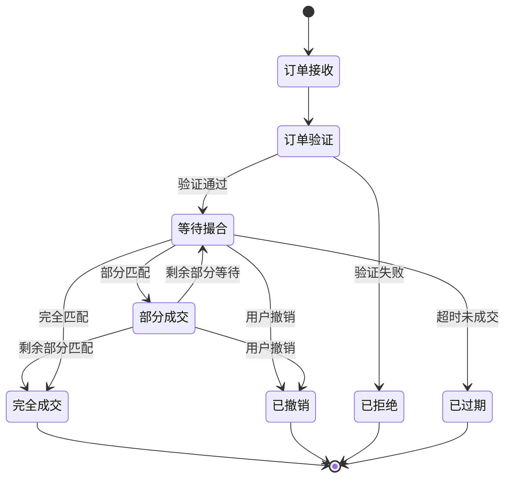

# 交易所统一账户与经典账户产品业务流分析

我们专门深入探讨撮合引擎的两个核心子系统：**订单管理** 和 **匹配策略**。这两者共同构成了交易公平与效率的基石。

---

### 一、 订单管理：订单簿的微观世界

订单管理负责订单从进入系统到离开（成交/撤销）的整个生命周期。其核心是**订单簿数据结构的实现**。

#### 1. 订单的生命周期

一个订单在系统中的典型生命周期如下：



#### 2. 订单簿的核心数据结构实现

订单簿需要支持两种主要操作：
*   **查询**：快速获取最优买/卖价
*   **更新**：快速增删改订单

**经典实现方案**：

*   **价格层级管理**：
    *   **数据结构**：使用**红黑树**或**跳跃表**。
    *   **键**：价格
    *   **值**：该价格对应的订单队列
    *   **为什么选择它们**？
        *   **红黑树**：保证最坏情况下的O(log n)性能，稳定可靠。
        *   **跳跃表**：平均O(log n)性能，在并发环境下更容易实现。

*   **订单队列管理**：
    *   **数据结构**：在每个价格层级下，使用**双向链表**或**FIFO队列**。
    *   **为什么选择链表**？
        *   **O(1)插入**：新订单直接插入尾部。
        *   **O(1)删除**：订单成交或撤销时，可直接从链表中移除。
        *   **保持时间顺序**：天然满足"时间优先"规则。

**代码级示例**：
```python
# 简化的订单簿结构
class OrderBook:
    def __init__(self):
        # 买盘和卖盘使用红黑树管理价格层级
        self.bids = RedBlackTree()  # 价格从高到低
        self.asks = RedBlackTree()  # 价格从低到高
        
    class PriceLevel:
        def __init__(self, price):
            self.price = price
            self.orders = LinkedList()  # 该价格下的订单链表
            self.total_volume = 0      # 该价格层总数量

    class Order:
        def __init__(self, order_id, is_buy, price, quantity, timestamp):
            self.order_id = order_id
            self.is_buy = is_buy
            self.price = price
            self.quantity = quantity
            self.remaining = quantity
            self.timestamp = timestamp
```

#### 3. 高级订单类型的管理

*   **冰山订单**：
    *   **实现**：维护一个"显示量"和一个"隐藏量"。
    *   **管理**：当显示量被完全成交后，自动补充新的显示量，直到隐藏量耗尽。
    *   **数据结构**：在订单队列中，只存储显示的部分。

*   **止损单**：
    *   **实现**：不直接进入订单簿，而是存储在独立的"条件订单表"中。
    *   **触发**：有专门的市场数据监听器，当市场价格触及止损价时，将其转为市价单或限价单送入主订单簿。

---

### 二、 匹配策略：市场规则的体现

匹配策略定义了订单如何相互匹配的规则。虽然"价格优先、时间优先"是基础，但实际实现中有多种变体和优化。

#### 1. 基础匹配算法

**限价单匹配逻辑**：
```python
def match_limit_order(new_order, orderbook):
    """匹配新限价单的核心算法"""
    if new_order.is_buy:
        # 买单：寻找卖盘中价格 <= 买单价格的订单
        opposing_side = orderbook.asks
        price_condition = lambda opp_price: opp_price <= new_order.price
    else:
        # 卖单：寻找买盘中价格 >= 卖单价格的订单
        opposing_side = orderbook.bids  
        price_condition = lambda opp_price: opp_price >= new_order.price
    
    # 按价格优先顺序遍历对手方订单簿
    for price_level in opposing_side.in_order():
        if not price_condition(price_level.price):
            break  # 没有更优价格了
            
        # 在该价格层级内按时间优先匹配
        for opposing_order in price_level.orders:
            if new_order.remaining == 0:
                return  # 新订单已完全成交
                
            # 计算可成交数量
            trade_quantity = min(new_order.remaining, opposing_order.remaining)
            
            # 执行成交
            execute_trade(new_order, opposing_order, trade_quantity, price_level.price)
            
            # 更新订单剩余数量
            new_order.remaining -= trade_quantity
            opposing_order.remaining -= trade_quantity
            
            # 如果对手方订单完全成交，从订单簿移除
            if opposing_order.remaining == 0:
                remove_from_orderbook(opposing_order)
    
    # 如果新订单还有剩余，将其加入订单簿
    if new_order.remaining > 0:
        add_to_orderbook(new_order)
```

#### 2. 高级匹配策略

**1. 连续竞价 vs 集合竞价**

| 特性         | **连续竞价** | **集合竞价**           |
| ------------ | ------------ | ---------------------- |
| **匹配时机** | 订单随到随撮 | 特定时间点集中撮合     |
| **价格形成** | 多个成交价格 | 单一成交价格           |
| **适用场景** | 连续交易时段 | 开盘、收盘、流动性差时 |

**集合竞价的价格发现算法**：
```python
def call_auction_matching(buy_orders, sell_orders):
    """集合竞价：寻找最大成交量的价格"""
    best_price = None
    max_volume = 0
    
    # 尝试所有可能的成交价格
    for candidate_price in all_possible_prices:
        # 计算在该价格下的总成交量
        buy_volume = sum(order.quantity for order in buy_orders 
                        if order.price >= candidate_price)
        sell_volume = sum(order.quantity for order in sell_orders 
                         if order.price <= candidate_price)
        trade_volume = min(buy_volume, sell_volume)
        
        # 寻找能实现最大成交量的价格
        if trade_volume > max_volume:
            max_volume = trade_volume
            best_price = candidate_price
        elif trade_volume == max_volume:
            # 成交量相同时，选择最接近参考价的价格
            best_price = choose_closest_to_reference(candidate_price, best_price)
    
    return best_price, max_volume
```

**2. 专业市场的高级策略**

*   **按比例分配**：
    *   **场景**：在单一价格上，买单总量 > 卖单总量（或反之）。
    *   **策略**：不按严格时间优先，而是按订单数量比例分配成交机会。
    *   **公式**：`每个订单的成交数量 = 订单数量 × (总成交量 / 总订单量)`

*   **最小剩余量优先**：
    *   **场景**：订单部分成交后产生"零股"。
    *   **策略**：优先匹配能产生最小剩余量的订单组合，减少订单簿碎片。

#### 3. 特殊市场结构

*   **做市商优先**：
    *   在某些市场，做市商的订单享有有限的优先权，以奖励其提供流动性。
    
*   **Dark Pools（暗池）**：
    *   **匹配策略**：不显示订单簿，在固定时间点以中间价（如买卖中间价）匹配。
    *   **优势**：减少市场冲击，适合大额交易。

---

### 三、 性能优化技术

#### 1. 内存管理优化
*   **对象池**：预分配订单对象，避免频繁的内存分配和垃圾回收。
*   **内存预取**：根据访问模式预加载数据到CPU缓存。

#### 2. 锁优化
*   **细粒度锁**：
    ```python
    # 不好的做法：锁整个订单簿
    with orderbook_lock:
        process_order(order)
    
    # 好的做法：只锁需要的价格层级
    price_level = orderbook.get_price_level(price)
    with price_level.lock:
        process_order_at_price(order, price_level)
    ```

#### 3. 批量处理
*   对多个订单进行批量验证和风险检查。
*   批量更新市场数据推送。

---

### 四、 实际案例：不同市场的差异

| 市场         | **股票市场**               | **外汇市场**              | **加密货币**        |
| ------------ | -------------------------- | ------------------------- | ------------------- |
| **主要匹配** | 价格时间优先               | 价格时间优先 + 按比例分配 | 价格时间优先        |
| **特殊规则** | 最小报价单位、开盘集合竞价 | Last Look（最后观望）     | Maker-Taker费用模型 |
| **订单类型** | 丰富（冰山、条件单）       | 相对简单                  | 日益丰富            |

### 总结

订单管理和匹配策略是撮合引擎的**灵魂与大脑**：

*   **订单管理** 关注的是**如何高效组织数据** - 通过精心设计的数据结构（红黑树+链表）来保证订单的快速查找、插入和删除。

*   **匹配策略** 关注的是**如何定义市场规则** - 通过精确的算法来实现价格发现和公平交易，从基础的价格时间优先到复杂的集合竞价和比例分配。

一个优秀的撮合引擎需要在**极致的性能**和**灵活的规则支持**之间找到平衡。理解这两者的深度实现，是构建高性能交易系统的关键。