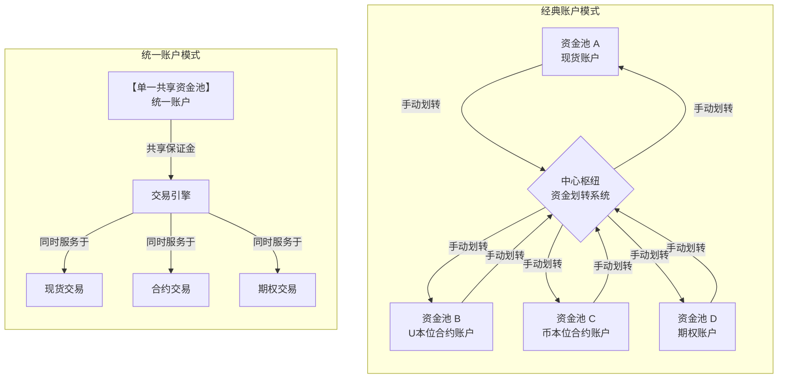

# 交易所统一账户与经典账户产品业务流分析

好的，这是一个非常专业和核心的金融产品设计问题。我们来深入分析**交易所统一账户**与**经典账户**在产品业务流上的差异。

### **核心概念定义**

1.  **经典账户模式**
    *   也称为“隔离账户模式”。用户拥有多个独立的子账户，如**现货账户**、**杠杆账户**、**合约账户（U本位、币本位）**、**期权账户**等。
    *   资金在这些账户之间是**隔离**的。要进行不同产品的交易，用户必须**手动进行资金划转**。

2.  **统一账户模式**
    *   用户只有一个**主账户**，该账户形成一个共享的资产池。
    *   这个资产池中的资金可以作为**保证金**，同时用于**现货、杠杆、合约、期权**等多种业务线的交易。
    *   实现了**保证金共享**和**跨品种对冲**，无需或大幅减少了手动划转操作。

---

为了更直观地理解这两种模式的根本区别，我们可以从用户和交易所两个视角来看待资金和风险的管理方式：

上图清晰地展示了两种模式的核心架构差异：**经典模式是“资金划转”为核心的多池隔离架构，而统一模式是“保证金共享”为核心的单一池架构**。这种根本性的区别，具体体现在以下完整的业务流中：

### **二、核心业务流对比分析**

我们以一个用户想同时进行现货和合约交易的典型场景来对比。

#### **场景：用户入金10000 USDT，希望用5000 USDT买现货BTC，同时用5000 USDT作为保证金开BTC合约多单。**

---

#### **经典账户模式业务流**

1.  **开户/入金**
    *   用户注册后，系统自动创建多个隔离账户（现货、杠杆、合约等）。
    *   用户充值10000 USDT到他的**资金账户**或默认的**现货账户**。

2.  **资金划转**
    *   用户需要手动操作，将5000 USDT从**现货账户**划转至**U本位合约账户**。
    *   **业务流：** `用户发起划转指令 -> 交易所校验两个账户余额 -> 现货账户-5000 USDT， 合约账户+5000 USDT -> 划转完成`。

3.  **交易操作**
    *   **现货交易：** 在**现货账户**中，使用剩余的5000 USDT下单购买BTC。
    *   **合约交易：** 在**U本位合约账户**中，使用划转过来的5000 USDT作为保证金，开立BTC/USDT永续合约多单。

4.  **风险与盈亏结算**
    *   **风险隔离：** 两个账户风险完全独立。
        *   现货BTC价格下跌，只会影响现货账户的资产价值。
        *   合约爆仓，只会损失合约账户中的5000 USDT保证金，不会波及到现货账户的BTC。
    *   **盈亏结算独立：**
        *   现货账户：获得BTC，减少USDT。
        *   合约账户：盈亏实时结算在合约账户的USDT余额中。

5.  **提现**
    *   用户如果想提现合约账户的盈利，需要先将盈利**从合约账户划转回现货账户**，然后从现货账户提现。

**经典模式痛点：**
*   **操作繁琐：** 频繁划转，体验割裂。
*   **资金效率低下：** 资金分散在各个“孤岛”中，无法形成合力。例如，合约账户爆仓时，现货账户的BTC无法作为补充保证金。
*   **无法自动对冲：** 持有的现货BTC和合约空头头寸的风险无法自动抵消，需要分别管理。

---

#### **统一账户模式业务流**

1.  **开户/入金**
    *   用户注册后，只有一个**统一账户**。
    *   用户充值10000 USDT直接进入该统一账户的资产池。

2.  **资金划转**
    *   **无需划转！** 所有资金都在一个池子里。

3.  **交易操作**
    *   **现货交易：** 用户直接下单购买5000 USDT的BTC。交易后，账户资产变为：BTC (约5000 USDT等值) + 5000 USDT。
    *   **合约交易：** 用户直接开立BTC/USDT永续合约多单，系统会自动从共享的资产池中**分配**5000 USDT作为该笔合约的“占用保证金”。
    *   **此时账户总览：**
        *   总权益： ≈ 10000 USDT
        *   可用保证金： 0 USDT (因为5000 USDT买了现货，5000 USDT被合约占用)
        *   持仓：现货BTC + 合约BTC多单

4.  **风险与盈亏结算**
    *   **统一的风险核算：**
        *   系统将用户的所有资产（BTC和USDT）和所有持仓（现货、合约）合并计算为一个**投资组合**。
        *   **风险核心指标：**
            *   **整体保证金率：** 基于整个投资组合计算。
            *   **跨品种对冲：** 如果用户同时持有现货BTC和合约空头，这部分风险会相互抵消，从而**释放出大量保证金**。
    *   **盈亏统一结算：** 所有交易的盈亏都实时反映在统一的资产池中，直接影响总权益。

5.  **提现**
    *   用户可以直接提现账户中的**可用余额**，无需任何内部划转。

**统一模式优势：**
*   **极致操作体验：** 一个账户交易所有产品，无缝切换。
*   **资金效率极高：** 所有资产共享作为保证金，避免了资金的闲置和碎片化。
*   **自动风险对冲：** 系统自动识别对冲头寸，降低保证金要求，鼓励用户进行风险管理。
*   **更优的爆仓风险：** 因为所有资产都作为担保，爆仓门槛相对提高（当然，如果全仓高杠杆，风险也更大）。

---

### **三、产品设计核心差异总结**

| 维度             | 经典账户模式                         | 统一账户模式                                           |
| :--------------- | :----------------------------------- | :----------------------------------------------------- |
| **账户结构**     | 多账户隔离，资金分散                 | 单一账户，资产池共享                                   |
| **资金划转**     | **必需且频繁**，用户体验的核心痛点   | **无需或极少需要**，操作流畅                           |
| **保证金机制**   | 隔离保证金，风险不互通               | **跨业务线共享保证金**，资金效率高                     |
| **风险计算**     | 分账户独立计算保证金和爆仓线         | **投资组合级统一风控**，计算整体风险度                 |
| **风险对冲**     | 无法自动识别和对冲，需要用户手动管理 | **自动识别跨品种对冲**，降低保证金需求                 |
| **清算机制**     | 分账户单独清算                       | 统一清算，可能“牺牲”部分资产以保全整个账户             |
| **用户认知成本** | 较低，易于理解（各账户独立）         | 较高，需要理解投资组合和统一风控的概念                 |
| **交易所复杂度** | 相对较低，系统架构简单               | **极高**，需要强大的风险引擎实时计算复杂投资组合的风险 |

---

### **四、发展趋势与选择建议**

*   **趋势：** **统一账户是绝对的主流和未来趋势**。顶级交易所（如Binance, OKX, FTX曾引领）均已推出并大力推广其统一账户模式，因为它极大地提升了用户体验和资金效率，构成了强大的产品竞争力。

*   **选择建议：**
    *   **对于交易所：** 如果不具备顶尖的**实时风险引擎**技术能力，贸然推出统一账户风险极高。可以从简单的“统一现货与杠杆”开始，逐步迭代。
    *   **对于用户：**
        *   **新手/保守型用户：** 可以从经典账户开始，风险可控，易于理解。
        *   **专业/活跃交易者：** **强烈推荐使用统一账户**。它能让你进行更复杂的策略（如期现套利），并最大化资金利用效率。但必须深刻理解其**统一风控**规则，避免因一个头寸的失误导致整个账户被清算。

**总结：** 从经典账户到统一账户的演进，是交易所产品从“功能堆砌”到“体验与效率驱动”的质变。它不仅仅是UI/UX的改进，更是底层清算、风控和资产管理系统的一次彻底重构。