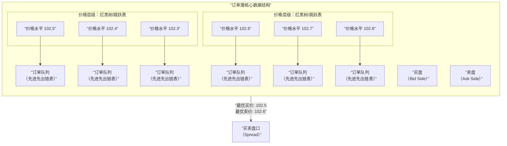
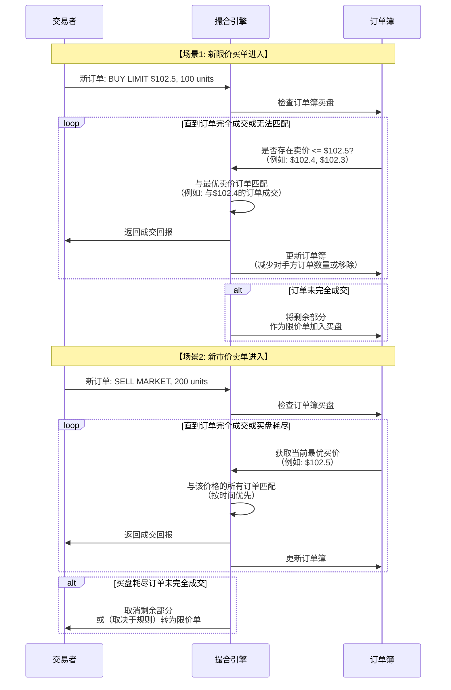

# 交易系统撮合引擎底层实现逻辑

我们来对交易系统中最核心、最复杂的组件——**撮合引擎**——进行深入的底层实现逻辑分析。它被誉为交易系统的“心脏”，决定了交易的公平、效率和稳定性。

---

### 一、 核心目标与基础概念

#### 1. 撮合引擎的核心目标
在保证**公平性**和**正确性**的前提下，以**最低的延迟**和**最高的吞吐量**，将买卖双方的订单进行匹配，完成交易。

#### 2. 基础概念
*   **订单簿**：当前所有未成交的**限价单**的集合，分为**买盘** 和**卖盘**。
    *   **买盘**：按**价格从高到低**排序（最优买价在最前）。
    *   **卖盘**：按**价格从低到高**排序（最优卖价在最前）。
*   **订单类型**：
    *   **限价单**：指定了价格和数量。只有达到或优于指定价格时才会成交。
    *   **市价单**：不指定价格，只指定数量。以当前订单簿中最优的价格立即成交。
*   **撮合规则**：最主流的是**价格优先、时间优先**。
    *   **价格优先**：更高价的买单和更低价的卖单优先成交。
    *   **时间优先**：在同一价格上，先进入系统的订单优先成交。

---

### 二、 核心数据结构：订单簿的实现

订单簿的高效数据结构是低延迟撮合的基础。其核心是实现价格的快速定位和订单的快速增删。

#### 1. 价格层次结构
订单簿的本质是一个二维结构：**价格** -> **该价格下的订单队列**。

为了高效管理，现代撮合引擎通常采用以下数据结构，其核心架构与数据流动如下图所示：

**数据结构解析**：
*   **价格层级**：
    *   **红黑树**：一种自平衡的二叉搜索树。可以快速地进行查找、插入和删除操作，时间复杂度为 O(log n)。是保证稳定性能的经典选择。
    *   **跳跃表**：一种替代平衡树的数据结构，通过多级索引实现快速查找。在并发环境下可能更易于实现，性能与树结构相当。
    *   这些结构保证了可以**快速找到**最优买价和最优卖价。
*   **订单队列**：
    *   在每个价格层级下，是一个**先进先出的链表**。
    *   新订单尾插入，撮合时从链表头取出订单。这完美地实现了**时间优先**规则。

---

### 三、 核心撮合算法逻辑

当一个新订单进入系统时，撮合引擎会启动以下匹配流程。我们以不同订单类型为例，其核心撮合逻辑可以通过下图展示：

**算法逻辑详解**：

1.  **订单接收与验证**：引擎接收到新订单，先进行基础验证（如格式、符号）。
2.  **确定撮合方向**：
    *   **如果是买单**：则寻找**卖盘**中价格**低于或等于**买单价格的订单。
    *   **如果是卖单**：则寻找**买盘**中价格**高于或等于**卖单价格的订单。
3.  **循环撮合**：
    *   从对手方订单簿的**最优价格**开始匹配。
    *   如果该价格层次的订单数量不足以完全满足新订单，则**全部吃掉**，并移动到下一个最优价格继续匹配，直到新订单被完全满足或没有更优的价格可供匹配。
4.  **订单簿更新**：
    *   **完全成交**：对手方订单被完全消耗，从订单簿中移除该订单。
    *   **部分成交**：对手方订单被部分消耗，更新其剩余数量。
    *   **新订单处理**：
        *   **市价单**：如果未被完全满足，通常剩余部分会立即失效。
        *   **限价单**：如果未被完全满足，剩余部分会作为一个新的限价单，**加入到本方订单簿**中对应的价格队列末尾。

---

### 四、 关键技术与进阶特性

#### 1. 锁与并发控制
在高频交易环境下，每秒有数十万订单涌入。如何保证并发操作下的数据一致性是关键挑战。
*   **细粒度锁**：不会锁整个订单簿，而是采用更精细的锁策略。
    *   **价格层级锁**：只锁当前正在撮合的价格层级。
    *   **订单锁**：只锁正在处理的单个订单。
*   **无锁数据结构**：在极端追求性能的场景下，会使用无锁编程和原子操作来避免锁的开销，但实现极其复杂。

#### 2. 订单类型支持
*   **冰山订单**：只显示一部分数量，被吃掉后自动补充。在订单队列的实现上需要特殊处理，由一个“主订单”和多个“子订单”构成。
*   **止损单**：本身不进入订单簿，当市场价格触发其条件时，才被激活为一个市价单或限价单进入撮合引擎。

#### 3. 内存管理
延迟是撮合引擎的生命线。所有核心数据结构和订单对象都必须在**内存中**处理，绝对避免磁盘I/O。大量使用对象池和预分配内存来减少垃圾回收带来的延迟抖动。

---

### 五、 不同市场的撮合特性

| 市场类型     | **连续竞价市场**                     | **集合竞价市场**                                 |
| :----------- | :----------------------------------- | :----------------------------------------------- |
| **撮合方式** | 订单随到随撮合，连续进行。           | 在特定时间点（如开盘、收盘）将所有订单集合起来。 |
| **价格确定** | 由最新的双边订单决定。               | 寻找一个能实现**最大成交量**的单一价格。         |
| **应用场景** | 股票、加密货币、外汇的连续交易时段。 | 开盘、收盘、流动性较差的市场。                   |

---

### 六、 总结：一个高性能撮合引擎的要素

1.  **极致的数据结构**：基于红黑树/跳跃表的订单簿和FIFO链表，提供O(log n)的查询和O(1)的增删性能。
2.  **高效的匹配算法**：严格的价格优先、时间优先规则，循环匹配直至订单完成。
3.  **低延迟的并发控制**：通过细粒度锁或无锁编程处理海量并发订单。
4.  **全内存计算**：所有核心操作在内存中完成，避免任何磁盘I/O。
5.  **可扩展的架构**：能够支持多种订单类型和复杂的交易规则。

**最终，一个优秀的撮合引擎是在速度、功能和正确性之间取得完美平衡的艺术品。** 它不仅是技术的体现，更是市场公平和效率的基石。无论是证券交易所还是顶级加密货币交易所，其核心竞争力都深深地烙印在其撮合引擎的性能之上。