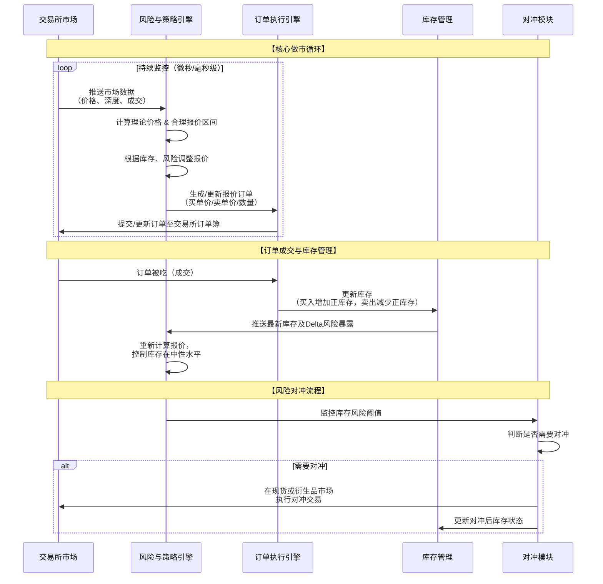

# 做市商产品业务流分析

我们将对交易生态中的“无名英雄”——**做市商**——的产品业务流进行深入分析。做市商并非简单的投机者，而是一个复杂的、系统化的**流动性提供和风险管理引擎**。

---

### 一、 做市商的核心价值主张与角色

#### 1. 核心定义
做市商是金融市场中，通过不断地**报出买入价和卖出价**，并承诺在这些价格上成交，从而为其他交易者提供**即时性**和**流动性**的专业机构。

#### 2. 核心价值主张
*   **对交易所/项目方**：
    *   **提供流动性**：减少买卖价差，让普通交易者能轻松、快速地买卖资产。
    *   **促进价格发现**：持续的双边报价有助于形成更公平、更稳定的市场价格。
    *   **提升市场质量**：更深的订单簿可以吸收大额订单的冲击，防止价格剧烈波动。
*   **对做市商自身**：
    *   **赚取价差**：通过“低买高卖”赚取买入价和卖出价之间的差额。
    *   **获取激励**：从交易所获得手续费返还或奖励。

#### 3. 做市商的类型
*   **义务做市商**：与交易所签订协议，有义务在特定条件下（如最大价差、最小挂单量）提供报价。
*   **非义务做市商**：自愿提供流动性，策略更灵活。

---

### 二、 做市商业务全流程分析

做市商的运作是一个高度自动化的闭环系统，其核心业务流程可以通过下图清晰地展示：

---

### 三、 各阶段业务逻辑深度解析

#### 1. 市场数据采集与处理
这是所有决策的基础。做市商系统需要处理海量的实时数据。

*   **数据源**：
    *   **Level 2/3 市场数据**：完整的订单簿深度信息、逐笔成交记录。
    *   **自身订单状态**：自己的挂单是否被成交、部分成交或取消。
*   **技术实现**：
    *   **低延迟连接**：通过交易所提供的直连端口接入，通常位于同一机房以降低网络延迟。
    *   **数据解析引擎**：解析高速的市场数据流，并将其转化为结构化的内部信息，供策略引擎使用。

#### 2. 定价与报价策略
这是做市商的“大脑”，核心是计算合理的买入价和卖出价。

*   **理论定价**：
    *   **对于现货**：通常围绕标的资产的**公允价值**进行报价。在加密货币市场，可能参考多个交易所的加权平均价格。
    *   **对于期权**：使用**布莱克-斯科尔斯**等数学模型，输入标的资产价格、行权价、到期时间、无风险利率和**隐含波动率**来计算理论价格。
*   **报价策略**：
    *   **基础价差**：在理论价格上下各减去和加上一个价差，形成买价和卖价。`买价 = 理论价 - 价差/2`， `卖价 = 理论价 + 价差/2`。
    *   **动态价差调整**：
        *   **市场波动性**：波动越大，价差越宽，以补偿更高的风险。
        *   **交易量**：交易活跃时，可能缩窄价差以吸引更多订单。
        *   **库存风险**：当库存偏离目标时，调整报价以促使反向交易（例如，库存过多时，降低卖价鼓励卖出）。

#### 3. 订单执行与管理
做市商需要高效地将报价策略转化为市场中的实际订单。

*   **订单类型**：
    *   **被动订单**：作为**Maker**挂限价单，等待其他交易者来成交，赚取手续费返还。
    *   **主动订单**：在某些情况下，作为**Taker**主动吃掉对手方的订单，以快速调整库存或捕捉瞬时机会。
*   **订单生命周期管理**：
    *   系统需要持续监控市场，如果价格变动使得自己的挂单变得“不合理”（例如，卖价已低于当前市场买价），则需要**快速撤单并重新报价**。

#### 4. 库存与风险管理
这是做市商长期生存的关键。目标是保持**市场中立**，避免因持有方向性头寸而遭受巨大亏损。

*   **库存管理**：
    *   **目标**：将持有的资产净头寸（库存）维持在接近零的水平。
    *   **实现方式**：通过调整买卖报价来引导交易流向。例如，当持有的BTC过多时，会调低BTC的卖价（使其更容易被卖出），同时调低BTC的买价（使其不那么容易被买入）。
*   **希腊字母风险管理（针对期权做市）**：
    *   **Delta**：衡量标的资产价格变动对期权组合价值的影响。做市商的目标是保持**Delta中性**，即通过买卖标的资产（如BTC）来对冲，使得组合价值不受标的资产价格方向性变动的影响。
    *   **Gamma**：衡量Delta的变化率。Gamma风险需要对标的资产进行动态调整。
    *   **Vega**：衡量波动率变动对组合价值的影响。需要交易其他期权来进行对冲。

#### 5. 对冲
当通过报价无法有效控制风险时，做市商会主动在相关市场进行对冲交易。

*   **场景**：一个BTC期权做市商卖出了大量看涨期权，导致其投资组合呈现负Delta（即担心BTC上涨）。为了对冲，他需要在现货市场**买入适量的BTC**。
*   **执行**：对冲通常在流动性更好、手续费更低的市场执行，例如现货市场或永续合约市场。

#### 6. 绩效分析
做市商需要精细地核算盈亏，以优化策略。

*   **盈利来源**：
    *   **已实现盈亏**：通过交易赚取的价差。
    *   **未实现盈亏**：当前持有头寸的浮动盈亏。
    *   **手续费净收入**：从交易所获得的手续费返还减去支付的手续费。
*   **关键绩效指标**：
    *   **夏普比率**：衡量风险调整后的收益。
    *   **最大回撤**：评估策略的最大风险。
    *   **胜率 & 盈亏比**。

---

### 四、 做市商的关键技术栈

1.  **低延迟系统**：从网络、硬件到操作系统和应用程序的全栈优化，追求微秒级的响应速度。
2.  **高性能计算**：用于复杂的定价模型（如蒙特卡洛模拟）和风险计算。
3.  **策略回测引擎**：利用历史市场数据验证和优化报价策略。
4.  **风控系统**：设置硬性止损、头寸限额等，防止“胖手指”错误或策略失效导致灾难性损失。

---

### 五、 挑战与风险

1.  **信息劣势风险**：
    *   **场景**：当有知情交易者（“大鲸鱼”）获得重大利好消息并大量买入时，做市商在不知情的情况下不断卖出，将遭受巨大亏损。
2.  **市场剧烈波动风险**：
    *   **场景**：在“闪崩”等极端行情中，市场流动性瞬间枯竭，做市商的报价被全部吃掉，无法及时对冲，导致库存急剧偏离并产生巨额亏损。
3.  **技术风险**：
    *   系统宕机、网络延迟、交易所API故障等都可能导致做市商无法正常报价，从而违反做市协议或错失对冲机会。
4.  **模型风险**：
    *   如果定价模型本身有缺陷或参数设置不当，会导致系统性错误报价。

### 总结

做市商产品的业务流本质是：**一个通过高频数据驱动、基于复杂数学模型进行决策、并通过自动化交易系统执行的、旨在通过提供流动性来稳定赚取微小价差的精密金融机器。**

其核心价值在于：
*   **策略层**：通过**动态定价**和**智能报价**来实现**持续盈利**。
*   **风控层**：通过**库存管理**和**希腊字母对冲**来维持**市场中立**。
*   **技术层**：通过**低延迟架构**和**高性能计算**来保证**竞争优势**。

做市商是金融市场不可或缺的“润滑剂”和“稳定器”。它们的存在，使得普通交易者能够在一个更公平、更高效、更稳定的市场中进行交易。然而，做市本身是一项对技术、资本、风控和策略要求极高的专业领域，其背后是复杂的系统工程和持续的进化能力。