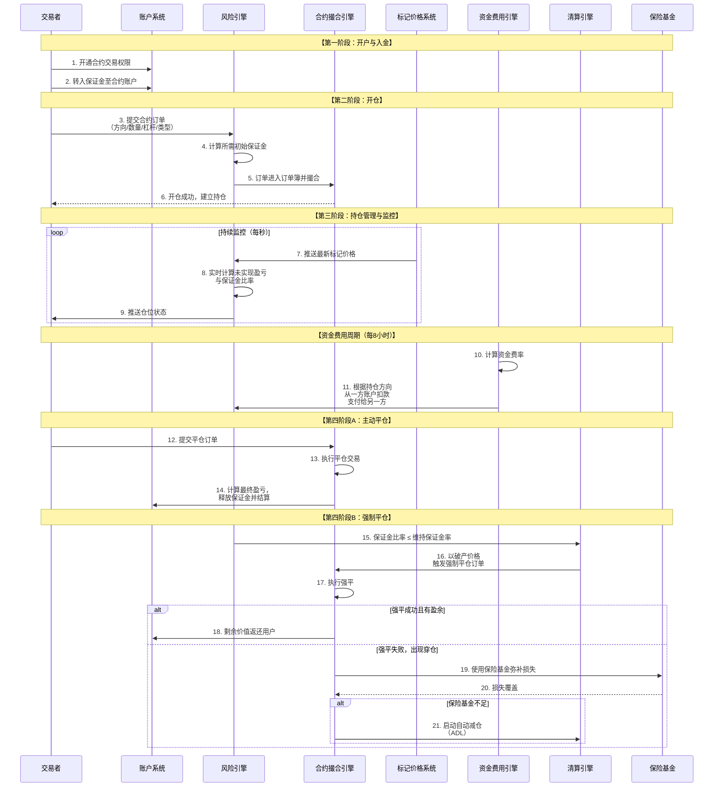

# 合约交易产品业务流分析

我们将对**合约交易产品**（特指**永续合约**）进行深入的业务流分析。合约交易是加密货币衍生品市场的核心，它通过引入**杠杆、做空、资金费用和自动减仓**等复杂机制，提供了一个高风险的投机和对冲工具。

---

### 一、 合约交易的核心概念与价值主张

#### 1. 核心定义
合约交易是一种**衍生品**，交易双方同意在未来的某个时间点，以预先确定的价格买卖某种标的资产。在加密货币领域，**永续合约** 是绝对的主流，它没有到期日，通过**资金费用**机制来锚定现货价格。

#### 2. 核心概念
*   **标的资产**：合约所追踪的资产，如BTC、ETH。
*   **保证金**：交易者存入的抵押品，用于开仓和承担亏损。
*   **杠杆**：允许交易者放大头寸的倍数。
*   **做多/做空**：预测价格上涨或下跌。
*   **资金费用**：多头和空头之间定期支付的费用，以使合约价格锚定现货价格。
*   **强制平仓**：当保证金不足以维持头寸时，系统强制平仓。
*   **标记价格**：用于计算未实现盈亏和强平的价格，通常由多个现货交易所的指数价格决定，以防止操纵。

#### 3. 价值主张
*   **高杠杆**：提供远高于现货和杠杆交易的杠杆倍数（如100x）。
*   **双向获利**：无论市场涨跌，均可通过做多或做空获利。
*   **对冲风险**：矿工和长期持有者可用合约对冲现货头寸的风险。
*   **资本效率**：无需实际持有标的资产即可获得风险敞口。

---

### 二、 合约交易全生命周期业务流分析

一个完整的合约交易流程，从开户到平仓，涉及风险计算、资金费用、清算等多个复杂环节。其核心业务流程可以通过下图清晰地展示：

---

### 三、 各阶段业务逻辑深度解析

#### 1. 开户与入金阶段

**A. 账户结构**
*   **业务流程**：用户需要将资产从其他账户（如现货账户）划转到“合约账户”。
*   **底层实现**：
    *   交易所为合约交易维护独立的账户体系和账本。
    *   合约账户内的资产以**保证金**形式存在，分为：
        *   **可用保证金**：可用于开新仓的部分。
        *   **已用保证金**：已被当前持仓占用的部分。

**B. 保证金模式**
*   **全仓保证金**：账户内所有资金都作为每个仓位的共享保证金。抗风险能力强，但一个仓位爆仓可能导致整个账户归零。
*   **逐仓保证金**：为每个仓位分配固定的、独立的保证金。风险被隔离，但更容易被强平。

#### 2. 开仓阶段

这是合约交易的起点，核心是**保证金计算**和**风险校验**。

**A. 订单与保证金计算**
*   **业务流程**：用户选择合约（如BTCUSDT永续）、方向、杠杆倍数和下单数量。
*   **底层实现**：
    *   **合约面值**：例如1张BTC合约代表1 USD的BTC。用户下单10,000张，即代表开了10,000 USD的头寸。
    *   **初始保证金计算**：`初始保证金 = 合约数量 * 合约面值 / 开仓价格 / 杠杆倍数`
        *   例如：在40,000 USD开多BTC，100倍杠杆，开仓10,000张（价值10,000 USD）。
        *   `初始保证金 = 10,000 * 1 / 40,000 / 100 = 0.0025 BTC`
    *   系统会冻结这0.0025 BTC作为已用保证金。

**B. 风险校验**
*   **底层实现**：
    *   检查可用保证金是否充足。
    *   检查仓位是否超过用户或平台级别的持仓限制。
    *   对于高杠杆订单，可能进行更严格的价格校验。

#### 3. 持仓管理与监控阶段

这是合约系统的“心脏”，需要实时计算每个仓位在瞬息万变的市场中的健康状况。

**A. 盈亏计算**
*   **未实现盈亏**：根据当前**标记价格**计算的浮动盈亏。
    *   **多仓**：`未实现盈亏 = (标记价格 - 开仓均价) * 持仓数量`
    *   **空仓**：`未实现盈亏 = (开仓均价 - 标记价格) * 持仓数量`
*   **已实现盈亏**：平仓后实际产生的盈亏。

**B. 关键风险指标：保证金比率**
这是决定仓位是否会被强平的核心指标。
*   `保证金比率 = (仓位保证金 + 未实现盈亏) / (持仓数量 * 合约面值 / 标记价格)`
    *   或者更直观的公式：`保证金比率 = 账户权益 / 仓位维持保证金要求`
*   **账户权益**：`仓位保证金 + 未实现盈亏 + 可用保证金`
*   当**保证金比率 ≤ 维持保证金率**时，触发强制平仓。

**C. 资金费用机制**
*   **目的**：使永续合约的价格锚定现货指数价格。
*   **流程**：
    1.  每8小时（通常UTC时间0:00, 8:00, 16:00）为一个周期。
    2.  计算**资金费率**：`资金费率 = (合约标记价格 - 现货指数价格) / 现货指数价格`，并有一个上限限制。
    3.  支付：
        *   如果资金费率为正，**多头向空头**支付费用。
        *   如果资金费率为负，**空头向多头**支付费用。
*   **底层实现**：在资金时间戳，系统扫描所有持仓，根据其方向和数量，自动从一方账户扣款，计入另一方账户。

#### 4. 平仓阶段

**A. 主动平仓**
*   **业务流程**：用户提交一个与开仓方向相反、数量相同的订单。
*   **底层实现**：
    1.  订单在市场上撮合成交。
    2.  计算**已实现盈亏**。
    3.  释放该仓位占用的**已用保证金**。
    4.  将盈亏结算到用户的**可用保证金**中。

**B. 强制平仓**
这是合约平台的风险防火墙，是整个系统中最复杂、最关键的环节。

*   **强平流程**：
    1.  **触发**：风险引擎实时监控，当仓位保证金比率触及维持保证金率时，立即触发强平。
    2.  **破产价格**：指仓位权益（保证金+未实现盈亏）恰好归零时的标记价格。强平引擎会尝试以**破产价格**接管该仓位。
    3.  **强平执行**：强平引擎将破产仓位在市场上进行平仓。

*   **穿仓处理**：
    *   **场景**：如果市场波动极快，强平订单的成交价格**差于**破产价格，导致平仓后仍有亏损，这部分亏损即为“穿仓损失”。
    *   **解决方案**：
        1.  **保险基金**：所有强平订单在优于破产价格成交的盈余会注入保险基金。当发生穿仓时，优先使用保险基金进行弥补。
        2.  **自动减仓**：如果保险基金耗尽，系统会启动ADL。它会按照盈利大小和杠杆高低，对市场上盈利最高的对手方仓位进行**自动减仓**，用其盈利来覆盖穿仓损失。这是交易者最不希望遇到的情况。

---

### 四、 关键子系统与风险

1.  **标记价格系统**：综合多个主流现货交易所的价格，计算出一个抗操纵的公平价格，是盈亏和强平的依据。
2.  **风险引擎**：实时计算全平台所有仓位的保证金比率，是系统的核心。
3.  **资金费用引擎**：定期计算和执行资金费用的收付。
4.  **清算引擎**：高效、公平地处理强平订单，管理保险基金和ADL流程。
5.  **保险基金**：作为穿仓损失的缓冲池，维护平台稳定。

**主要风险**：
*   **高杠杆风险**：极小的价格波动可能导致本金全部损失。
*   **流动性风险**：在极端行情下，市场深度不足，导致强平订单无法及时成交，加剧穿仓。
*   **系统风险**：平台宕机或延迟可能导致用户无法及时管理仓位而爆仓。
*   **对手方风险**：在ADL机制下，盈利仓位可能被自动减仓。

### 总结

合约交易产品的业务流本质是：**一个建立在精密数学模型和实时风控系统之上的、高杠杆的衍生品交易平台，它通过资金费用机制实现价格锚定，并通过复杂的清算和保险机制来管理高杠杆带来的极端风险。**

其核心创新在于：
*   **产品层**：通过**永续合约**和**资金费用**解决了衍生品的到期和价格偏离问题。
*   **风控层**：通过**标记价格**、**实时保证金计算**和**自动强平**构建了全天候的风险管理系统。
*   **清算层**：通过**保险基金**和**自动减仓**创造了风险共担的社区化清算模型。

合约交易是加密货币领域金融工程学的巅峰体现，它提供了无与伦比的流动性和投机机会，但同时也伴随着极高的风险。一个优秀的合约交易产品，其核心竞争力在于**风险模型的稳健性、清算流程的效率和公平性，以及在极端行情下的系统稳定性**。