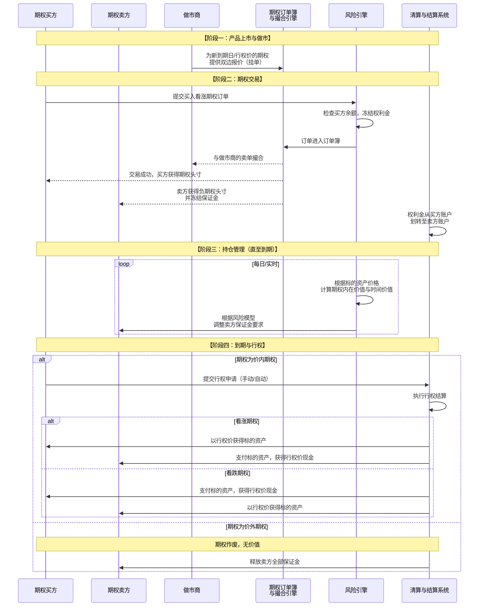

# 期权产品业务流分析

我们将对金融衍生品皇冠上的明珠——**期权产品**——进行深入的业务流分析。期权提供了前所未有的灵活性和精准的风险管理能力，其业务流程也比现货和合约更为复杂。

---

### 一、 期权核心概念与价值主张

#### 1. 核心定义
期权是一种**权利合约**，它赋予持有者在未来某个特定时间或之前，以**特定价格**买入或卖出某种标的资产的**权利**，但**没有义务**。

#### 2. 核心概念与术语
*   **标的资产**：期权所依附的资产，如BTC、ETH。
*   **看涨期权**：赋予持有者**买入**权利的期权。
*   **看跌期权**：赋予持有者**卖出**权利的期权。
*   **行权价**：预先约定的买卖价格。
*   **到期日**：期权权利失效的日期。
*   **权利金**：买方为获得权利而向卖方支付的费用。这是卖方的最大收益，买方的最大亏损。
*   **美式 vs 欧式**：
    *   **美式**：在到期日前任何时间都可行权（加密货币期权主流）。
    *   **欧式**：只能在到期日行权。

#### 3. 价值主张
*   **对买方**：
    *   **风险有限，收益无限**：最大亏损为权利金，但潜在收益理论上无上限（看涨）。
    *   **精准策略**：可用于对冲、投机收入、或构建复杂的组合策略。
*   **对卖方**：
    *   **赚取权利金**：在横盘或缓跌（卖出看涨）/缓涨（卖出看跌）市场中获得收益。
    *   **增强收益**：在持有现货时卖出看涨期权，赚取额外权利金。

---

### 二、 期权交易全生命周期业务流分析

一个完整的期权交易生命周期，从产品上线、交易、到期到行权，涉及做市商、交易者、风控和清算等多个参与方。其核心业务流程可以通过下图清晰地展示：

---

### 三、 各阶段业务逻辑深度解析

#### 1. 产品上市与做市阶段

期权产品的诞生始于交易所的设计和做市商的参与。

*   **业务流程**：交易所会为某个标的资产（如BTC）上线一系列不同**到期日**和**行权价**的期权合约。
*   **底层实现**：
    *   **合约规格**：定义每个合约的标的资产、合约乘数（如1个BTC）、报价单位、最小变动价位等。
    *   **做市商义务**：交易所通常与做市商合作，要求他们为这些新合约提供连续的**买价和卖价**，以确保市场有足够的流动性供零售交易者交易。
    *   **订单簿创建**：为每个独立的期权合约（如“BTC-30JUN24-60000-C”）创建独立的订单簿和撮合引擎。

#### 2. 期权交易阶段

这是期权生命周期的核心，涉及**权利金交易**和**保证金管理**。

**A. 买方交易逻辑**
*   **业务流程**：买方支付**权利金**，获得一个期权头寸（正数）。
*   **底层实现**：
    *   **余额检查与冻结**：风险引擎检查买方账户是否有足够的可用资金（如USDT）来支付全额权利金，并进行冻结。
    *   **头寸创建**：交易成功后，系统在买方的账户中创建一个**看涨期权多头**或**看跌期权多头**头寸，数量为对应的张数。
    *   **成本**：买方的最大亏损就是付出的权利金。

**B. 卖方交易逻辑**
*   **业务流程**：卖方收取**权利金**，但必须冻结足够的**保证金**，以履行未来可能被行权的义务。
*   **底层实现**：
    *   **保证金计算**：这是期权系统的核心风控环节。卖方所需的保证金远高于权利金收入，因为它需要覆盖潜在的违约风险。计算模型通常包括：
        *   **风险模型**：如**SPAN** 或**STANS**，综合考虑标的资产价格、波动率、时间衰减、不同头寸组合的风险抵消等因素。
        *   **简单模型**：`保证金 = 权利金 + max[ (标的资产价值 * 保证金率) - 价外值, (标的资产价值 * 最低保证金率) ]`
    *   **头寸创建**：在卖方的账户中创建一个**看涨期权空头**或**看跌期权空头**头寸（负数）。
    *   **盈利与风险**：卖方的最大盈利是收到的权利金，但潜在亏损理论上是无限的（卖出看涨）或非常大（卖出看跌）。

#### 3. 持仓管理阶段

从开仓到到期，系统需要持续管理头寸风险，特别是对卖方。

*   **业务流程**：系统实时监控所有期权头寸的风险。
*   **底层实现**：
    *   **标记价格**：为每个期权合约计算一个公平的标记价格，通常基于**布莱克-斯科尔斯**等期权定价模型，输入参数包括标的资产价格、行权价、到期时间、隐含波动率和无风险利率。
    *   **风险值计算**：
        *   **Delta**：标的资产价格变动1单位，期权价格的变化量。
        *   **Gamma**：Delta的变化率。
        *   **Vega**：隐含波动率变动1%，期权价格的变化量。
        *   **Theta**：随时间流逝，期权价格每天的衰减量。
    *   **保证金追加重估**：根据最新的市场数据和风险值，实时调整卖方的保证金要求。如果标的资产价格向不利于卖方的方向剧烈波动，系统会要求卖方**追加保证金**，否则可能强制平仓其头寸。

#### 4. 到期与行权阶段

这是期权生命的终点，决定了其最终价值。

*   **业务流程**：在到期日，系统会自动处理所有未平仓的期权头寸。
*   **底层实现**：
    *   **价内/价外判定**：
        *   **看涨期权**：如果到期时**标的资产价格 > 行权价**，则为价内期权。
        *   **看跌期权**：如果到期时**标的资产价格 < 行权价**，则为价内期权。
    *   **自动行权**：大多数交易所默认对**价内期权**进行自动行权，因为这对持有者有利。
    *   **行权结算**：
        *   **看涨期权行权**：
            1.  从**买方账户**扣除（行权价 × 合约乘数）的现金。
            2.  向**买方账户**增加对应数量的标的资产。
            3.  从**卖方账户**扣除对应数量的标的资产。
            4.  向**卖方账户**增加（行权价 × 合约乘数）的现金。
        *   **看跌期权行权**：
            1.  从**买方账户**扣除对应数量的标的资产。
            2.  向**买方账户**增加（行权价 × 合约乘数）的现金。
            3.  从**卖方账户**扣除（行权价 × 合约乘数）的现金。
            4.  向**卖方账户**增加对应数量的标的资产。
    *   **价外期权处理**：所有价外期权在到期后自动作废，买方损失全部权利金，卖方获得全部权利金并释放所有保证金。

---

### 四、 关键子系统与风险

1.  **复杂的定价引擎**：使用数学模型（如BS模型）为期权定价，并计算希腊值。
2.  **高级风险引擎**：基于投资组合的风险模型（如SPAN）计算保证金，这是期权平台稳健运行的关键。
3.  **做市商系统**：为市场提供流动性，确保买卖价差合理。
4.  **行权与结算系统**：在到期日高效、准确地处理大量行权操作，涉及复杂的资产划转。

**主要风险**：
*   **模型风险**：定价模型或风险模型不准确可能导致巨额损失。
*   **流动性风险**：深度不足的期权合约可能难以平仓。
*   **波动率风险**：隐含波动率的剧烈变化会极大影响期权价格和保证金要求。
*   **行权结算风险**：行权过程中大规模的资产转移可能带来操作风险和流动性压力。

### 总结

期权产品的业务流本质是：**一个建立在复杂金融数学模型之上的、权利与义务分离的衍生品系统，它通过权利金交易和动态保证金管理，实现了风险的精细化定价、转移和对冲。**

其核心创新在于：
*   **产品层**：通过**看涨/看跌**和**行权价/到期日**的组合，创造了无限多种**风险收益结构**。
*   **风控层**：通过**非线性定价模型**和**投资组合保证金系统**，实现了对复杂风险的**动态量化管理**。
*   **清算层**：通过**权利金预付**和**卖方保证金冻结**，确保了到期**行权义务的绝对履行**。

期权是金融工程的巅峰之作，它为市场提供了无与伦比的灵活性和精准性。一个成功的期权产品，其核心竞争力在于**定价模型的准确性、风险管理的稳健性、结算系统的可靠性，以及流动性的深度**。