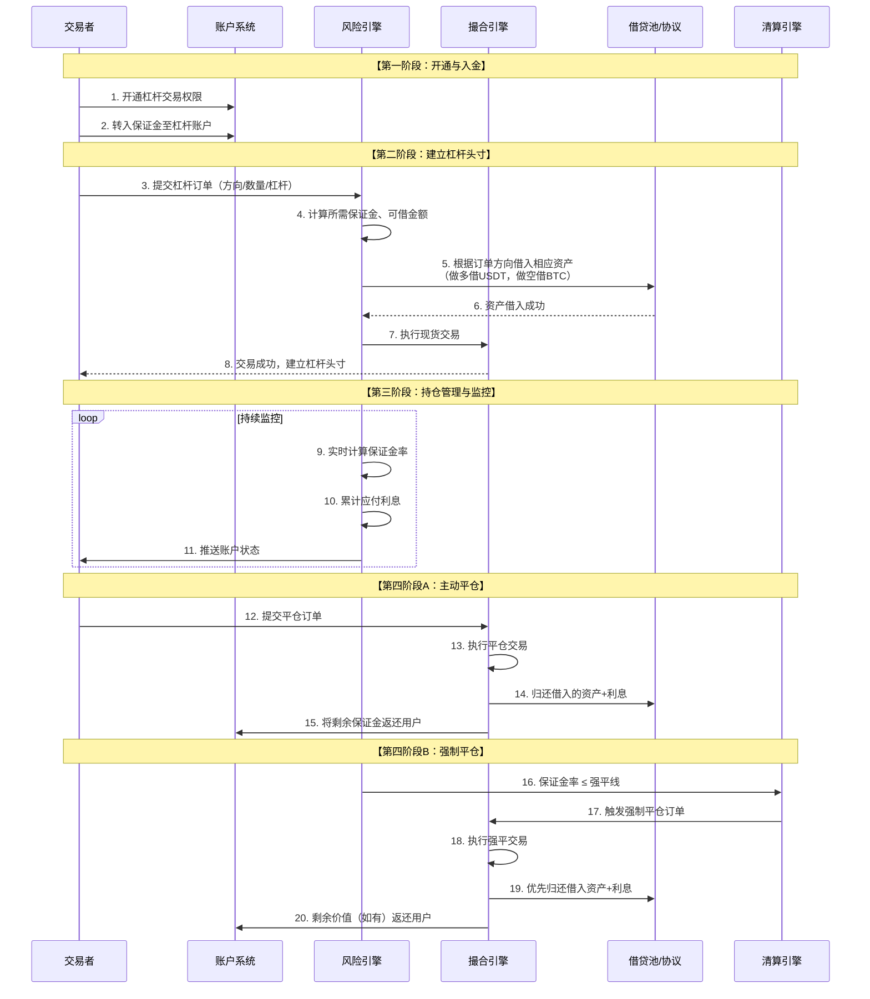

# 杠杆交易产品业务流分析

我们将对**杠杆交易产品**进行深入的业务流分析。杠杆交易是现货交易的进阶版本，通过引入**借贷**和**保证金**机制，允许用户放大自己的交易能力和风险。

---

### 一、 杠杆交易的核心概念与价值主张

#### 1. 核心定义
杠杆交易是指交易者通过**借入资金**或**资产**，以超出自身本金的价值进行交易的行为。它本质上是一种**保证金交易**。

#### 2. 核心概念
*   **保证金**：交易者自己投入的资金，作为交易的抵押品和风险缓冲。
*   **杠杆倍数**：总头寸价值与保证金的比率。例如，10倍杠杆意味着用1个BTC的保证金控制10个BTC的头寸。
*   **借贷利率**：因借入资产而需支付给贷方或协议的费用。
*   **强制平仓**：当保证金不足以覆盖潜在损失时，系统强制卖出头寸以偿还贷款的行为。

#### 3. 价值主张
*   **放大收益**：用较少的本金撬动更大的头寸，从而放大盈利。
*   **做空机制**：通过借入资产并立即卖出，实现“高卖低买”的做空操作，在下跌市场中获利。
*   **提升资本效率**：同一笔资金可以作为多个头寸的保证金（在跨保证金模式下）。

---

### 二、 杠杆交易全生命周期业务流分析

一个完整的杠杆交易流程，从开通权限到最终平仓，涉及借贷、交易、风控和清算等多个复杂子系统。其核心业务流程可以通过下图清晰地展示：

---

### 三、 各阶段业务逻辑深度解析

#### 1. 开通与入金阶段

**A. 权限开通**
*   **业务流程**：用户需要主动同意风险协议，并完成相关的风险知识测评。某些司法管辖区可能有更严格的合格投资者要求。
*   **底层实现**：在用户数据库中添加杠杆交易权限标识。

**B. 账户结构与入金**
*   **业务流程**：用户需要将资产从“现货账户”划转到“杠杆账户”作为保证金。
*   **底层实现**：
    *   **账户隔离**：交易所通常会为用户维护独立的账户子账户：
        *   **现货账户**：用于普通交易。
        *   **杠杆账户**：用于杠杆交易，资产作为保证金并被冻结。
    *   **余额更新**：划转操作在数据库中是原子操作，减少现货账户余额，增加杠杆账户余额。

#### 2. 建立杠杆头寸阶段

这是最复杂的环节，核心是**借贷**与**交易**的原子性组合。

**A. 订单验证与借贷**
*   **业务流程**：
    1.  用户提交杠杆买单（例如，10倍杠杆做多BTC）。
    2.  系统计算：用户投入1,000 USDT保证金，按10倍杠杆，总订单价值为10,000 USDT。因此需要借入 **10,000 - 1,000 = 9,000 USDT**。
    3.  系统从**借贷池**中锁定9,000 USDT。
*   **底层实现**：
    *   **借贷池**：可以是交易所内部的资金池（汇集了其他用户出借的资产），也可以是集成的外部DeFi借贷协议（如Compound, Aave）。
    *   **风险检查**：检查杠杆倍数是否超过上限、借贷利率是否可接受、借贷池深度是否足够。

**B. 执行交易**
*   **业务流程**：使用借入的9,000 USDT和用户的1,000 USDT保证金，总计10,000 USDT在现货市场购买BTC。
*   **底层实现**：
    *   本质上，这是一笔**现货交易**。撮合引擎并不知道这是杠杆交易，它只处理买入10,000 USDT的BTC订单。
    *   交易成功后，用户的杠杆账户中持有价值10,000 USDT的BTC，同时负债为9,000 USDT（+利息）。

**C. 做空逻辑**
*   做空是相反的流程。用户借入**BTC**然后立即卖出换成USDT。当BTC价格下跌后，用户用更少的USDT买回BTC归还，赚取差价。

#### 3. 持仓管理与监控阶段

这是风险控制的核心，系统需要实时计算每个账户的健康状况。

**A. 关键指标计算**
*   **账户价值**：`总资产 - 总负债`
    *   `总资产` = 持仓市值 + 杠杆账户剩余保证金
    *   `总负债` = 借入资产的本金 + 应计利息
*   **保证金率**：这是最重要的风险指标。
    *   `保证金率 = 账户净值 / (持仓市值 * 维护保证金率)`
    *   或更简单的公式：`保证金率 = (总资产 - 总负债) / 总负债`

**B. 风险等级**
系统会设置几个关键阈值：
*   **预警线**：当保证金率跌至此线，系统会提醒用户追加保证金。
*   **强平线**：当保证金率跌至此线，系统将触发强制平仓。

**C. 利息计算**
*   **业务流程**：借贷利息通常按小时或按天计算，并持续累积到负债中。
*   **底层实现**：有一个后台服务定期（例如每分钟）扫描所有未平仓头寸，根据当前的借贷利率更新其应计利息。

#### 4. 平仓阶段

**A. 主动平仓**
*   **业务流程**：用户提交卖出BTC的订单。
*   **底层实现**：
    1.  执行现货卖出交易，获得USDT。
    2.  系统自动从获得的USDT中扣除需要归还的**本金+利息**，归还给借贷池。
    3.  剩余的USDT（即盈利部分+原始保证金）返还到用户的杠杆账户中。

**B. 强制平仓**
这是交易所的“防火墙”，防止亏损超过用户的保证金。
*   **触发条件**：当保证金率触及**强平线**时，风险引擎会立即触发。
*   **业务流程**：
    1.  清算引擎接管用户的头寸，以当前市场价格或更激进的价格（以确保成交为首要目标）卖出抵押品。
    2.  卖出获得的资金**优先用于偿还借贷本金和利息**。
    3.  **剩余资金**：如果偿还后还有剩余，会返还给用户。
    4.  **穿仓**：如果市场波动过快，平仓后仍无法覆盖全部债务，则产生“穿仓”。交易所通常会使用**保险基金**或**自动减仓机制** 来弥补这部分损失。

---

### 四、 保证金模式

#### 1. 逐仓保证金
*   **逻辑**：为每个头寸单独分配和隔离保证金。
*   **优点**：风险被限制在单个头寸内，一个头寸爆仓不会影响其他头寸。
*   **缺点**：资本效率较低。

#### 2. 全仓保证金
*   **逻辑**：所有头寸共享一个保证金池。
*   **优点**：资本效率高，因为盈利头寸的保证金可以覆盖亏损头寸的损失，更难被强平。
*   **缺点**：风险高，一个头寸的巨额亏损可能导致所有头寸被清算。

---

### 五、 关键子系统与风险

1.  **风险引擎**：实时计算所有账户的保证金率，是系统的“大脑”。
2.  **借贷与利率系统**：管理借贷池，根据供需动态调整借贷利率。
3.  **清算引擎**：高效、快速地对高风险头寸进行平仓，防止系统性风险。
4.  **保险基金**：用于覆盖穿仓损失，保障平台和贷方的资金安全。

**主要风险**：
*   **市场风险**：高杠杆在极端波动下极易爆仓。
*   **流动性风险**：在市场闪崩时，清算订单可能无法以理想价格成交，加剧穿仓。
*   **技术风险**：风险引擎的延迟或故障可能导致灾难性后果。

### 总结

杠杆交易产品的业务流本质是：**一个在严格风控框架下，通过实时借贷和现货交易组合，放大用户交易敞口，并通过保证金和强制平仓机制来管理违约风险的复杂金融系统。**

其核心创新在于：
*   **业务层**：通过**借贷机制**创造了**做空**和**杠杆**功能。
*   **技术层**：通过**实时风险引擎**和**清算系统**实现了**风险自动化管理**。
*   **经济层**：通过**利率模型**和**保险基金**构建了**自平衡的金融生态**。

杠杆交易极大地丰富了交易策略，但也显著提高了风险。一个稳健的杠杆交易产品，其核心竞争力不仅在于提供高杠杆，更在于其**风险管理的精度、清算效率的高低以及极端行情下的系统稳定性**。