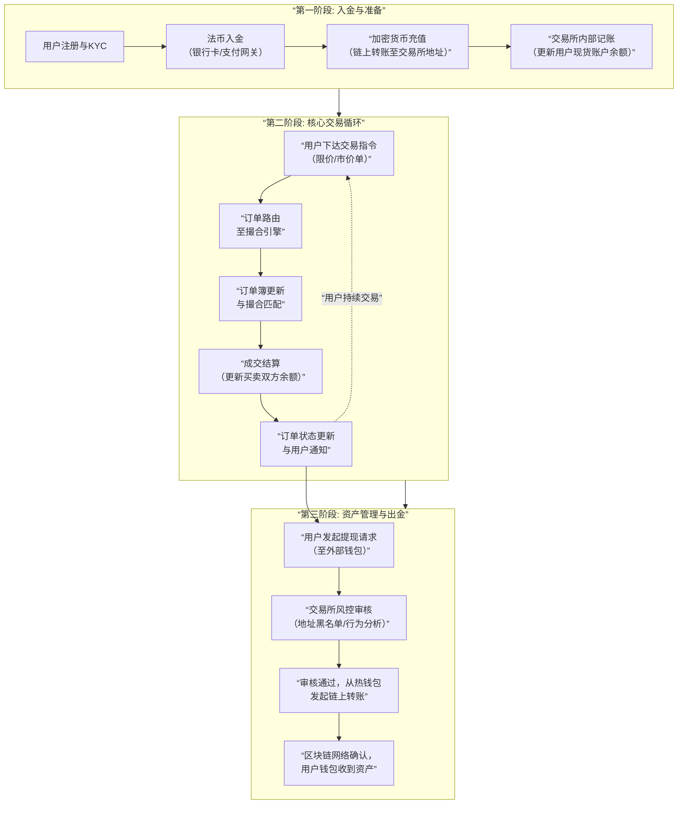

# 现货交易产品业务流分析

我们将对**现货交易产品**的业务流进行全面深入的分析。现货交易是加密货币世界中最基础、最核心的业务，其业务流程涉及用户、交易所、区块链网络等多个参与方。

---

### 一、 现货交易的核心定义与价值主张

#### 1. 核心定义
现货交易是指**以当前市场价格进行资产的即时买卖和交割**的交易方式。交易双方在达成交易后，资产（如BTC, ETH）和资金（如USDT, USD）会**立即或在短时间内（T+0）完成划转**。

#### 2. 价值主张
*   **即时性**：满足用户即时买卖资产的需求。
*   **价格发现**：通过买卖双方的持续交易，形成公允的市场价格。
*   **流动性**：为市场提供资产转换的通道。
*   **投资与投机**：为用户提供资产配置和价格博弈的工具。

---

### 二、 现货交易全生命周期业务流分析

一个完整的现货交易流程，从用户注册到最终提现，涉及多个系统和复杂的状态转换。其核心业务流程可以通过下图清晰地展示：

---

### 三、 各阶段业务逻辑深度解析

#### 1. 入金与准备阶段

此阶段的目标是让用户的资金进入交易所体系，为交易做准备。

**A. 法币入金**
*   **业务流程**：
    1.  用户绑定银行卡、支付宝等支付渠道。
    2.  用户输入购买金额，系统通过第三方支付网关或做市商提供报价。
    3.  用户确认，跳转至银行页面完成支付。
    4.  支付成功后，交易所等额增加用户在**现货账户**中的法币余额（或稳定币如USDT）。
*   **底层实现**：
    *   集成第三方支付API（如Stripe, Adyen）。
    *   与法币做市商合作，获取流动性。
    *   **关键点**：严格遵守KYC和AML法规。

**B. 加密货币充值**
*   **业务流程**：
    1.  用户在交易所获取一个**专属的充值地址**。这个地址通常由交易所的**总热钱包**管理，通过标签或Memo区分用户。
    2.  用户从外部钱包向该地址发起链上转账。
    3.  交易所的**节点**监控区块链，检测到该地址有资金流入。
    4.  确认达到**区块确认数**后，交易所系统在用户现货账户中增加相应资产余额。
*   **底层实现**：
    *   **地址管理**：使用HD钱包为海量用户生成并管理地址。
    *   **区块链监控**：运行全节点或使用Infura等节点服务，通过WebSocket监听交易事件。
    *   **充值扫描服务**：一个后端服务，持续扫描新区块，将交易与用户地址匹配，并更新数据库。

#### 2. 核心交易循环阶段

这是现货交易产品的核心，涉及交易所最关键的子系统——**撮合引擎**。

**A. 订单创建与路由**
*   **业务流程**：
    1.  用户选择交易对（如BTC/USDT）、订单类型（限价/市价）、价格和数量，点击买入/卖出。
    2.  前端进行基础校验（如余额是否充足）。
    3.  订单通过API或WebSocket被发送到交易所的交易网关。
*   **底层实现**：
    *   **订单管理服务**：接收订单，进行风险检查（如限价单价格是否合理），然后将其转发给撮合引擎。
    *   **余额预冻结**：在订单进入订单簿前，系统会先在用户账户中**冻结**相应的资产（如卖出BTC则冻结BTC，买入则冻结USDT），防止重复花费。

**B. 订单撮合与结算**
*   **业务流程**：
    1.  撮合引擎将新订单与订单簿中的对手单进行匹配。
    2.  按照**价格优先、时间优先**的原则成交。
    3.  成交后，生成成交记录。
*   **底层实现**：
    *   **撮合引擎**：一个高性能的内存系统，核心是订单簿数据结构（通常用红黑树管理价格层级，链表管理同价位订单）。
    *   **结算系统**：成交后，引擎发出结算指令：
        *   解除冻结的资产。
        *   将资产从卖方账户划转到买方账户。例如，一笔BTC/USDT交易成功后，系统从卖方账户扣除BTC并增加USDT，为买方账户增加BTC并扣除USDT。
    *   **数据持久化**：所有订单和成交记录被异步写入数据库，并实时推送至行情系统。

**C. 订单状态更新与用户通知**
*   **业务流程**：用户在前端实时看到自己订单的状态变化（部分成交、完全成交、已撤销）。
*   **底层实现**：
    *   通过**WebSocket** 连接，将订单状态和成交推送给前端。
    *   用户可以通过REST API查询历史订单和成交记录。

#### 3. 资产管理与出金阶段

此阶段是用户将资产从交易所转移回自我托管钱包的过程，风险控制至关重要。

**A. 提现申请**
*   **业务流程**：
    1.  用户输入提现地址、数量和二次验证（2FA/邮箱/手机）。
    2.  系统进行风控检查。
*   **底层实现**：
    *   **地址风控**：检查提现地址是否在黑名单中（如黑客地址、混币器地址）。
    *   **行为风控**：检查提现行为是否异常（如新地址、大额提现）。可能触发人工审核。

**B. 提现处理**
*   **业务流程**：
    1.  风控通过后，系统从用户的现货账户中扣除相应资产。
    2.  提现任务进入处理队列。
    3.  交易所的**热钱包** 构建一笔链上交易，并签名广播。
*   **底层实现**：
    *   **私钥签名**：在高度安全的环境（如HSM）中，使用热钱包的私钥对交易进行签名。
    *   **手续费管理**：根据当前网络拥堵情况，动态设置Gas费或网络费，以平衡速度和成本。
    *   **事务管理**：跟踪提现交易的状态（待处理、广播中、已确认、失败）。如果失败（如Gas不足），需要人工介入处理。

**C. 资金安全架构**
*   **冷热钱包分离**：
    *   **热钱包**：存放少量用于日常提现的资金，在线运行，风险较高。
    *   **冷钱包**：存放绝大部分用户资产，私钥离线存储，安全性极高。定期从热钱包归集资金。

---

### 四、 关键子系统与技术支持

1.  **账户系统**：区分现货账户、法币账户、杠杆账户等，管理各账户下的资产余额和冻结金额。
2.  **风控系统**：实时监控异常交易行为（如对敲、洗钱）、API访问频率、提现模式等。
3.  **行情系统**：基于订单簿和成交记录，实时计算K线、深度图、Ticker数据，并通过WebSocket对外推送。
4.  **API系统**：为程序化交易用户提供REST和WebSocket接口，允许他们以编程方式执行所有操作。

---

### 五、 挑战与未来趋势

#### 核心挑战：
*   **安全与信任**：如何保障用户资产安全是交易所的生命线。
*   **性能与扩展性**：在极端市场行情下，每秒数十万笔订单的吞吐量和低延迟是巨大挑战。
*   **监管合规**：全球各地不同的监管政策给运营带来复杂性。
*   **用户体验**：在安全、合规和易用性之间取得平衡。

#### 未来趋势：
*   **链上结算**：通过**智能合约**实现非托管交易，用户始终控制私钥（如DEX）。
*   **零知识证明**：用于实现隐私交易和提升可扩展性。
*   **跨链交易**：无缝交易不同区块链上的资产。
*   **账户抽象**：用智能合约钱包简化助记词、Gas费等复杂概念，大幅改善用户体验。

### 总结

现货交易产品的业务流本质是：**一个在中心化信任模型下，通过分层、模块化的技术架构，高效、安全地实现用户资产登记、价格发现、订单匹配和资金结算的复杂金融系统。**

其核心价值在于：
*   **业务层**：通过**订单簿和撮合引擎**实现**流动性**和**价格发现**。
*   **技术层**：通过**冷热钱包管理和风控系统**保障**安全**。
*   **用户体验层**：通过**即时结算和简洁界面**提供**效率**。

无论是中心化交易所还是去中心化交易所，其设计的精髓都在于如何在这三个层面取得最佳平衡，从而为用户提供一个可信赖的交易环境。