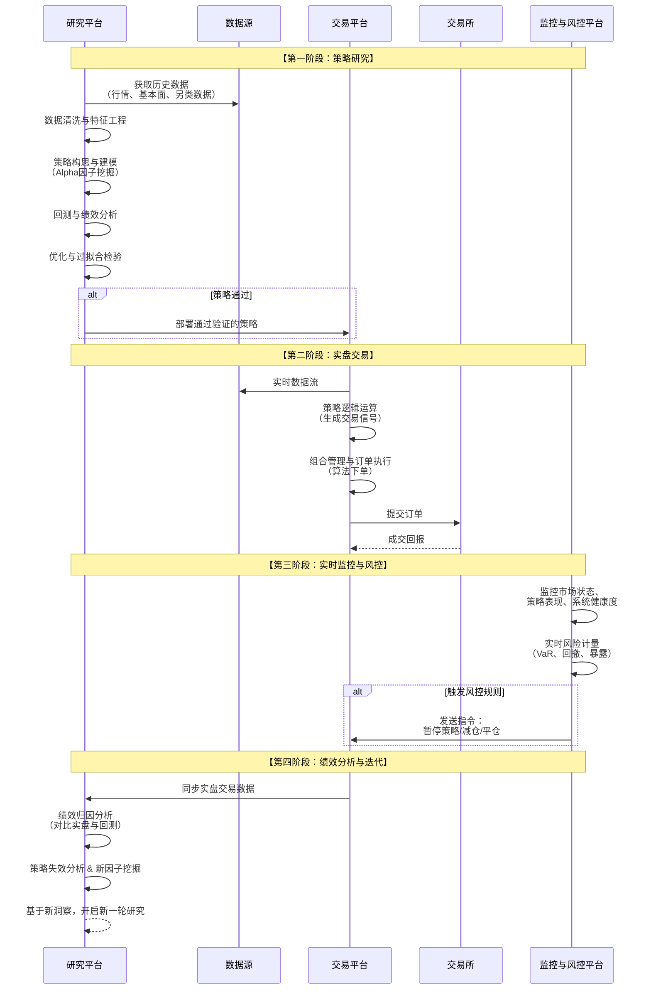

# 量化交易产品业务流分析

我们将对**量化交易产品**进行深入的业务流分析。量化交易是金融与科技的结合体，它用系统性的、数据驱动的模型取代了人为的主观判断，其业务流程是一个严谨的、不断迭代的循环系统。

---

### 一、 量化交易的核心定义与价值主张

#### 1. 核心定义
量化交易是指利用**数学模型、统计分析和计算机算法**来识别和执行交易机会的一种系统性方法。它涵盖了从数据获取、策略研究、回测验证到自动执行的完整链条。

#### 2. 核心价值主张
*   **纪律性**：排除人类情绪（贪婪、恐惧）的干扰，严格执行策略。
*   **速度与效率**：算法可以在毫秒级别内发现并执行交易机会。
*   **系统性**：能够同时监控数百个市场、资产和因子，处理海量信息。
*   **可回溯性**：所有策略都基于历史数据验证，绩效可度量、可分析。

---

### 二、 量化交易全生命周期业务流分析

一个成熟的量化交易业务是一个持续迭代的闭环系统，其核心生命周期可以通过下图清晰地展示：

---

### 三、 各阶段业务逻辑深度解析

#### 1. 策略研究与回测阶段

这是量化交易的“大脑”，核心是**发现并验证能够带来超额收益的“Alpha”**。

**A. 数据获取与处理**
*   **数据源**：
    *   **历史市场数据**：高频tick数据、分钟/日线OHLCV（开高低收成交量）。
    *   **基本面数据**：公司财报、宏观经济指标。
    *   **另类数据**：卫星图像、社交媒体情绪、网络流量、供应链数据等，用于获取独特的信息优势。
*   **数据处理**：
    *   **数据清洗**：处理缺失值、异常值、数据错误（如“闪崩”导致的异常价格）。
    *   **特征工程**：从原始数据中构建有预测能力的因子，例如：
        *   `动量因子`：过去N天的收益率。
        *   `波动率因子`：价格的标准差。
        *   `价量相关性因子`：价格与成交量的关系。

**B. 策略建模与回测**
*   **策略逻辑**：
    *   **趋势跟踪**：认为上涨的资产会继续上涨。
    *   **均值回归**：认为价格终将回归其长期均值。
    *   **统计套利**：利用两个或多个相关资产间的价差进行交易。
    *   **因子模型**：基于多因子模型（如Fama-French三因子）选股。
*   **回测引擎**：
    *   **核心功能**：在历史数据上模拟策略交易，计算出模拟的绩效曲线。
    *   **关键考量**：
        *   **交易成本**：必须考虑手续费、滑点（实际成交价与预期价的差值），否则回测结果会过于乐观。
        *   **前视偏差**：确保在回测的每个时间点，策略只能使用当时已经存在的数据。

**C. 绩效评估与优化**
*   **评估指标**：
    *   **年化收益率 & 最大回撤**：收益与风险的直观体现。
    *   **夏普比率**：衡量风险调整后的收益。`（收益率 - 无风险利率）/ 收益波动率`。
    *   **信息比率**：衡量相对于基准的超额收益能力。
    *   **胜率 & 盈亏比**。
*   **优化与过拟合**：
    *   **优化**：调整策略参数（如均线周期、止损比例）以找到最佳组合。
    *   **过拟合**：最大的陷阱。指策略在历史数据上表现完美，但在未来数据上失效。防范方法包括：
        *   **样本外测试**：将历史数据分为“训练集”（用于优化）和“测试集”（用于最终验证）。
        *   **交叉验证**。
        *   **保持策略逻辑简洁**。

#### 2. 实盘交易阶段

这是策略的“执行臂”，核心是**将信号准确、高效地转化为市场订单**。

**A. 实时数据流**
*   **技术实现**：通过交易所的直连或API，订阅实时行情（tick级或深度数据）。
*   **低延迟要求**：对于高频策略，从接收数据到发出订单的延迟需在微秒级别。这需要专门的硬件和网络优化。

**B. 策略信号生成**
*   **业务流程**：实时数据流入运行策略逻辑的服务器，算法根据预设的模型判断是否产生交易信号（买入/卖出/持有）。
*   **底层实现**：代码将当前市场状态与策略规则进行比对，例如：`IF 短期均线上穿长期均线 THEN 生成买入信号`。

**C. 组合管理与订单执行**
*   **组合管理**：
    *   管理整个投资组合的风险敞口，确保符合策略要求（如市场中性、行业中性）。
    *   计算每个信号对应的具体下单数量。
*   **订单执行**：
    *   **直接下单**：简单的限价单或市价单。
    *   **算法执行**：对于大额订单，使用更智能的执行算法来最小化市场冲击，例如：
        *   **TWAP**：在特定时间段内均匀下单。
        *   **VWAP**：按成交量加权平均价格下单，跟踪市场成交量分布。
        *   **冰山订单**：隐藏真实下单量。

#### 3. 实时监控与风控阶段

这是量化基金的“免疫系统”，核心是**实时发现并阻止异常情况**。

**A. 策略监控**
*   **实时绩效**：对比实盘收益与回测收益的差异，如果偏离过大，可能意味着策略失效。
*   **行为监控**：检查策略的交易行为是否正常，例如：是否在短时间内发出异常大量的订单？

**B. 风险控制**
*   **硬性风控规则**：
    *   **每日止损**：当日亏损达到一定金额或比例，停止所有交易。
    *   **仓位限制**：单个策略或整个组合的最大仓位限制。
    *   **杠杆限制**。
*   **软性风控规则**：
    *   **风险价值**：在给定置信水平下，投资组合可能面临的最大损失。
    *   **压力测试**：模拟极端市场情景下的潜在亏损。

**C. 系统监控**
*   监控服务器CPU、内存、网络延迟，确保交易系统稳定运行。

#### 4. 绩效分析与迭代阶段

这是量化交易的“进化引擎”，核心是**从实盘表现中学习，驱动策略升级**。

*   **绩效归因**：
    *   分析收益来源：是来自选股？择时？还是某个特定因子？
    *   区分**Alpha**（超额收益）和**Beta**（市场整体收益）。
*   **策略失效分析**：
    *   如果策略长期表现不佳，需要分析原因：是市场环境变了（如波动率 regime 切换）？还是因子失效了（被市场 arbitrage  away）？
*   **新循环开始**：
    *   基于分析结论，研究人员开始挖掘新的因子，构建新的策略，开启新一轮的研究-回测-实盘循环。

---

### 四、 关键子系统与技术栈

1.  **研究系统**：通常使用Python（Pandas, NumPy, Scikit-learn）和R，在Jupyter Notebook环境中进行快速迭代。
2.  **回测引擎**：可以是自研的高性能系统（C++/Java），或基于开源框架（如Zipline, Backtrader）。
3.  **交易执行系统**：通常是低延迟的C++/Java系统，直接与交易所API交互。
4.  **数据基础设施**：包括实时数据总线和历史数据库。
5.  **风险与监控系统**：实时告警和仪表盘系统。

---

### 五、 主要策略类型与挑战

| 策略类型     | **高频交易**     | **统计套利**       | **宏观量化** | **机器学习驱动** |
| :----------- | :--------------- | :----------------- | :----------- | :--------------- |
| **核心逻辑** | 微秒级套利、做市 | 相关资产价差回归   | 经济数据驱动 | 非线性模型预测   |
| **持仓时间** | 秒/分钟          | 天/周              | 周/月        | 可变             |
| **主要风险** | 技术延迟、监管   | 模型错误、价差扩大 | 宏观预测错误 | 过拟合、模型失效 |

**核心挑战**：
*   **数据质量**：垃圾进，垃圾出。
*   **过拟合**：量化最大的敌人。
*   **策略衰减**：任何Alpha随着被广泛知晓都会逐渐失效。
*   **技术壁垒**：对基础设施和人才的要求极高。
*   **黑箱风险**：复杂的模型可能难以解释，在发生异常时难以排查。

### 总结

量化交易产品的业务流本质是：**一个将金融洞察、数学建模和计算机科学深度融合的、高度自动化的“数据炼金”系统，它通过严谨的科学研究方法，将市场数据转化为可持续的、非情绪化的投资决策。**

其核心竞争力在于：
*   **研究层**：通过**严谨的因子挖掘和回测**，确保策略的**科学性和稳健性**。
*   **技术层**：通过**低延迟架构和高效执行系统**，确保策略的**实施精度和速度**。
*   **风控层**：通过**全流程实时监控和硬性规则**，确保资本的**生存和安全**。

成功的量化交易不是一个一劳永逸的“圣杯”策略，而是一个**持续进化的、系统化的能力体系**，它要求团队在数据、研究、技术和风控每一个环节上都追求极致。