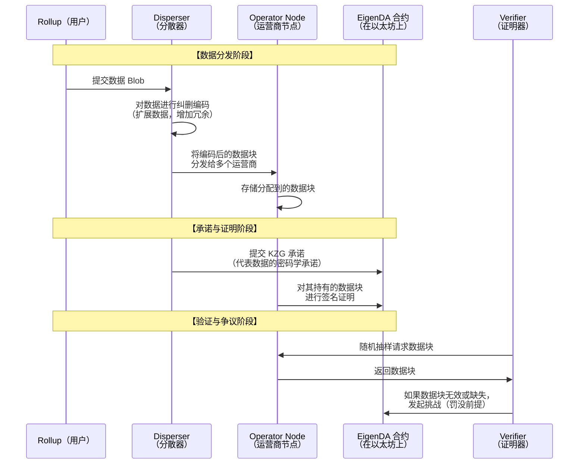
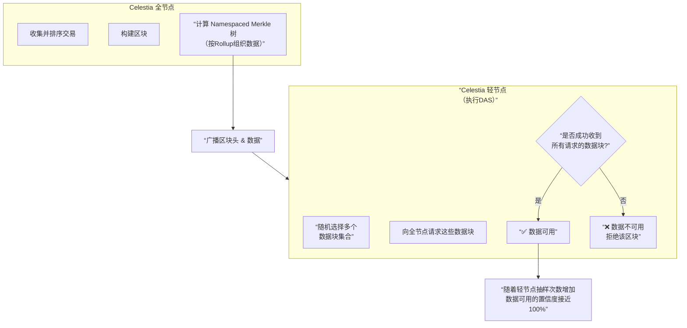

# DA 代表项目EigenDA-Celestia底层实现分析

我们来深入分析两个最具代表性的数据可用性层项目：**EigenDA** 和 **Celestia**。它们代表了模块化区块链架构中“数据可用性”层的两种核心实现路径，对于理解区块链的未来格局至关重要。

---

### 一、 数据可用性的核心问题与价值

在深入项目之前，我们必须理解 **“数据可用性问题”**：

*   **问题**：当一个区块生产者发布一个新区块时，他可能只广播区块头，却隐藏了部分交易数据。这样，网络就无法验证该区块内的交易是否有效（例如，是否存在双花）。如果轻节点接受了无效区块，就会导致资金损失。
*   **解决方案**：网络需要一种方式能**快速、低成本地确信**：**所有区块数据都已发布，并且是可获取的**。

**DA层的价值主张**：
*   **安全分离**：将执行层、结算层和数据可用性层分离，允许每个层独立优化。
*   **成本效益**：为Rollup等执行层提供一个比以太坊主网Calldata更便宜的数据发布场所。
*   **可扩展性**：通过专门化的DA层，打破区块链的“数据可用性瓶颈”。

---

### 二、 EigenDA 底层实现分析

EigenDA 是基于 **EigenLayer** 的**再质押** 生态构建的一个**数据可用性服务**。

#### 1. 核心定位与架构
EigenDA 不是一个独立的区块链，而是一个**AVS**，即运行在以太坊之上的、由再质押ETH保障安全的**服务**。

*   **安全来源**：**重新质押的ETH**。节点运营商在EigenLayer上重新质押他们的ETH或LST，并承诺诚实地运行EigenDA节点软件。如果作恶，其质押的ETH将被罚没。
*   **核心角色**：
    *   **分散器**：来自Rollup的原始数据被分割成许多小数据块。
    *   **运营商**：负责存储这些数据块，并对其可用性进行签名证明。
    *   **证明器**：负责验证运营商是否正确地存储了数据。

#### 2. 关键技术：纠删编码与KZG承诺
为了确保数据可用性，即使部分节点失效或作恶，整个数据也能被恢复，EigenDA采用了如下图的流程：

**流程与技术要点**：
1.  **纠删编码**：将原始数据通过数学变换，扩展成带有冗余的数据块。只要收到足够比例（如50%）的数据块，就能完全恢复原始数据。这极大地增强了系统的抗故障能力。
2.  **KZG 承诺**：一种向量承诺方案，可以生成一个简短的密码学承诺，用于代表整个数据。任何人都可以用这个承诺来验证某个数据块是否属于原始数据，而无需下载全部数据。
3.  **分散器**：目前由EigenLabs团队运行一个中心化的分散器，未来会去中心化。
4.  **安全性**：依赖于**经济安全**。运营商如果无法提供数据证明，或提供虚假证明，将会被**罚没**其重新质押的ETH。

#### 3. 优势与挑战
*   **优势**：
    *   **高吞吐量与低成本**：专为高带宽需求设计，目标吞吐量高达10 MB/s。
    *   **借用以太坊安全**：通过再质押模型，共享以太坊验证者集的经济安全性。
    *   **与EigenLayer生态协同**：作为核心AVS，能吸引大量再质押资产。
*   **挑战**：
    *   **早期中心化**：分散器初期是中心化的。
    *   **依赖以太坊**：其安全最终依赖于以太坊和EigenLayer的成功。
    *   **技术复杂性**：需要完善的证明和罚没机制。

---

### 三、 Celestia 底层实现分析

Celestia 是一个**专攻数据可用性的模块化区块链网络**。它本身是一条独立的POS区块链，是所有模块化栈中的“DA层”首选。

#### 1. 核心定位与架构
Celestia 被设计为**主权Rollup** 和模块化区块链的**基础数据可用性层**。

*   **安全来源**：**独立的POS区块链**。拥有自己的验证者集和原生代币$TIA。其安全性由购买其区块空间的需求和$TIA的价值支撑。
*   **核心创新**：**数据可用性抽样**。

#### 2. 关键技术：数据可用性抽样与Namespaced Merkle树
Celestia 的核心突破是允许轻节点无需下载整个区块也能可靠地验证数据可用性。其工作流程如下：

**流程与技术要点**：
1.  **数据可用性抽样**：
    *   轻节点随机从区块中请求**一小部分**数据块。
    *   如果能够成功收到这些数据块，它就认为整个区块的数据**大概率**是可用的。
    *   随着越来越多的轻节点进行多次随机抽样，整个网络对数据可用性的置信度会指数级增长，直至接近100%。
2.  **Namespaced Merkle树**：
    *   这是一种特殊的Merkle树，它将不同Rollup（或应用）的数据组织在树的不同“命名空间”下。
    *   这使得一个Rollup的轻节点可以**只下载和验证与其自身相关的交易**，而无需处理整个Celestia区块的数据，实现了极高的可扩展性。
3.  **二维RS纠删编码**：Celestia在将数据发布到网络前，会先对其进行二维的Reed-Solomon纠删编码，这使网络即使在丢失高达50%数据的情况下也能恢复原始数据，使DAS更加高效可靠。

#### 3. 优势与挑战
*   **优势**：
    *   **强大的轻节点安全性**：通过DAS，轻节点能获得与全节点几乎同等的数据可用性保证。
    *   **主权与灵活性**：Rollup可以自由地定义自己的执行环境、治理和社会共识，同时享受Celestia提供的数据可用性。
    *   **高可扩展性**：吞吐量随着节点数量增加而增长（通过DAS）。
*   **挑战**：
    *   **引导新的安全信任**：需要建立自己独立的安全性和验证者生态。
    *   **网络效应**：需要吸引足够的Rollup来购买其区块空间，以支撑$TIA的价值和网络安全。

---

### 四、 对比总结与未来展望

| 维度         | **EigenDA**                 | **Celestia**                         |
| :----------- | :-------------------------- | :----------------------------------- |
| **本质**     | 基于再质押的**服务**        | 独立的**区块链**                     |
| **安全模型** | **借用安全**（再质押的ETH） | **原生安全**（独立的POS + $TIA）     |
| **核心技术** | 纠删编码 + KZG承诺 + 证明   | 数据可用性抽样 + Namespaced Merkle树 |
| **节点要求** | 运营商节点需要高性能和存储  | 轻节点可参与安全验证（DAS）          |
| **价值主张** | 为以太坊生态提供高性价比DA  | 为整个模块化世界提供主权DA层         |
| **生态定位** | **以太坊生态的扩展**        | **模块化宇宙的基石**                 |

**未来展望**：

1.  **竞争与共存**：EigenDA 和 Celestia 并非简单的你死我活关系。EigenDA 更侧重于服务以太坊生态内的Rollup，作为其**高性能、低成本的DA选项**。而Celestia 旨在成为整个模块化区块链宇宙的**通用DA层**，尤其吸引那些追求“主权”的区块链。
2.  **模块化堆栈的融合**：未来可能会出现**混合型**的解决方案。例如，一个Rollup可能使用Celestia来实现低成本DA，同时通过EigenLayer进行再质押来获得额外的经济安全。
3.  **DA层的商品化**：长期来看，DA可能会成为一种商品化的服务。竞争将围绕**成本、安全性、延迟和开发者体验**展开。

**结论**：EigenDA 和 Celestia 分别从“共享安全”和“主权互联”两个角度，为区块链的可扩展性未来提供了两种截然不同但同样强大的解决方案。它们的竞争与发展，将共同推动模块化区块链时代的快速到来。