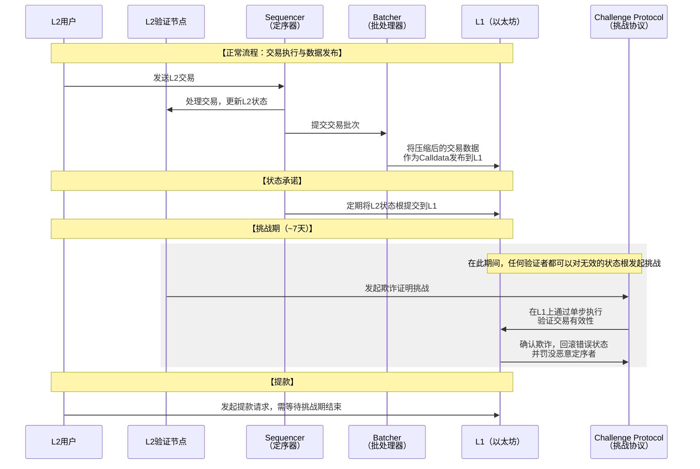
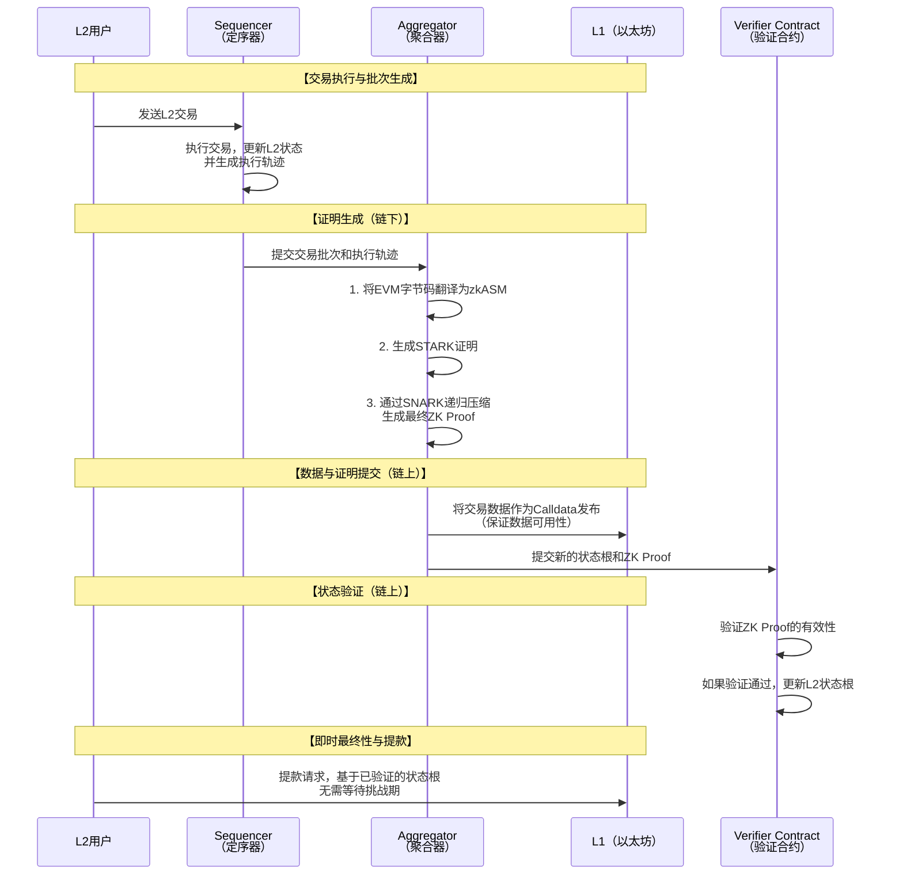

# Layer2 代表项目OpStack 和 PolygonZkevm底层实现分析

我们来深入分析两个极具代表性的 Layer 2 扩容解决方案：**Op Stack** 和 **Polygon zkEVM**。它们分别代表了 **Optimistic Rollup** 和 **ZK-Rollup** 两大技术路线的最新进展，并且都致力于实现 **EVM 等效性**，为开发者提供无缝的迁移体验。

---

### 一、 核心范式对比：Op Stack vs. Polygon zkEVM

在深入底层细节之前，我们先从高层面对比两者的核心范式：

| 维度             | **Op Stack (Optimistic Rollup)**                             | **Polygon zkEVM (ZK-Rollup)**                                |
| :--------------- | :----------------------------------------------------------- | :----------------------------------------------------------- |
| **核心安全机制** | **欺诈证明**：假设所有交易都是有效的，除非在挑战期内被证明欺诈。 | **有效性证明**：每批次交易生成一个密码学证明（ZK Proof），验证其正确性。 |
| **最终确定性**   | **经济最终性**：快速（约1小时），但资金提取到L1需要等待**7天挑战期**。 | **数学最终性**：慢（生成证明需要时间），但一旦证明在L1验证，状态即最终确定，**无提款延迟**。 |
| **EVM 兼容性**   | **字节码级等效**：可以几乎不加修改地运行Solidity/Vyper合约。 | **字节码级等效**：将EVM字节码翻译为zkASM，在zkEVM中执行。    |
| **计算重心**     | **链下**：在L2执行交易。                                     | **链下**：在L2执行交易并生成证明。                           |
| **验证重心**     | **链上**：仅在发生争议时，在L1重新执行交易。                 | **链上**：始终在L1验证简洁的ZK证明。                         |
| **Gas成本结构**  | L2交易费 + L1数据发布成本。                                  | L2交易费 + L1数据发布成本 + **高昂的证明生成成本**。         |

---

### 二、 Op Stack 底层实现分析

Op Stack 不是一个单一的链，而是一个**标准化、可配置、模块化的开源蓝图**，用于构建Optimistic Rollup。其核心目标是让任何人都能像部署智能合约一样轻松地启动一条自己的L2链（称为“OP Chain”）。

#### 1. 核心架构与工作流程

Op Stack 采用分层架构，其核心工作流程与组件交互可以通过下图清晰地展示：

#### 2. 关键组件与技术特点

*   **Sequencer**：
    *   **角色**：唯一的交易定序者（初期由Offchain Labs运行，未来去中心化）。
    *   **功能**：接收用户交易，定序后生成新的L2区块，提供即时交易确认。
*   **Batcher**：
    *   **角色**：将多个L2交易压缩并批量提交到L1。
    *   **功能**：将交易数据作为**Calldata** 发布到L1上的**Batch Inbox** 合约。这是**数据可用性**的关键，确保任何人都能从L1数据重建L2状态。
*   **Verifier**：
    *   **角色**：监控状态提交，在挑战期内验证其正确性。
    *   **功能**：如果发现无效的状态根，可以通过**欺诈证明**合约发起挑战。
*   **欺诈证明**：
    *   采用**交互式欺诈证明**。当发生争议时，不会在L1重新执行整个批次，而是通过一个“二分法”游戏，将争议范围缩小到单步操作，极大降低了挑战的Gas成本。
*   **模块化设计**：
    *   **Derivation Layer**：从L1数据推导出L2链。
    *   **Execution Layer**：执行交易并更新状态。
    *   **Settlement Layer**：处理与L1的结算和通信。
    *   这种设计允许开发者“换件”，例如，将来将数据可用性层从以太坊Calldata替换为Celestia或EigenDA。

---

### 三、 Polygon zkEVM 底层实现分析

Polygon zkEVM 是一个实现了**字节码级别EVM等效性**的ZK-Rollup。它的目标是让现有的以太坊DApp能够以最小的改动进行迁移，同时享受ZK-Rollup的终极安全性和快速终局性。

#### 1. 核心架构与工作流程

Polygon zkEVM 的工作流程紧密围绕零知识证明的生成与验证展开，其核心流程如下图所示：

#### 2. 关键组件与技术特点

*   **Sequencer**：
    *   与Op Stack类似，负责定序和执行L2交易，并生成批次的执行轨迹。
*   **Aggregator**：
    *   **角色**：负责生成有效性证明的节点。
    *   **功能**：收集Sequencer的批次数据，运行zkEVM，生成复杂的密码学证明。
*   **zkEVM 引擎**：
    *   这是技术的核心。Polygon zkEVM没有创建一个全新的VM，而是选择将**EVM字节码翻译**成其自定义的、针对零知识证明优化过的汇编语言**zkASM**。
    *   通过这种方式，它实现了高度的EVM等效性，支持几乎所有的EVM操作码。
*   **证明系统**：
    *   采用**混合证明系统**：
        1.  首先生成一个**STARK**证明，因为它证明生成速度快且无需可信设置。
        2.  然后生成一个**SNARK**证明来证明这个STARK证明是有效的。
    *   **优势**：SNARK证明体积更小，在L1上验证的成本更低。这种“STARK->SNARK”的递归压缩，在证明生成效率和链上验证成本之间取得了良好平衡。
*   **数据可用性**：
    *   与Op Stack一样，将交易数据以Calldata形式发布到以太坊L1。未来也可能支持外部DA层。
*   **即时终局性**：
    *   一旦ZK Proof在L1上得到验证，相应的状态根就是**最终**的。用户提款到L1无需等待挑战期，这是相对于Optimistic Rollup的巨大用户体验优势。

---

### 四、 总结：优势、挑战与未来

#### Op Stack：
*   **优势**：技术相对成熟，EVM兼容性极佳，模块化设计赋予了巨大的灵活性和可组合性（“超级链”愿景），开发者生态繁荣。
*   **挑战**：7天的挑战期影响用户体验，中心化的Sequencer（正在去中心化），经济安全性最终依赖于验证者活跃度。
*   **未来**：推进**去中心化Sequencer**，发展**超级链生态**，探索**链抽象**。

#### Polygon zkEVM：
*   **优势**：**最高的安全性**（密码学保证），**无提款延迟**，EVM等效性程度高。
*   **挑战**：证明生成计算密集型，导致**交易确认延迟**更高且成本更昂贵，技术复杂度极高。
*   **未来**：持续优化证明生成**效率和成本**，推进**Polygon 2.0**愿景，构建由ZK驱动的L2链网络。

**最终选择**：
*   追求**极致安全、快速终局性**且能容忍稍高的延迟和成本 -> **Polygon zkEVM**。
*   追求**成熟的生态、极致的兼容性和模块化未来**且能接受挑战期 -> **Op Stack**。

两者共同推动着以太坊扩容向前发展，它们之间的竞争与合作，最终将为整个Web3世界带来一个可扩展、安全且用户友好的未来。