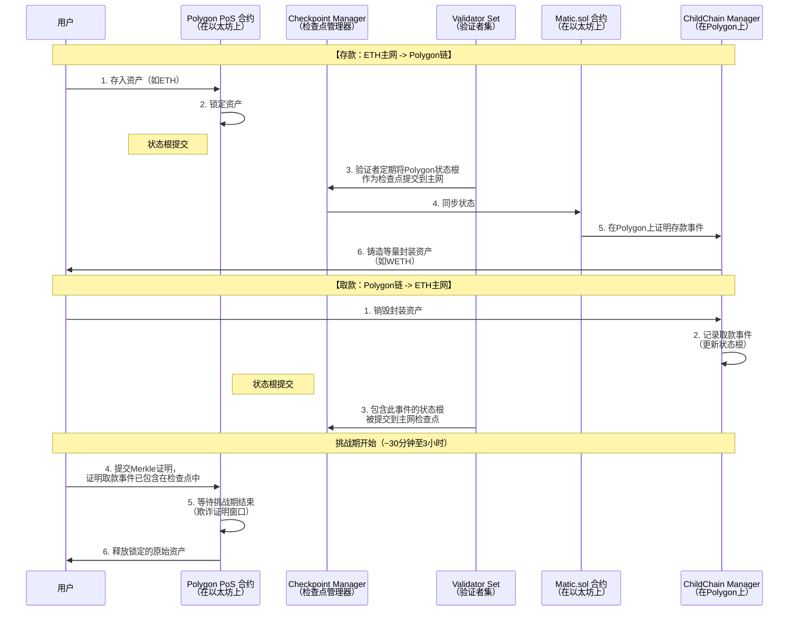
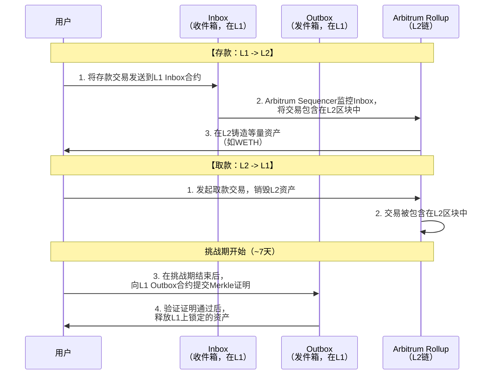

# 知名项目官方跨链桥业务流分析

我们将对知名项目的官方跨链桥进行深入的业务流分析。官方桥通常由项目核心团队开发，旨在安全地将其原生资产或生态系统与其他链连接起来。

我们将重点分析两种最主流的官方桥模式：**锁定/铸造模式** 和 **流动性网络模式**，并以 **Polygon PoS Bridge** 和 **Arbitrum Bridge** 为例。

---

### 一、 核心跨链桥模式

#### 1. 锁定/铸造模式
这是最常见、最经典的官方桥模式。

*   **核心逻辑**：在源链上**锁定**资产，在目标链上**铸造**等量的封装资产。
*   **代表项目**：Polygon PoS Bridge, Arbitrum Bridge, Optimism Bridge。
*   **流程**：
    1.  用户在源链（如以太坊主网）将资产存入官方桥的智能合约，资产被**锁定**。
    2.  桥的**监视器** 检测到该存款事件。
    3.  目标链（如Polygon）上的桥合约**铸造**等量的封装资产（如 poETH）并发送到用户地址。

#### 2. 流动性网络模式
这种模式更像一个去中心化的交易所，使用流动性池来实现跨链。

*   **核心逻辑**：在两条链上都有流动性池，通过原子交换或类似机制完成跨链。
*   **代表项目**：**Hop Protocol**, **Stargate**。
*   **流程**：
    1.  用户在源链上将资产存入流动性池A。
    2.  中继器或验证者网络在目标链的流动性池B中为用户提供等量资产。
    3.  通过协议代币激励和手续费机制，保持两条链上的流动性平衡。

---

### 二、 Polygon PoS Bridge (锁定/铸造模式) 深度分析

Polygon PoS Bridge 是锁定/铸造模式的典范，它连接以太坊主网和Polygon侧链。

#### 1. 核心参与方与架构
其跨链流程涉及多个关键角色，通过检查点和质押机制来保障安全，具体流程如下图所示：

#### 2. 安全机制：检查点与欺诈证明
*   **检查点**：
    *   Polygon的验证者集定期将Polygon链的状态根提交到以太坊主网。这个提交过程被称为“检查点”。
    *   它不仅是跨链通信的桥梁，也是Polygon侧链**最终性**的来源。一旦状态根在以太坊上得到确认，对应的Polygon区块就被认为是最终的。
*   **欺诈证明**：
    *   在取款时，有一个**挑战期**。
    *   如果验证者作恶，提交了无效的状态根，任何观察者都可以在挑战期内提交**欺诈证明**。
    *   如果证明有效，作恶的验证者将被**罚没**其质押的MATIC代币，无效的状态根将被拒绝，从而保护了主网上锁定的资产。

#### 3. 优缺点
*   **优点**：
    *   **高度安全**：依赖以太坊主网的安全性和庞大的验证者质押。
    *   **支持任意资产**：只要在以太坊上存在，就可以通过桥映射到Polygon。
*   **缺点**：
    *   **取款速度慢**：必须等待检查点提交和挑战期结束，通常需要1-3小时。
    *   **用户体验复杂**：用户需要理解两阶段提款流程。

---

### 三、 Arbitrum Bridge (锁定/铸造模式) 深度分析

Arbitrum Bridge 与Polygon桥逻辑相似，但融入了其Optimistic Rollup的技术特点。

#### 1. 核心业务流程
其流程与Polygon类似，但挑战期机制直接继承自Optimistic Rollup的核心安全模型：

#### 2. 安全机制：Rollup挑战期
*   **核心**：Arbitrum是一个Optimistic Rollup。其桥的安全性与Rollup本身的安全模型完全绑定。
*   **挑战期**：
    *   所有从L2到L1的取款都必须经过一个**约7天的挑战期**。
    *   在这段时间内，任何验证者都可以对L2的状态转换发起**欺诈挑战**。
    *   如果没有人挑战，7天后状态被视为最终状态，取款才能完成。
*   **与Polygon的区别**：Polygon的挑战期主要针对状态根提交，而Arbitrum的挑战期是针对整个批次的L2交易。

---

### 四、 官方桥的优劣势总结

#### 优势：
1.  **最高的安全性**：通常直接依赖于底层区块链（如以太坊）的安全性或多重签名/权威证明机制。
2.  **官方背书**：由项目核心团队开发和维护，可信度高。
3.  **深度集成**：与项目的底层架构紧密集成，通常是访问其生态系统的“正门”。

#### 劣势与风险：
1.  **速度慢**：尤其是Optimistic Rollup的官方桥，需要漫长的挑战期。
2.  **功能单一**：通常只支持其原生资产和少数几种主流资产。
3.  **中心化风险**：某些官方桥的初始版本可能依赖多重签名，存在单点故障。
4.  **可扩展性差**：每条链都需要构建和维护自己到其他链的桥，导致“桥爆炸”问题。

---

### 五、 跨链桥的未来展望

1.  **通用消息传递**：未来的桥不仅仅是资产桥，更是**通用跨链消息传递**平台，能够调用不同链上的智能合约。
2.  **链抽象**：最终目标是实现“链抽象”，用户无需感知底层链的存在，钱包和DApp会自动选择最优的路径和桥接方式。
3.  **安全性标准化**：会出现像**IBC** 这样的标准化跨链通信协议，降低新链的接入成本和安全风险。
4.  **零知识证明的应用**：ZK技术可以用于构建**轻客户端桥**，实现更快速、更去信任化的跨链验证。

**结论**：官方跨链桥在当前阶段是连接不同区块链生态最安全、最可靠的方式，尤其是在与Layer 2解决方案配合时。然而，它们在速度和用户体验上的短板，也为第三方桥（如Hop, Multichain）和更先进的跨链协议（如IBC, LayerZero）留下了发展空间。未来将是一个多种桥接方案并存、相互补充的格局。