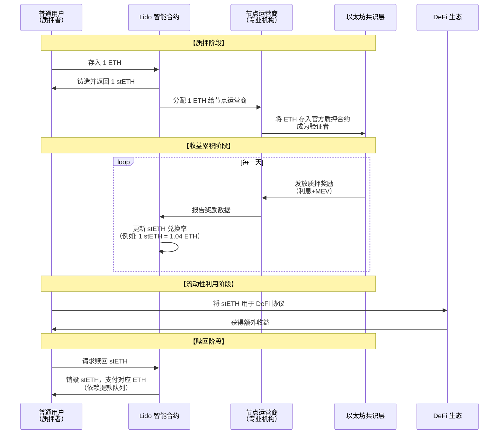

# LST-LSD 产品业务流分析

我们将对 **LST** 和 **LSD** 产品进行一次全面的业务流分析。这是以太坊转向权益证明之后，最重要的 DeFi 原语之一，重构了整个生态的收益和经济模型。

---

### 一、 核心概念与价值主张

首先，我们需要明确几个关键术语：

*   **质押**：将 ETH 存入以太坊共识层，成为验证者，以维护网络安全并获取奖励。
*   **LSD**：**流动性质押衍生品**。这是一个广义类别，指代任何代表质押资产权益的Token。
*   **LST**：**流动性质押Token**。这是 LSD 最常见的形式，是一个可交易的、生息的 ERC-20 Token（如 stETH, rETH）。

#### 核心价值主张：
*   **解决质押的“三难困境”**：
    1.  **安全性**：参与质押，维护网络安全。
    2.  **流动性**：获得一个可自由交易的 LST，无需锁定原生资产。
    3.  **收益性**：在持有 LST 的同时，持续获得质押收益。

---

### 二、 核心参与角色与业务流程

一个典型的流动性质押协议（以 Lido 为例）涉及多个参与方，其核心业务流可以用下图清晰地展示：

---

### 三、 各阶段业务逻辑深度解析

#### 1. 质押与衍生品铸造阶段

*   **用户行为**：用户将 ETH 发送到 Lido 的智能合约。
*   **协议行为**：
    *   Lido 合约会**立即**为用户铸造并发送 1:1 数量的 stETH。例如，存入 1 ETH，获得 1 stETH。
    *   这 1 stETH 代表了用户对质押资金池的**份额所有权**。
*   **节点运营商**：Lido 协议将用户汇集来的 ETH 分配给其预选并通过 DAO 批准的、可信的节点运营商。
*   **链上质押**：节点运营商使用这些 ETH 在以太坊官方质押合约中创建新的验证者节点。

#### 2. 收益累积与复利阶段

这是 LST 价值增长的核心，通常通过**“兑换率”模型**或**“Rebase”模型**实现。

*   **Lido 模型**：**兑换率模型**
    *   stETH 与 ETH 的兑换率从 1:1 开始。
    *   随着验证者获得质押奖励，协议会**定期更新兑换率**。
    *   **例如**：
        *   第一天：`1 stETH = 1.000000 ETH`
        *   一年后（假设年化 4%）：`1 stETH = 1.040000 ETH`
    *   **用户感知**：你钱包里的 stETH 数量不变，但每个 stETH 的价值在增长。当你赎回时，1 个 stETH 可以换回更多的 ETH。

*   **其他模型**：**Rebase 模型**
    *   一些协议（如早期的 StakeWise）采用此模型。你的 LST 数量会**每天自动增加**，以反映你赚取的收益，而每个 LST 与 ETH 的汇率保持 1:1。
    *   **用户感知**：你钱包里的 stETH 数量每天都在变多。

#### 3. 流动性利用阶段：LST 的“超级力量”

这是 LST 业务流中最关键的一环，它创造了巨大的可组合性。

*   **作为抵押品**：用户可以将 stETH 存入 Aave、Compound 等借贷协议中，借出其他资产（如 USDC, DAI）进行其他投资，实现**杠杆质押**。
*   **提供流动性**：用户可以将 stETH-ETH 或其他 LST 交易对提供到 DEX（如 Uniswap, Curve）的流动性池中，赚取交易手续费，这被称为 **LP 质押**。
*   **收益农场**：将上述 LP Token 再次质押到收益农场协议（如 Yearn, Convex）中，获取额外的代币奖励。
*   **作为稳定币抵押品**：如 Lido 的 stETH 是 MakerDAO 中最重要的抵押品之一，可以借出 DAI。

#### 4. 赎回与解质押阶段

在以太坊上海升级之前，质押的 ETH 无法赎回，这是 LST 存在的根本原因。升级后，赎回流程如下：

*   **用户请求**：用户将 stETH 发送回协议合约，请求赎回。
*   **触发解质押**：协议会指示节点运营商发起验证者退出流程，将 32 ETH 从共识层解锁到执行层。
*   **等待期**：这个过程需要时间（从几个小时到几天），包括：
    1.  验证者退出队列。
    2.  解质押延迟。
*   **支付**：一旦 ETH 可用，协议会将对应的 ETH（根据当前兑换率计算）支付给用户。

---

### 四、 不同协议的业务模型对比

| 特性             | **Lido（托管式）**         | **Rocket Pool（去信任化）**            | **Coinbase（中心化）** |
| :--------------- | :------------------------- | :------------------------------------- | :--------------------- |
| **核心模式**     | 由 DAO 筛选节点运营商      | 无需许可的节点运营商网络，需要质押 RPL | 中心化运营             |
| **运营商门槛**   | 高（需要被 Lido DAO 批准） | 低（只需质押 16 ETH + RPL）            | 内部团队               |
| **用户体验**     | 简单，无最低限制           | 简单，无最低限制                       | 简单，受监管           |
| **去中心化程度** | 中等（运营商集中心化）     | 高（运营商网络去中心化）               | 低                     |
| **费用结构**     | 收取用户收益的 10%         | 节点运营商获得佣金（RPL 奖励）         | 收取用户收益的 25%     |

---

### 五、 风险与挑战分析

#### 1. 技术风险
*   **智能合约风险**：协议智能合约可能存在漏洞。
*   ** slashing 风险**：验证者节点因不当行为（如离线、双重签名）而受到惩罚，导致质押资金损失。信誉良好的协议通常设有**保险基金**来覆盖此类损失。

#### 2. 中心化风险
*   **Lido 主导地位**：Lido 占据了过大的质押市场份额，引发了关于以太坊共识层中心化的担忧。
*   **运营商风险**：在托管模式下，用户需要信任协议选择的节点运营商。

#### 3. 金融风险
*   **脱锚风险**：在极端市场条件下，LST（如 stETH）可能在二级市场（如 Curve 池）短暂地与 ETH 脱钩，产生折价。
*   **监管风险**：某些司法管辖区可能将 LST 视为证券，从而带来合规挑战。

#### 4. 竞争风险
*   **新兴挑战者**：如 EigenLayer 的**再质押** 概念，允许用户将他们的 LST（如 stETH）再次质押到其他网络中，以获取额外收益，这可能会分流流动性。

### 总结

LST/LSD 产品的业务流本质是：**通过一个中间层协议，将高门槛、低流动性的底层质押行为，转化为低门槛、高流动性的、可组合的 DeFi 生息资产。**

其业务逻辑的核心创新在于：

1.  **资产证券化**：将质押的 ETH 转化为标准化的、生息的 ERC-20 代币。
2.  **风险聚合与专业化**：将技术和操作风险转移给专业的节点运营商，并为普通用户提供简单的界面。
3.  **可组合性引擎**：创造了一个巨大的、生息的抵押品基础，为整个 DeFi 生态系统注入了新的活力和杠杆来源。

**LST 已经成为以太坊 DeFi 的基石利率和最重要的抵押品类型之一。** 它不仅是质押的工具，更是一个强大的金融基元，正在催生出如 LSDfi、再质押等更复杂的金融乐高组合，持续推动着 DeFi 的创新边界。