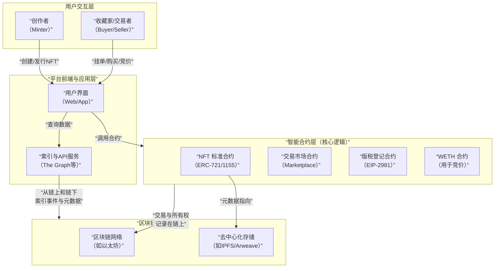

# NFT 交易平台底层逻辑分析

我们将对 **NFT 交易平台** 的底层逻辑进行一次全面深入的分析。这不仅仅是关于买卖数字图片的市场，而是一个关于数字所有权、创作者经济和新形态商业模式的复杂生态系统。

---

### 一、 产品定位与核心价值主张

#### 1. 产品定位
NFT 交易平台是一个**去中心化的数字资产市场和基础设施**，它专注于非同质化代币的发行、交易、展示和权益管理。

#### 2. 核心价值主张
*   **对创作者**：
    *   **新的收入模式**：通过一级市场销售和持续的二级市场版税获得收入。
    *   **直接面向粉丝**：无需中间商，直接与收藏家和社区建立联系。
*   **对收藏家/交易者**：
    *   **真实所有权**：在区块链上拥有可验证的、唯一的数字资产。
    *   **全球流动性**：在一个全球性的、24/7 开放的市场中进行交易。
    *   **可组合性**：拥有的 NFT 可以作为凭证，用于访问其他 DeFi、GameFi 和 DAO 应用。
*   **对开发者**：提供一套完整的 API 和 SDK，用于构建基于 NFT 的应用。

---

### 二、 核心架构与关键组件

一个成熟的 NFT 交易平台是一个由智能合约、前端界面和链下服务组成的复杂系统。

---

### 三、 底层实现逻辑深度解析

#### 1. NFT 的创建与存储机制

*   **链上核心**：NFT 本身是一个符合 **ERC-721** 或 **ERC-1155** 标准的智能合约。每个 NFT 由一个唯一的 `tokenId` 标识。
*   **元数据难题**：
    *   **问题**：将图片/视频等大文件直接存储在链上成本极高。
    *   **解决方案**：采用**链上-链下混合存储**。
        *   **链上**：NFT 合约中存储一个指向元数据文件的**URI**。
        *   **链下**：元数据文件（包含图片链接、名称、属性等）存储在**去中心化存储**网络（如 IPFS, Arweave）或中心化服务器上。
        *   **最佳实践**：使用 IPFS，其内容寻址特性保证了文件不可篡改。URI 格式为 `ipfs://Qm...`。

#### 2. 核心交易机制：订单簿与撮合

NFT 交易本质是**订单的创建和撮合**，与股票交易所有些类似。

*   **挂单**：
    *   卖家通过调用市场合约的 `createListing` 函数，签署一条消息，授权以特定价格出售其 NFT（`tokenId`）。
    *   为了节省 Gas，订单签名通常是**链下签署**，仅将签名后的订单存储在平台后端。只有当买家接受订单时，才上链执行。

*   **购买/出价**：
    *   **固定价格购买**：买家接受一个已挂出的订单，调用合约执行交易，支付 ETH 或 WETH，NFT 转移给买家。
    *   **竞价**：买家对某个 NFT 出价。这通常需要将资金（WETH）锁定在市场合约中。卖家可以选择接受最高出价。

*   **撮合引擎**：
    *   平台的后端服务负责维护订单簿，匹配买家和卖家的意图。
    *   当订单匹配时，平台前端引导用户发起一笔区块链交易，最终在链上完成资产交换。

#### 3. 版税机制：创作者经济的基石

这是 NFT 区别于传统艺术品交易的核心特征之一。

*   **实现原理**：
    1.  在市场合约的 `executeTrade` 函数中，不仅计算给卖家的金额，还会查询**版税登记合约**或 NFT 合约本身，以确定创作者的地址和版税比例（例如 5%）。
    2.  然后，将交易金额的 5% 直接转发给创作者的地址，剩余的 95% 给卖家。
*   **技术标准**：**EIP-2981** 是一个智能合约标准，它定义了一个返回版税信息和接收地址的函数，使得所有市场都能以统一的方式支持版税。
*   **挑战**：版税是一种**社会共识**而非强制技术约束。如果交易发生在不遵守版税的市场上（如绕过市场直接点对点转移），版税将无法执行。这引发了“可选版税”与“强制版税”的行业大讨论。

#### 4. 竞价与金融化

为了增加流动性，平台引入了更复杂的金融功能。

*   **WETH 的使用**：由于原生 ETH 不支持授权机制，竞价系统普遍使用 **Wrapped ETH**。用户将 ETH 包装成 WETH，并授权给市场合约使用，这样合约就可以在竞价被接受时自动划转资金。
*   **地板价池**：如 Blur 的**借贷池**，允许用户将 NFT 存入一个共享池中作为抵押品来借出 ETH，从而释放 NFT 的流动性，而不必出售它。

#### 5. 索引与数据层：用户体验的关键

区块链本身不便于复杂查询（如“筛选所有蓝色背景的Punk”）。

*   **问题**：直接从头扫描区块链来获取 NFT 数据几乎不可能。
*   **解决方案**：使用 **“索引器”**。
    *   最常用的是 **The Graph** 协议。
    *   它持续扫描区块链，监听与 NFT 相关的智能合约事件（如 `Transfer`, `ListingCreated`）。
    *   将这些事件数据处理后，存入一个便于快速查询的数据库。
    *   平台前端通过 GraphQL API 向 The Graph 查询数据，从而实现快速、丰富的筛选和展示。

---

### 四、 不同平台的核心竞争维度

| 维度         | **OpenSea**      | **Blur**           | **LooksRare**      |
| :----------- | :--------------- | :----------------- | :----------------- |
| **目标用户** | 主流用户、新手   | 专业交易者、巨鲸   | 代币激励参与者     |
| **交易模型** | 多种出价方式     | 高级竞价、聚合交易 | 类似OpenSea        |
| **版税政策** | 强制 -> 可选     | 可选，激励支付     | 强制               |
| **经济模型** | 平台收取交易费   | 低费用，空投激励   | 交易挖矿，代币激励 |
| **技术特点** | 支持多链，UI友好 | 聚合器，交易速度快 | 类似OpenSea        |

---

### 五、 优势与挑战分析

#### 核心优势：
1.  **创造了新的资产类别**：使数字内容具备了稀缺性、唯一性和可交易性。
2.  **重构创作者经济**：通过版税为创作者提供了持续的被动收入。
3.  **强大的可组合性**：NFT 是进入 GameFi、Metaverse 和 DAO 的通行证。
4.  **全球化与无障碍**：任何人只要有钱包和网络，就可以参与。

#### 面临的挑战与未来方向：
1.  **技术挑战**：
    *   **可扩展性**：高 Gas 费阻碍了小额交易。
    *   **存储可靠性**：如果元数据存储在中心化服务器，存在“rug pull”风险。
2.  **经济与治理挑战**：
    *   **版税战争**：如何平衡创作者、交易者和平台的利益。
    *   **流动性碎片化**：同一个系列的 NFT 在不同市场有不同订单。
3.  **用户体验挑战**：
    *   **复杂性**：钱包、Gas、私钥管理等对新手极不友好。
4.  **未来趋势**：
    *   **账户抽象**：用智能合约钱包简化用户体验。
    *   **链上游戏**：完全基于区块链和 NFT 的游戏，实现真正的资产所有权。
    *   **实物资产上链**：将房地产、奢侈品等实物资产用 NFT 代表。

### 总结

NFT 交易平台的底层逻辑是：**构建一个将链下复杂业务逻辑（订单簿、元数据）与链上强制执行（所有权转移、版税支付）相结合的、非托管的数字资产交换系统。**

它不仅仅是一个“买卖图片的地方”，而是一个**多边的数字商品经济网络**，其核心价值在于：
*   **技术层**：通过智能合约和去中心化存储，**确权**。
*   **市场层**：通过订单簿和竞价机制，**定价**和**提供流动性**。
*   **经济层**：通过版税和可组合性，**创造持续的价值流**。

未来的 NFT 交易平台将越来越不像一个“网站”，而更像一套**开放的、可编程的、服务于数字产权的金融基础设施**，成为连接物理世界与数字世界的桥梁。