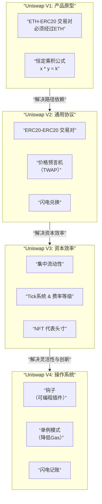

# Uniswap 从 V1 到 V4 的演进进行一次深度的底层实现分析

这不仅是一个产品迭代史，更是一部去中心化交易所技术的进化史。

---

### 核心范式：自动做市商

在深入版本细节之前，必须理解 Uniswap 的核心范式——**自动做市商** 模式。它摒弃了传统的订单簿，使用一个预定义的数学公式来为资产定价。

*   **恒定乘积公式**：`x * y = k`
    *   `x`：池中第一种资产的数量（如 ETH）
    *   `y`：池中第二种资产的数量（如 DAI）
    *   `k`：一个恒定不变的乘积
*   **定价机制**：当你用 `Δx` 买入 `Δy` 时，必须满足 `(x + Δx) * (y - Δy) = k`。由此公式可推导出你能得到的 `Δy`。**价格由资产在池中的比率决定**。

---

### Uniswap V1: 开创时代的产品原型

#### 1. 核心设计
*   **ETH-ERC20 交易对**：所有交易对都必须包含 ETH。如果你想用 DAI 兑换 USDC，需要先由 DAI/ETH 池兑换成 ETH，再用 ETH/USDC 池兑换成 USDC。
*   **单一流动性池**：每个 ERC20 代币与 ETH 组成一个独立的流动性池。

#### 2. 底层实现关键点
*   **工厂模式**：`UniswapV1Factory` 合约用于部署新的交易对合约。
*   **交易对合约**：每个 `UniswapV2Pair` 合约管理一个特定的 ETH-ERC20 池，并实现核心的 `swap`, `addLiquidity`, `removeLiquidity` 功能。
*   **直接交互**：用户直接与交易对合约进行交互。

#### 3. 优缺点分析
*   **优点**：设计极简，开创了 AMM 模式。
*   **缺点**：
    *   **必须经过 ETH**：路径冗余，滑点高，用户体验差。
    *   **资本效率低**：流动性被割裂在各个 ETH 交易对中。

---

### Uniswap V2: 成熟的通用交换协议

#### 1. 核心创新
*   **ERC20-ERC20 交易对**：支持任意两种 ERC20 代币直接组成交易对，不再需要 ETH 作为中介。
*   **价格预言机**：引入了**时间加权平均价格**，为 DeFi 生态提供了相对抗操纵的价格数据。
*   **闪电兑换**：允许用户无需预存资金即可从合约中提取资产，但必须在同一笔交易中归还或支付费用。

#### 2. 底层实现关键点
*   **核心合约**：`UniswapV2Pair` 合约管理任意两种 ERC20 资产的池子。
*   **预言机实现**：在每个区块的第一笔交易时，记录该区块的累计价格（`price0CumulativeLast, price1CumulativeLast`）。外部合约可以通过计算两个区块间的累计价差除以时间差来得到 TWAP。
*   **路径优化**：引入了 `Router` 合约，可以自动计算最佳兑换路径（例如，DAI -> WETH -> USDC），用户只需一次交易即可完成。
*   **协议费用**：可开启 0.05% 的协议费用（默认为关闭）。

#### 3. 优缺点分析
*   **优点**：成为 DeFi 乐高基石，通用性强，提供了可靠的预言机。
*   **缺点**：
    *   **资本效率依然不高**：流动性均匀分布在 0 到无穷大的价格区间，而大部分流动性其实聚集在市场价格附近。
    *   **高滑点**：对于大额交易，滑点依然显著。

---

### Uniswap V3: 资本效率的革命

#### 1. 核心创新：集中流动性
*   **概念**：流动性提供者可以将其流动性部署在**一个自定义的价格区间**内（例如，USDC/DAI 在 $0.99 - $1.01 之间）。
*   **效果**：在指定的价格区间内，LP 提供的流动性被放大，从而获得更高的手续费收入，同时为交易者提供更低的滑点。

#### 2. 底层实现关键点
*   **抛弃 ERC20 LP Token**：不再发行传统的 LP Token，取而代之的是**非同质化化的流动性位置**，即 **NFT**。
*   **Tick 系统**：将连续的价格范围离散化为一个个的 `tick`。每个 `tick` 都有对应的流动性和价格。
*   **流动性记账**：使用一种高效的**位图** 来记录哪些 `tick` 区间内存在流动性，大大降低了查询和计算的 Gas 成本。
*   **多费率等级**：提供 0.05%、0.30%、1.00% 三个不同的费率等级，以适应不同波动性的资产对。

#### 3. 优缺点分析
*   **优点**：
    *   **资本效率提升高达 4000 倍**。
    *   **做市策略专业化**：LP 可以执行更复杂的策略（如区间挂单）。
    *   **更好的交易体验**：滑点更低。
*   **缺点**：
    *   **非永久性损失风险更复杂**：如果价格超出设定的区间，LP 将停止赚取手续费并完全暴露于一种资产中。
    *   **主动管理要求高**：LP 需要监控市场并调整头寸，变得“更像主动做市商”。

---

### Uniswap V4: 可定制化的交易所操作系统

V4 是目前的设计提案，其核心是**高度可定制化**，旨在成为 DEX 的“操作系统”。

#### 1. 核心创新：钩子
*   **概念**：`Hooks` 是在池子创建、交易执行、流动性增减等**关键生命周期节点**部署和运行的代码插件。
*   **作用**：允许开发者在无需分叉整个 Uniswap 协议的情况下，为流动性池添加自定义逻辑。

#### 2. 钩子的应用场景
*   **动态费率**：根据波动性或交易量自动调整手续费。
*   **限价单**：在价格达到某个阈值时自动执行交易。
*   **时间加权平均做市商**：模仿传统做市策略，在偏离 TWAP 时提供更多流动性。
*   **链上限价单**：允许用户下指定价格的买单或卖单。
*   **流动性挖矿**：在特定时期或条件下，向 LP 分发额外的奖励代币。

#### 3. 底层实现关键点
*   **单例模式**：将所有交易对的流动性都存储在**一个合约**中，极大降低了部署新池子的 Gas 成本和跨池交换的复杂度。
*   **闪电记账系统**：在单例模式下，采用了一种新的会计系统，允许先完成交易再更新净余额，这与 V2/V3 的实时余额更新不同。
*   **钩子合约架构**：
    1.  在创建池子时，可以关联一个预定义的钩子合约地址。
    2.  当池子状态发生变化时（如 `beforeSwap`, `afterSwap`, `beforeModifyPosition`, `afterModifyPosition`），主合约会调用钩子合约的相应函数。
    3.  钩子合约可以执行自定义逻辑，甚至可以阻止交易的执行（如在 `beforeSwap` 中）。

#### 4. 优缺点分析
*   **优点**：
    *   **无限的创新空间**：钩子生态将催生大量创新的交易功能和策略。
    *   **极致的 Gas 效率**：单例模式和闪电记账大幅降低了成本。
    *   **可组合性**：钩子之间可以相互组合，构建更复杂的金融产品。
*   **挑战**：
    *   **安全复杂性**：每个钩子合约都是一个潜在的攻击向量，审计和风险评估变得更加复杂。
    *   **用户体验碎片化**：用户可能面对功能各异、风险不同的池子，需要更高的认知成本。

---

### 总结：演进脉络与未来展望

为了更直观地展示 Uniswap 各版本的核心架构演进与关键创新，我们可以通过下图进行梳理：

**演进脉络**：

1.  **V1 -> V2**：解决了**路径依赖**问题，从一个实验性产品演变为通用的基础设施。
2.  **V2 -> V3**：解决了**资本效率**问题，从被动流动性提供演变为主动头寸管理。
3.  **V3 -> V4**：解决了**灵活性与创新速度**问题，从一个固定的协议演变为一个可编程的、由社区驱动的开放平台。

**未来展望**：
Uniswap V4 通过“钩子”将协议的核心控制权下放，标志着 DEX 从一种**标准化的金融工具**向一个**充满活力的金融应用平台**的转变。未来的竞争将不再是简单的费率或UI竞争，而是**生态系统、开发者社区和金融创新能力的竞争**。