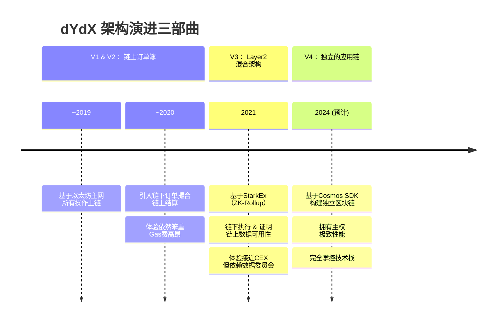

# 去中心化衍生品交易所(DyDx)产品实现分析

dYdX 的演进史本身就是一部 DeFi 衍生品技术架构的探索史。

---

### 一、 产品定位与核心价值主张

#### 1. 产品定位
dYdX 是一个专注于**永续合约**交易的去中心化交易所，旨在提供媲美中心化交易所的交易体验（高吞吐量、低延迟、低手续费），同时保持资金的**非托管**和**链上可验证**。

#### 2. 核心价值主张
*   **自我托管**：用户始终控制自己的私钥，资产存于智能合约，杜绝了交易所挪用或跑路的风险。
*   **透明与可验证**：所有交易头寸、保证金和清算过程都在链上可查，操作规则由代码定义，无法被随意更改。
*   **丰富的交易产品**：提供高达20倍杠杆的永续合约，支持多种主流加密资产。
*   **成熟的交易体验**：提供完整的订单簿、限价/市价单、止损止盈等专业交易功能。

---

### 二、 dYdX 的架构演进：三部曲

dYdX 的成功离不开其在不同阶段对技术架构的果断选择。其演进历程深刻地反映了在去中心化与性能之间寻找平衡点的探索。

---

### 三、 dYdX V3（当前主流版本）底层实现深度解析

V3 是基于 StarkWare 的 **StarkEx** 扩容引擎构建的，采用了 **ZK-Rollup** 技术，这是一个典型的**混合架构**。

#### 1. 核心架构：链下执行 + 链上保障

| 组件                   | 实现位置                  | 技术/目的                                                    |
| :--------------------- | :------------------------ | :----------------------------------------------------------- |
| **订单撮合与匹配**     | **链下 - StarkEx 引擎**   | 由 dYdX 运营的中心化服务器处理，实现高吞吐量和低延迟。       |
| **交易执行与状态更新** | **链下 - StarkEx 引擎**   | 在链下批量处理成千上万笔交易，更新用户余额和头寸。           |
| **资产托管与安全**     | **链上 - 以太坊智能合约** | 用户资产锁定在以太坊主网的智能合约中，是安全性的根本。       |
| **有效性证明**         | **链上**                  | StarkEx 为每批交易生成一个 **STARK 零知识证明**，并提交到以太坊验证，确保链下状态转换的**正确性**。 |
| **数据可用性**         | **链上**                  | 每批交易的关键数据（足以重建状态）被发布到以太坊的 Calldata 中，确保数据的**可获得性**。 |

#### 2. 关键业务流程分析

**A. 充值**
1.  用户将资产（如 ETH）存入以太坊主网的 dYdX 智能合约。
2.  StarkEx 链下引擎监测到充值事件，并在链下状态中为用户计入相应余额。
3.  **此时，资产的控制权已从用户转移到智能合约，但在链下账本中用户拥有支配权。**

**B. 交易**
1.  用户通过 dYdX 前端提交订单（签名）。
2.  订单被发送到 dYdX 的**链下订单簿**和匹配引擎。
3.  订单成交后，**链下状态**（用户的余额、头寸）立即更新。用户体验与中心化交易所无异。

**C. 生成与验证证明**
1.  StarkEx 引擎定期（例如每小时）将一批交易打包成一个“批次”。
2.  为这个批次生成一个 **STARK 证明**，证明从旧状态到新状态的所有转换都是有效的（如签名正确、无透支、清算合理）。
3.  将该证明和状态根提交到以太坊主网进行验证。

**D. 提现**
1.  用户在 dYdX 前端发起提现请求。
2.  这被视为一笔链下交易，会被包含在下一个批次中。
3.  当包含该提现的批次在以太坊上得到验证后，用户即可以**无需许可**的方式从主网智能合约中提取资产。

#### 3. 风险与清算引擎

*   **保证金模型**：采用**交叉保证金**模式，账户内所有资产作为所有头寸的共享保证金。
*   **保证金计算**：实时计算账户的**初始保证金**和**维持保证金**。
*   **清算触发**：当账户的保证金余额低于维持保证金要求时，会触发清算。
*   **清算过程**：由特定的清算机器人（或任何第三方）执行，以一定的折扣接管用户的亏损头寸，并将所得归还给协议，以覆盖用户的债务。

#### 4. 数据可用性模式：dYdX 的关键选择

dYdX V3 使用了 StarkEx 的 **“Validium”** 模式，这是其核心特征之一：
*   **Validium**：**证明在链上，但数据在链下**。交易数据不发布到以太坊，而是由一个**数据可用性委员会** 在链下存储和承诺。
*   **优势**：Gas 费极低，吞吐量极高。
*   **牺牲**：引入了**信任假设**。如果 DAC 作恶并隐瞒数据，用户可能无法证明自己的资产所有权。虽然无法盗取资金（有证明），但可能导致状态冻结。

---

### 四、 dYdX V4：迈向主权应用链

由于 V3 架构仍存在对 StarkEx 的依赖和 Validium 的信任假设，dYdX 决定进行更彻底的革命。

#### 1. 核心转变：从 L2 Rollup 到 独立区块链
dYdX V4 正在基于 **Cosmos SDK** 构建一条属于自己的区块链，即 **dYdX Chain**。

#### 2. 底层实现变化
*   **共识机制**：使用 **Tendermint Core** 的权益证明共识，由 **$DYDX** 代币持有者质押并成为验证者。
*   **完全去中心化**：订单簿、匹配引擎、清算等所有组件都将在链上运行，由全球验证者网络共同维护。
*   **性能提升**：作为一条专注于交易的单一应用链，可以通过优化底层逻辑获得极致的性能（目标吞吐量：1000+ TPS，订单延迟：1-10 秒）。
*   **主权与可定制性**：dYdX 团队可以完全控制技术栈，无需受限于以太坊的路线图或 StarkWare 的许可。

#### 3. 业务逻辑影响
*   **验证者取代委员会**：DAC 的角色被开放的验证者集取代，实现了更高程度的去中心化和安全性。
*   **$DYDX 代币价值捕获**：交易手续费将分配给验证者和质押者，使代币与协议的成功紧密相连。
*   **跨链资产**：通过 **IBC** 协议，用户可以将其他链（如以太坊）的资产跨链到 dYdX Chain 上进行交易。

---

### 五、 优势与挑战分析

#### 优势：
1.  **非托管与安全**：核心优势，资金自持。
2.  **高性能体验**：V3 和 V4 架构提供了接近 CEX 的交易速度。
3.  **透明度**：所有操作可审计。
4.  **创新驱动**：从 V1 到 V4，始终在探索技术边界。

#### 挑战与竞争：
1.  **架构复杂性**：混合架构（V3）的理解门槛高， Validium 模式存在理论上的数据可用性风险。
2.  **中心化权衡**：V3 的订单簿和匹配引擎仍是中心化的，是其去中心化纯度上的一个瑕疵。
3.  **激烈的竞争**：
    *   **订单簿模式**：**ApeX Protocol, Vertex Protocol** 等也在采用类似的混合或应用链模式。
    *   **vAMM 模式**：如 **Perpetual Protocol**，使用虚拟 AMM 来解决流动性问题，但可能存在定价偏差。
    *   **合成资产模式**：如 **Synthetix**，通过债务池对冲，无需交易对手方。
4.  **流动性分散**：与币安等顶级 CEX 相比，流动性仍有差距。

### 总结

dYdX 的产品实现分析揭示了一个清晰的演进路径：**从完全依赖主网，到利用 L2 进行性能折衷，最终走向完全主权、高度优化的专用应用链。**

*   **V1/V2** 证明了**想法可行**。
*   **V3** 证明了**体验可行**，通过 ZK-Rollup 技术将 DeFi 衍生品体验提升到了一个新的高度。
*   **V4** 旨在证明**范式可行**，即一个复杂的金融应用（如衍生品交易）完全构建在一个去中心化的、专用的区块链上是可能且必要的。

dYdX 的探索不仅是其自身的发展史，也为整个 DeFi 行业指明了**应用链**作为终极可扩展性解决方案的巨大潜力。未来，dYdX Chain 能否成功构建一个充满活力的、去中心化的全球衍生品交易市场，将是其面临的最大考验。