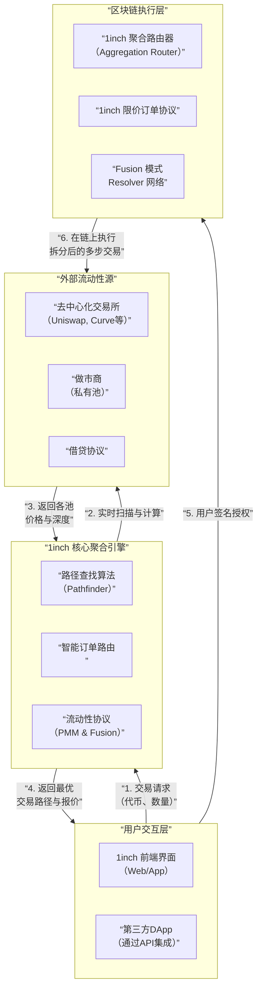

# 聚合流动性平台 1Inch 产品底层逻辑分析

它不仅仅是简单的 DEX 聚合器，而是一个复杂的、旨在为用户找到最优交易路径的金融路由器。

---

### 一、 产品定位与核心价值主张

#### 1. 产品定位
1inch 是一个**去中心化的交易聚合协议**，它通过智能算法在数百个去中心化交易所和流动性来源中，为用户的交易请求寻找并执行**最优的价格和最低的滑点**。

#### 2. 核心价值主张
*   **最优价格**：通过拆分订单到多个 DEX，获取比任何单一来源都更好的有效价格。
*   **降低滑点**：通过智能路径寻找，避免大额交易对单一流动性池造成巨大冲击。
*   **节省 Gas**：通过 Chi Gastoken、路由优化等方式，尽可能降低用户的交易成本。
*   **非托管与安全**：用户资产始终由自己控制，1inch 仅作为智能路由，不托管用户资金。

---

### 二、 核心组件与架构

1inch 的生态系统由多个核心智能合约和算法组成，共同协作以实现其价值主张。

---

### 三、 底层实现逻辑深度解析

#### 1. 路径查找算法：聚合器的“大脑”

这是 1inch 最核心的技术，其工作原理如下：

*   **数据获取**：实时从所有集成的 DEX 和流动性协议中获取报价和深度信息。
*   **路径探索**：算法不仅考虑直接交易对（如 ETH -> USDC），还会探索通过一个或多个**中间代币**的路径（如 ETH -> DAI -> USDC），这被称为**多跳交易**。
*   **拆分算法**：对于大额订单，算法会将其**拆分成多个部分**，分别路由到不同的协议中。例如，一笔 100 ETH 的兑换可能被拆成：
    *   30 ETH 在 Uniswap V3
    *   40 ETH在 Balancer V2
    *   30 ETH 在 Curve
*   **成本优化**：算法会综合考虑**有效价格**（包含滑点后）和**预估 Gas 成本**，计算出**净收益最高**的路径。

#### 2. 智能订单路由：从“发现”到“执行”

找到最优路径后，1inch 通过其**聚合路由器**合约在链上执行。

*   **统一接口**：用户只需授权一笔交易给 1inch 路由器，它就会自动处理与多个不同 DEX 合约的复杂交互。
*   **原子性交易**：整个多步、多协议的兑换过程在一个区块链交易中完成。要么全部成功，要么全部失败，防止了部分成交带来的风险。
*   **套利保护**：通过设置**最小输出量** 和截止时间，确保用户不会在交易被矿工打包前因市场价格波动而遭受损失。

#### 3. 限价订单协议：超越即时交易

1inch 允许用户下**去中心化的限价单**，这是其产品矩阵的重要一环。

*   **工作原理**：用户可以设定“当 1 ETH ≥ 2000 USDC 时，卖出我的 1 ETH”。
*   **链上订单簿**：这些订单被发布在链上，由一个去中心化的**Resolver**网络监控。
*   **自动执行**：当市场价格达到条件时，任何一个 Resolver 都可以提交一个交易来执行该订单，并从中获得奖励。这实现了类似中心化交易所的限价单功能，但完全在链上且非托管。

#### 4. Fusion 模式：革命性的交易体验

这是 1inch 近年来最重要的升级，引入了 **P2P** 和 **荷兰式拍卖** 机制。

*   **核心思想**：用户提交一个“意图”，指定输入和期望的输出，但不立即执行。这个意图进入一个**去中心化的订单池**。
*   **Resolver 网络竞争**：专业的做市商和 Resolver 节点为了获取手续费，会相互竞争，试图为用户提供其期望的输出。
*   **荷兰式拍卖**：
    1.  用户设定一个**目标数量**（如 1 ETH 换至少 2000 USDC）和一个**截止时间**（如 1 小时）。
    2.  在截止时间内，Resolver 可以随时以**等于或优于**目标数量的价格来“填充”这个订单。
    3.  Resolver 有动力提供更好的价格，因为他们也在与其他 Resolver 竞争。
*   **核心优势**：
    *   **MEV 保护**：交易在内存池中是不可见的，Resolver 无法进行抢跑交易。
    *   **Gasless 对于用户**：用户不需要支付 Gas 费，Gas 成本由执行订单的 Resolver 承担，并已包含在报价中。
    *   **可能获得更好价格**：竞争机制可能促使 Resolver 提供比当前市场价更优的价格。

---

### 四、 协议的经济模型与代币效用

**$1INCH** 代币是协议治理和生态系统的核心。

*   **治理**：代币持有者可以对协议的关键参数进行投票，例如：
    *   各个流动性源的**默认交换费用**。
    *   **价格影响** 算法的参数。
    *   协议**国库**的资金使用。
*   **流动性挖矿**：通过提供流动性到 1inch 的**PMM**，用户可以赚取交易手续费和 $1INCH 奖励。
*   **Fusion 模式激励**：Resolver 需要质押 $1INCH 代币才能参与订单的填充，这既保证了网络的安全性，也为代币创造了需求。

---

### 五、 优势与挑战分析

#### 核心优势：
1.  **极致的价格优化**：通过拆分和多路径，提供了市场最佳的有效价格。
2.  **不断的技术创新**：从简单的聚合器，发展到包含限价单、Fusion 模式的复杂生态系统。
3.  **强大的网络效应**：集成了几乎所有主流的 DEX 和流动性协议，成为 DeFi 世界的默认流动性入口之一。
4.  **增强的用户保护**：Fusion 模式有效对抗了 MEV 和抢跑攻击。

#### 面临的挑战与竞争：
1.  **复杂的竞争环境**：
    *   **其他聚合器**：ParaSwap, Matcha, 0x API 等提供类似服务。
    *   **DEX 原生聚合**：如 Uniswap 自身的“Universal Router”也在尝试优化路由。
    *   **钱包内置**：MetaMask 等钱包也集成了 Swap 功能。
2.  **协议依赖风险**：1inch 的安全性依赖于其集成的所有 DEX 协议的安全性。如果某个底层协议被攻击，1inch 的用户也可能受影响。
3.  **中心化与去中心化的权衡**：路径查找算法目前仍主要由 1inch 团队控制的服务器运行，存在一定的中心化风险。Fusion 模式是向去中心化迈出的重要一步。
4.  **Gas 优化的局限性**：尽管有优化，但复杂的多步交易本身 Gas 成本就不低，在以太坊主网拥堵时依然昂贵。

### 总结

1inch 的底层逻辑可以概括为：**一个通过先进算法和智能合约，将碎片化的 DeFi 流动性整合成一个虚拟的、统一的、高效的“超级流动性池”，并为用户提供单一、最优执行点的复杂系统。**

它的演进路径清晰地展示了 DeFi 基础设施的发展方向：
*   **从聚合**（找到最好的价格）
*   **到创新**（创造新的交易范式，如 Fusion）
*   **再到治理与生态建设**（通过代币经济激励整个网络）

未来，1inch 的竞争壁垒将不仅在于其算法，更在于其建立的 **Resolver 网络、品牌信任度和广泛的集成度**。它正在从一個工具，演变为 DeFi 领域不可或缺的基础设施层。