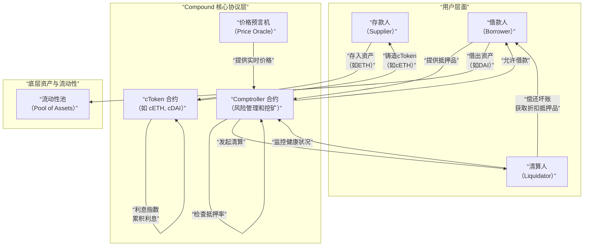

# 质押借贷产品(Compound)底层逻辑分析

它不仅是首个采用算法利率模型的协议，更开创了"流动性挖矿"的先河，彻底改变了 DeFi 的格局。

---

### 一、 产品定位与核心价值主张

#### 1. 产品定位
Compound 是一个基于以太坊的**去中心化、算法驱动的货币市场协议**。它允许用户无需信任第三方即可存入特定加密资产赚取利息，或通过超额抵押借入其他资产。

#### 2. 核心价值主张
*   **即时借贷**：无需信用检查或审批流程，只要有足额抵押品，即可立即借出资产。
*   **市场化利率**：存款和借款利率由市场的供需关系通过算法实时决定，完全透明。
*   **资本效率**：存款人的资金在赚取利息的同时，仍可作为抵押品用于借款，提升了资本利用率。
*   **非托管与可组合性**：用户始终控制自己的资产，协议作为可组合的乐高积木，可与其它 DeFi 应用无缝集成。

---

### 二、 核心架构与关键概念

Compound 的协议逻辑建立在几个核心概念和智能合约之上，其运作机制可以通过下图清晰地展示：

---

### 三、 底层实现逻辑深度解析

#### 1. cToken：协议的基石与计息凭证

这是 Compound 最核心的创新。cToken 是一种**可互换的、计息的 ERC-20 代币**。

*   **存款即铸造**：当用户存入资产（如 ETH）时，协议会按当前汇率 1:1 铸造相应的 cToken（如 cETH）并发送给用户。
*   **利息体现为 cToken 的升值**：
    *   **cToken 兑换率**：定义了 1 个 cToken 能兑换多少底层资产。这个兑换率会**随着时间推移而增加**，因为协议会将借款方支付的利息累积到资金池中。
    *   **提现即销毁**：当用户想要取回自己的 ETH 时，他需要将 cETH 返还给协议，协议按**当前的兑换率**计算出他应得的 ETH 数量。由于兑换率升高了，他得到的 ETH 会比他最初存入的更多，多出的部分就是利息。

**示例**：
*   你存入 100 DAI，当时 `cDAI兑换率 = 1`，你获得 100 cDAI。
*   一段时间后，`cDAI兑换率 = 1.05`。
*   你用 100 cDAI 赎回，得到 `100 * 1.05 = 105 DAI`。其中 5 DAI 就是你的利息。

#### 2. 算法利率模型：市场的无形之手

Compound 使用一个基于**资金利用率** 的模型来动态调整利率。

*   **资金利用率**：`U = 总借款 / (总流动性 + 总借款)`
    *   它衡量了资金池中有多少资产被借出。
*   **利率曲线**：
    *   **借款利率**：随着 U 的升高而**升高**，以激励更多存款人提供流动性，并抑制借款人继续借贷。
    *   **存款利率**：`存款利率 = 借款利率 * U * (1 - 准备金率)`
        *   存款利率总是低于借款利率，其差值的一部分作为协议的**准备金**（用于应对坏账风险），其余部分则激励给存款人。

#### 3. 抵押与清算引擎：系统的风险控制器

*   **抵押因子**：
    *   每种资产都有一个由社区治理设定的抵押因子（0 - 90%）。它代表了该资产作为抵押品的"效力"。
    *   例如，ETH 的抵押因子为 82%，意味着你存入价值 $100 的 ETH，最多可以借出价值 $82 的其他资产。
*   **账户健康度/抵押率**：
    *   协议实时计算每个借款账户的**总抵押价值**和**总借款价值**。
    *   **抵押率 = (总抵押价值 * 抵押因子) / 总借款价值**
    *   当**抵押率 < 100%** 时，账户处于**被清算状态**。
*   **清算**：
    *   当账户抵押率低于 100% 时，任何**清算人**都可以代表该用户偿还部分债务，同时以**折扣价**获得其抵押品作为奖励。
    *   这确保了协议总是处于**超额抵押**状态，从而保证了整个系统的偿付能力。

#### 4. COMP 代币与流动性挖矿：治理与激励

*   **治理代币**：COMP 是 Compound 的治理代币，持有者可以对协议参数（如抵押因子、利率模型、上新资产）进行投票。
*   **流动性挖矿**：
    *   Compound 首创了"借贷即挖矿"模式。
    *   协议每天向协议的存款人和借款人分发固定数量的 COMP 代币。
    *   你在一个市场中提供的流动性或产生的债务越多，你分得的 COMP 就越多。
    *   这一机制在 2020 年引发了 "DeFi 之夏"，极大地激励了用户参与。

---

### 四、 协议的经济模型与风险

#### 1. 收入与价值流
*   **利差**：协议通过保留一部分借款利息作为**准备金**来产生收入。
*   **COMP 代币价值**：协议的成功和治理权力捕获了 COMP 的价值。

#### 2. 风险分析
*   **智能合约风险**：核心合约经过多次审计，但仍有被黑客攻击的可能（历史上曾出现过预言机攻击导致资金被盗的事件）。
*   **清算风险**：在极端市场波动下，用户可能因抵押品价值急剧下跌而来不及还款或增加抵押品，导致被清算，遭受资产损失。
*   **流动性风险**：如果市场出现挤兑，大量用户同时提现可能导致协议流动性不足。
*   **治理风险**：中心化的治理可能通过不利于社区的提案。

---

### 五、 优势与挑战

#### 核心优势：
1.  **创新性与先驱地位**：定义了 DeFi 借贷的标准，引入了 cToken 和流动性挖矿。
2.  **强大的网络效应**：作为最老牌、最受信任的借贷协议之一，拥有最深度的流动性。
3.  **高度的可组合性**：cToken 已成为整个 DeFi 生态的基础资产，被广泛用于其它协议作为抵押品。
4.  **透明的市场化利率**：利率由代码自动生成，无需人为干预。

#### 面临的挑战与竞争：
1.  **激烈的市场竞争**：
    *   **Aave**：提供更丰富的功能，如闪电贷、固定利率、信用委托等。
    *   **Euler Finance**：提供权限分离和风险更低的创新模型。
2.  **资本效率瓶颈**：超额抵押模式限制了资本效率，无法满足无抵押借贷的需求。
3.  **利率模型僵化**：算法利率模型有时无法快速响应市场的剧烈变化。
4.  **Gas 成本**：在以太坊主网上进行交互的 Gas 费仍然较高。

### 总结

Compound 的底层逻辑可以概括为：**一个通过 cToken 将流动性池证券化，并利用基于利用率的算法利率模型来平衡供需，同时通过超额抵押和清算机制来管理风险的自动化货币市场。**

它的伟大之处在于：
*   **技术层面**：创造了 **cToken** 这一巧妙的计息资产标准。
*   **经济层面**：通过 **流动性挖矿** 证明了代币激励可以引爆市场。
*   **理念层面**：实现了 **"货币市场乐高积木"**，让借贷变得可编程和可组合。

Compound 不仅是 DeFi 借贷的开拓者，更是一个持续运行的、价值数十亿美元的**去中心化中央银行**的雏形。它为我们展示了一个开放、透明、全球化的金融系统可能的样子。尽管面临挑战，但它奠定的基础和开创的模式将继续深远地影响着 DeFi 的未来发展。