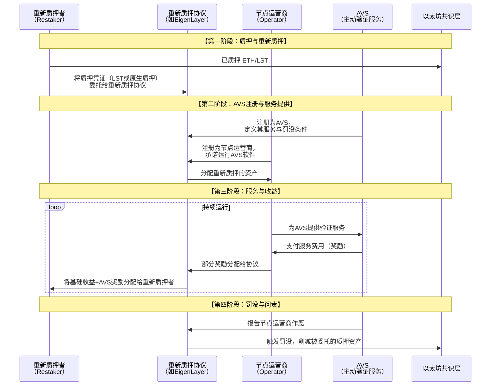

# 重新质押协议与知名项目分析

这被认为是继流动性质押之后，下一个潜在的“万亿级”市场。

---

### 一、 重新质押的核心概念与价值主张

#### 1. 什么是重新质押？
**重新质押** 是一种新兴的加密经济安全原语，它允许**已经质押在底层共识层（如以太坊）的资产（ETH 或 LST），将其安全属性“租借”给其他需要安全的中间件、DA层、跨链桥等协议（这些协议被称为“主动验证服务”），并为此获得额外的奖励**。

#### 2. 核心价值主张
*   **对 AVS**：无需从头开始建立自己的信任网络和安全预算，可以**“借用”以太坊的强大安全性**，快速启动并专注于核心业务逻辑。
*   **对重新质押者**：**最大化资本效率和收益**。同一笔质押的 ETH 除了获得基础质押收益外，还能通过“出租安全性”获得来自多个 AVS 的额外奖励。
*   **对整个生态系统**：创建一个**共享的安全经济层**，避免了安全性的碎片化，促进了网络效应的形成。

---

### 二、 重新质押协议的核心架构与业务流程

重新质押协议的运作涉及多个关键角色和复杂的交互。其核心业务流程可以通过下图清晰地展示：

---

### 三、 重新质押的两种主要模式

#### 1. 原生重新质押
*   **对象**：在以太坊共识层直接运行验证者的节点运营商。
*   **方式**：这些运营商可以将其验证者提款凭证指向 EigenLayer 的智能合约，从而承诺其质押的 32 ETH 也将用于保障其所选择的 AVS。
*   **特点**：技术门槛高，主要面向专业节点运营商。

#### 2. LST 重新质押
*   **对象**：持有流动性质押代币的普通用户（如 stETH, rETH, cbETH 的持有者）。
*   **方式**：用户只需将其 LST 存入 EigenLayer 的智能合约中，即可参与重新质押。
*   **特点**：**用户友好，无门槛**，是吸引大量流动性的主要方式。用户会收到一个代表其重新质押头寸的衍生代币（如 EigenLayer 中的 `ezETH` 或类似物）。

---

### 四、 知名项目深度分析：EigenLayer

EigenLayer 是该领域的绝对开创者和主导者，可以被理解为 **“安全即服务”的市场** 或 **“信任的租赁平台”**。

#### 1. 核心组件
*   **重新质押池**：用户存入 ETH/LST 的智能合约，是共享安全性的来源。
*   **注册表**：
    *   **节点运营商注册表**：管理和验证节点运营商的身份与信誉。
    *   **AVS 注册表**：管理和验证所有接入的主动验证服务。
*   **罚没机制**：定义了对节点运营商不当行为的惩罚规则，这是整个系统可信度的基石。
*   **治理**：通过 $EIGEN 代币管理协议的关键参数和升级。

#### 2. $EIGEN 代币与“Intersubjective Staking”
$EIGEN 代币的一个革命性创新是引入了**“跨主观质押”**。

*   **问题**：如何对无法在链上完全客观验证的欺诈行为（例如，预言机报告了错误的外部世界数据）进行罚没？
*   **解决方案**：$EIGEN 被设计为专门用于处理这类 **“跨主观”** 故障。
    *   如果 AVS 检测到可能的作恶，可以发起一个“质疑”。
    *   $EIGEN 持有者（即“守护者”）将参与治理，投票决定是否实施罚没。
    *   这使得 EigenLayer 能够支持更复杂、更多样化的 AVS，超越了单纯依靠代码验证的范畴。

#### 3. 已集成的 AVS 示例（展示其潜力）
EigenLayer 上已经吸引了大量高质量的 AVS 项目，包括：
*   **EigenDA**：一个高性能的**数据可用性** 层，作为以太坊 Dencun 升级后 Blob 空间的补充，为 Rollup 提供更低成本的数据存储。
*   **AltLayer**：一个提供**弹性 Rollup** 即服务的网络，利用重新质押来确保其临时 Rollup 的安全。
*   **Brevis**：一个**零知识证明协处理器**，允许智能合约以可验证的方式计算任意链下数据。
*   **Lagrange**：一个提供**跨链状态证明**的协议。

---

### 五、 其他知名项目与生态

除了 EigenLayer，其他项目也在以不同方式探索重新质押：

*   **Karak**：定位为“通用再质押层”，支持更多种类的资产（如稳定币、LP Token）进行重新质押，概念更广义。
*   **Swell**：一个流动性质押协议，正在构建自己的 **L2 Rollup**，并将利用其质押的 ETH 和 swETH（其 LST）来保障该 Rollup 的安全，是“为自己重新质押”的典型。
*   **Babylon**：试图将比特币的**时间戳和安全模型**通过重新质押的方式共享给其他 PoS 链，解决“远程攻击”问题。

---

### 六、 风险与挑战分析（“潘多拉魔盒”）

重新质押在带来巨大潜力的同时，也引入了前所未有的系统性风险。

#### 1. 系统性风险：“叠加的罚没”
这是最核心的风险。一个节点运营商同时为多个 AVS 服务。
*   **场景**：如果该运营商因在一个 AVS 上作恶而被罚没，那么**所有委托资产给该运营商的重新质押者，无论他们选择了多少个 AVS，都会遭受损失**。
*   **类比**：就像你把所有鸡蛋放在一个篮子里，即使你把鸡蛋分给了不同的买家（AVS），但如果篮子掉了，所有鸡蛋都会碎。

#### 2. 中心化风险
*   **运营商中心化**：为了简化管理和降低风险，重新质押者可能会涌向少数大型、信誉良好的节点运营商，导致权力集中。
*   **协议中心化**：EigenLayer 作为“安全超市”，其本身可能成为关键的中介和单点故障。

#### 3. 流动性风险与“再抵押循环”
类似于 2008 年金融危机中的“再抵押”，同一笔 ETH 的安全属性被多次出售。如果某个环节出现崩溃（如一个主要 AVS 被黑客攻击），可能会引发连锁反应和流动性危机。

#### 4. 监管不确定性
重新质押的复杂金融模型可能引起监管机构的关注，特别是其代币 $EIGEN 的“跨主观”治理模式，可能被认定为某种形式的证券。

### 总结

重新质押协议，特别是 **EigenLayer**，代表了一种**范式转移**：

*   **从“安全孤岛”到“共享安全”**：它打破了每个协议都需要自行建立安全壁垒的传统，创建了一个可交易的安全市场。
*   **从“单一收益”到“超级货币”**：它让 ETH 不再仅仅是保护以太坊的资产，而是变成了保护整个加密生态的“基础安全资产”，其价值捕获能力被极大提升。
*   **从“客观真理”到“跨主观共识”**：$EIGEN 的模型尝试用加密经济方法解决更复杂的社会协调和信任问题。

**未来展望**：
重新质押正在催生一个全新的生态系统，称为 **“Restaking Stack”** 或 **“EigenLayer 生态”**。如果成功，它将极大地加速模块化区块链和中间件的发展，降低创新门槛，并可能使以太坊成为加密世界的“安全结算层”。然而，这片新大陆也充满了未知的风险，其长期稳定性和抗冲击能力仍需在实战中接受考验。它既是机遇，也是一个需要被谨慎管理的“浮士德式的交易”。