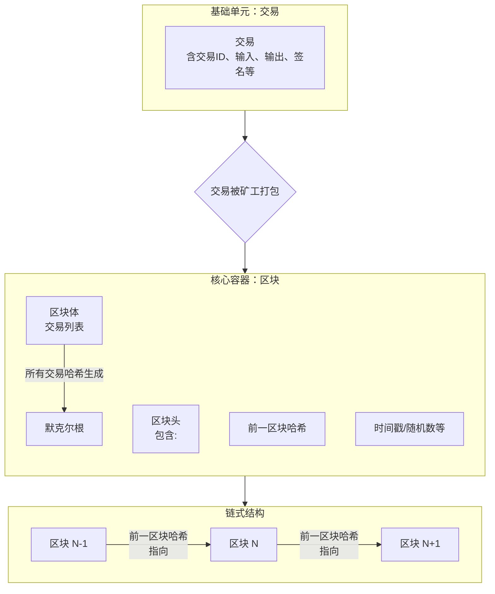

# 区块链的基本数据结构

区块链，顾名思义，是由一系列“区块”以“链”式结构连接而成的分布式数据库。其核心数据结构可以分解为以下几个关键部分：

### 1. 交易 - 最基本的构成单元

*   **是什么**：交易是区块链上记录的一次状态变更。例如：“Alice 向 Bob 转账 10个代币”。
*   **结构**：
    *   **交易ID**：一个唯一的哈希标识符，由交易内容生成。
    *   **输入**：说明资金的来源（引用之前的交易输出）。
    *   **输出**：指定资金的去向和条件（如需要谁的签名才能花费）。
    *   **数字签名**：由转账方生成，用于授权这笔交易。
    *   **其他数据**：在智能合约平台（如以太坊）上，还可能包含被调用的合约函数和参数。

### 2. 区块 - 交易的容器

一个区块就像会计账簿中的一页，记录了一段时间内发生的多笔交易。它主要由**区块头**和**区块体**两部分组成。

#### **A. 区块头 - 区块的“身份证”和“链接器”**

区块头包含了该区块的元数据，是形成“链”的关键。它主要包含以下字段：

1.  **版本号**：指明区块遵循的验证规则。
2.  **前一区块哈希**：**这是形成“链”的核心！** 它指向上一个区块头的哈希值。任何对前一个区块的修改都会导致其哈希值改变，从而破坏整个后续链条，这就是区块链不可篡改性的来源。
3.  **默克尔根**：**这是高效验证交易完整性的核心！** 它是通过将本区块中所有交易两两哈希，最终计算出的一个根哈希值。任何一笔交易的微小变动都会导致默克尔根彻底改变。
4.  **时间戳**：区块的大致生成时间。
5.  **难度目标**：当前网络挖矿难度的指标。
6.  **随机数：** 一个用于工作量证明挖矿的计数器。矿工通过不断改变这个数值来寻找一个满足特定条件的哈希值。

#### **B. 区块体 - 交易的“清单”**

区块体包含了该区块打包的所有交易记录。通常第一笔交易是** Coinbase 交易**（也称创币交易），这是给矿工的区块奖励和手续费。

---

### 核心数据结构的可视化解析

为了更直观地理解这些组件如何协同工作，我们可以通过以下图表来梳理区块链的数据结构：

从上图可以看出：
1.  **链式连接**：每个区块通过“前一区块哈希”指向上一个区块，形成一条单向的、可追溯的链。
2.  **数据完整性**：“默克尔根”确保了区块体内所有交易无法被篡改。
3.  **工作量证明**：区块头中的“随机数”和“难度目标”共同体现了工作量证明共识机制，确保了区块创建需要付出计算成本。

---

### 关键数据结构的技术精髓

#### 1. 哈希指针链
普通的指针告诉你数据存储在哪里，而**哈希指针**不仅告诉你位置，还允许你**验证数据是否被篡改**。这正是区块链不可篡改性的密码学基础。
*   **篡改检测**：如果攻击者修改了区块N的内容，那么区块N的哈希会改变。由于区块N+1的头部记录的是区块N的原哈希，这个变化会被立刻发现。为了掩盖修改，攻击者必须连续修改所有后续区块，这在计算上是不可行的。

#### 2. 默克尔树
这是一种二叉树结构，将所有交易哈希组织起来，最终生成一个唯一的“默克尔根”并存入区块头。
*   **高效验证**：默克尔树允许进行**简洁验证**。要证明某笔交易（Tx3）是否存在于某个区块中，你不需要下载整个区块的所有交易，只需要提供从Tx3到默克尔根路径上的少量哈希值（即“默克尔证明”）即可。这对于轻钱包（如手机钱包）和Layer 2扩展方案至关重要。

---

### 总结

区块链的基本数据结构是一个精妙的组合：

*   **交易**是承载价值的操作记录。
*   **区块**是批量打包交易的容器。
*   **哈希指针**将区块串联成一条**不可篡改的链**。
*   **默克尔树**在区块内部构建了一个**高效验证交易身份的机制**。

这种结构共同赋予了区块链**去中心化信任、数据不可篡改、和可追溯**这三大核心特性。