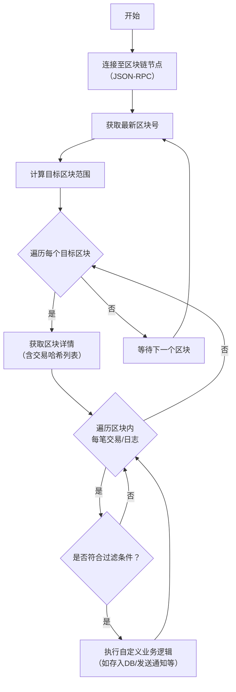

# 扫块

### 1. 什么是“扫块”？

“扫块”指的是通过程序自动监听、获取并解析区块链上每个新产生的区块，从中提取出你感兴趣的交易和日志信息的过程。它不是主动去“扫描”整个链的历史数据，而是持续地“监听”新区块，就像一个实时监控器。

**核心目标：** 实时获取链上发生的特定事件。

### 2. 扫块的核心业务逻辑

扫块的业务逻辑可以概括为一个持续的循环流程，其核心流程图如下：



下面我们来详细解释流程图中的每一个环节。

#### 步骤 1: 建立连接
- **描述**： 你的应用程序（扫块程序）需要连接到一个区块链节点。这个节点可以是你自己搭建的，也可以使用第三方服务提供商（如 Infura、Alchemy、QuickNode 等）的服务。
- **技术**： 通常通过 **JSON-RPC** 接口进行连接，Web3.js 或 Ethers.js 这类库封装了这些底层调用。

#### 步骤 2: 监听新区块
- **描述**： 程序需要知道什么时候产生了新区块。有两种主流方式：
    - **轮询**： 以一个固定的时间间隔（例如每秒）主动查询节点的 `eth_blockNumber` 方法，检查最新的区块号是否增长。这是最常用、最可靠的方式。
    - **订阅**： 通过 WebSocket 连接订阅 `newHeads` 事件。当节点产生新区块时，它会主动推送通知给你的程序。这种方式更实时，但需要维持稳定的 WebSocket 连接，并且在连接中断后需要处理重连和数据补漏。

#### 步骤 3: 获取区块详情
- **描述**： 一旦发现新区块（假设区块号为 `N`），就通过 `eth_getBlockByNumber` 方法获取该区块的完整详情。
- **关键信息**： 这个响应里包含了：
    - 所有交易哈希的列表 (`transactions` 数组)
    - 区块时间戳
    - 矿工地址等

#### 步骤 4: 解析交易和日志
这是最核心的一步。对于区块中的每一笔交易哈希，你需要进一步分析。这里又分为两种主要场景：

**场景 A: 监听普通交易**
- **描述**： 如果你关心的是原生代币（如 ETH）的转账，或者对特定合约的某个函数调用，你需要获取交易的收据。
- **操作**： 使用交易哈希，调用 `eth_getTransactionReceipt` 来获取交易收据。
- **分析收据**：
    - `to` 地址： 判断是否是你要监控的合约地址。
    - `from` 地址： 交易的发起者。
    - `input` 数据： 如果你监控的是合约函数调用，需要通过解码此数据来判断调用了哪个函数、参数是什么。
    - `logs` 日志： 合约在执行过程中触发的事件都会在这里。这是更重要的信息来源。

**场景 B: 监听合约事件**
- **描述**： 这是更常见、更高效的扫块场景。智能合约通过触发事件来记录关键状态变化（如：代币转账 `Transfer`、交易成功 `OrderFulfilled`）。
- **操作**： 直接在步骤3获取的区块信息中，使用 `eth_getLogs` 方法，过滤出特定合约地址和特定事件主题的日志。
- **优势**： 相比获取每一笔交易的收据，直接过滤日志的 **资源消耗更小，速度更快**，是推荐的做法。

#### 步骤 5: 过滤与处理
- **描述**： 将解析出的交易或日志与你预设的过滤条件进行匹配。
    - **过滤条件示例**：
        - 合约地址等于 `0x...`
        - 事件签名等于 `Transfer(address,address,uint256)`
        - 交易 `from` 或 `to` 地址属于你的用户列表
- **处理**： 对于匹配上的数据，执行你的业务逻辑，例如：
    - 将信息存入数据库
    - 更新用户余额
    - 发送一封通知邮件或推送
    - 触发一个后端API

#### 步骤 6: 错误处理与重试机制
- **描述**： 区块链节点服务可能不稳定，网络可能会中断，程序可能崩溃。一个健壮的扫块程序必须具备：
    - **重试机制**： 如果获取某个区块失败，需要重试。
    - **漏块处理**： 如果程序宕机了一段时间，重启后需要能够计算出遗漏的区块号范围，并补抓数据。
    - **确认数延迟**： 为了避免在链发生重组时处理无效的交易，有时会等待几个区块确认后再进行处理（例如，只处理比最新区块落后5个块的区块）。

### 3. 代码逻辑示例（使用 Ethers.js 伪代码）

```javascript
const { ethers } = require("ethers");

// 1. 建立连接
const provider = new ethers.providers.JsonRpcProvider("YOUR_RPC_URL");

// 目标监听的合约和事件
const targetContractAddress = "0x...";
const targetEventTopic = ethers.utils.id("Transfer(address,address,uint256)");

async function scanBlock(blockNumber) {
    // 3. 获取区块详情
    const block = await provider.getBlockWithTransactions(blockNumber);
    
    console.log(`扫描区块 #${blockNumber}`);

    // 4. 解析交易和日志 - 这里使用过滤日志的方式（场景B）
    const logs = await provider.getLogs({
        fromBlock: blockNumber,
        toBlock: blockNumber,
        address: targetContractAddress, // 过滤地址
        topics: [targetEventTopic]      // 过滤事件
    });

    // 5. 过滤与处理
    for (const log of logs) {
        // 解码日志
        const parsedLog = interface.parseLog(log);
        console.log(`发现 Transfer 事件! From: ${parsedLog.args.from}, To: ${parsedLog.args.to}, Value: ${parsedLog.args.value}`);
        
        // TODO: 在这里执行你的业务逻辑，例如存入数据库
        // await db.saveTransferEvent(...);
    }
}

// 2. 监听新区块 - 使用轮询方式
provider.on("block", async (blockNumber) => {
    // 可选：加入确认数延迟，例如等待1个确认
    const targetBlock = blockNumber - 1;
    try {
        await scanBlock(targetBlock);
    } catch (error) {
        console.error(`处理区块 ${targetBlock} 时出错:`, error);
        // TODO: 重试逻辑
    }
});
```

### 4. 进阶考虑与优化

1.  **性能**： 当链上活动频繁时，扫描每个交易可能很慢。**优先使用 `getLogs` 过滤事件**。
2.  **速率限制**： 公共的 RPC 节点通常有请求频率限制，你需要管理你的请求速率，或者使用付费套餐。
3.  **数据完整性**： 一定要处理链重组。即区块链偶尔会抛弃之前的区块，重新生成新的链。你的程序需要能够检测到这种情况，并回滚或更新已经处理过的数据。
4.  **从历史区块开始**： 程序第一次启动时，可能需要从头开始扫描所有历史数据，这需要另外的逻辑来处理。
5.  **使用专业服务**： 对于复杂或高要求的应用，可以考虑使用 The Graph、Chainlink 等中间件，或者直接使用已解析数据的索引服务，来减轻自己扫块的负担。

总结来说，扫块的业务逻辑是一个 **“监听-获取-解析-过滤-处理”** 的循环过程，是构建DApp后端、交易所、区块链数据分析平台等应用的基础。