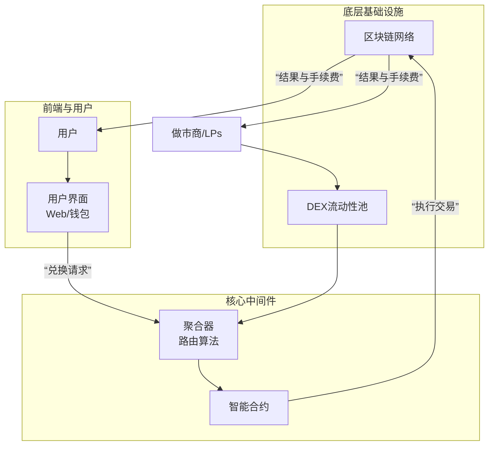

# 闪兑的业务体系

### 核心逻辑：闪兑的业务价值链

闪兑业务的本质是 **“连接用户需求与分散流动性，并通过算法优化执行路径，从中赚取费用”**。其价值链条如下：

### 业务体系的核心组成部分

#### 1. 用户层
- **零售用户**：进行普通资产兑换的个人。
- **机构用户/巨鲸**：进行大额兑换，对滑点极其敏感。
- **DeFi 协议**：作为“用户”调用闪兑服务来完成其自身的复杂逻辑（如清算、套利）。

#### 2. 协议层
这是业务体系的技术核心，主要包括：

**a. 基础流动性协议**
- 提供最基础的交易对和流动性，如 **Uniswap, Curve, Balancer** 等。
- **商业模式**：向流动性提供者（LPs）收取交易手续费（如0.05%），这部分是闪兑的“货源”。

**b. 聚合器协议**
- 这是闪兑业务的“大脑”，如 **1inch, Matcha, ParaSwap**。
- **核心功能**：
  - **路由算法**：在所有基础协议中寻找最优价格和最低滑点的路径。
  - **拆分算法**：将大额交易拆分成数个小额，通过不同路径执行，以最小化对市场价格的影响。
  - **Gas优化**：估算并选择Gas成本最低的执行方式。
- **商业模式**：
  - **收取协议费**：在兑换金额的基础上收取一小部分作为服务费（例如0.1%）。
  - **治理代币激励**：通过发行代币（如1INCH）来激励用户使用其平台，并分享协议收入。

#### 3. 网络层
- **以太坊主网**：流动性最丰富，但Gas费最高。
- **Layer 2**：如 **Arbitrum, Optimism, Base**。通过降低Gas费，使得小额闪兑变得经济可行，极大地扩展了用户基础。
- **其他EVM公链**：如 **BNB Chain, Polygon, Avalanche**。提供替代的低成本环境。

#### 4. 生态角色层
这是业务体系中活跃的各类参与者，他们共同维持着系统的运行和效率。

**a. 流动性提供者**
- **角色**：将自有资产存入各类DEX的资金池，作为所有兑换交易的对手盘。
- **盈利模式**：赚取交易手续费分成。

**b. 搜索者与套利机器人**
- **角色**：监控内存池，寻找套利机会或清算机会，并通过支付高额Gas费抢先进场交易。
- **盈利模式**：套利价差。他们是网络Gas费的主要支付者之一，但也维护了不同交易所间价格的一致性。

**c. 区块构建者与验证者**
- **角色**：在PoS机制下，打包交易并生成区块。他们倾向于将包含高额小费的交易（通常来自搜索者）优先打包。
- **盈利模式**：交易Gas费和MEV（矿工可提取价值）小费。

### 核心商业模式与收入来源

1.  **协议费用**
    - 聚合器对通过其路由的交易收取固定比例的费用。
    - 例如，1inch的“Gas补偿”模式，实际上是从交易额中抽取一小部分。

2.  **治理与代币价值捕获**
    - 协议通过治理代币将部分费用收入返还给代币质押者，或通过回购销毁来提升代币价值。
    - 例如，持有并质押1INCH代币可以分享协议收入。

3.  **Gas费优化差价**
    - 聚合器通过更优的Gas估算，可能会在用户支付的Gas和实际消耗的Gas之间产生微小差价，这部分也可能成为收入。

4.  **潜在的MEV捕获**
    - 一些新兴协议（如CowSwap）尝试通过“批量拍卖”等方式，将原本被搜索者捕获的MEV价值部分返还给用户或协议本身。

### 业务流程详解（以1inch为例）

1.  **请求**：用户在前端界面输入想兑换的资产和数量。
2.  **询价**：1inch服务器收到请求，向其连接的数百个DEX流动性池发起询价。
3.  **计算**：聚合算法运行，考虑价格、滑点、Gas费，计算出最优的“路由路径”。
4.  **展示**：前端向用户显示预计能收到的资产数量、手续费、最佳路径等信息。
5.  **授权**：用户钱包首先需要授权智能合约使用其代币（通常只需一次）。
6.  **交易**：用户确认交易，签名后发送至区块链网络。
7.  **执行与结算**：
    - 搜索者/验证者将交易打包进区块。
    - 1inch的智能合约精确执行预设的路径，与多个DEX交互。
    - 交易成功后，目标资产进入用户钱包，手续费被扣除。
    - 如果任何一步失败，整个交易回滚。

### 面临的业务挑战与未来演进

1.  **挑战**：
    - **MEV问题**：抢先交易和三明治攻击损害普通用户体验。
    - **监管不确定性**：全球对DeFi和聚合器的监管政策仍在演变中。
    - **安全性**：智能合约漏洞和前端攻击是持续存在的风险。
    - **竞争白热化**：聚合器赛道同质化竞争严重，利润空间被压缩。

2.  **未来演进**：
    - **Intent-Centric（以意图为中心）**：用户只需表达“我想以某个价格卖出X资产”，而无需关心具体执行路径，由专业求解器网络竞争完成。
    - **跨链聚合**：实现不同区块链资产之间的无缝、最优兑换。
    - **智能订单路由**：更复杂的算法，能预测价格影响，实现“时间加权”等高级交易策略。

**总结**：闪兑的业务体系是一个典型的Web3多层模型，它通过将**流动性提供、路由算法、用户接口、区块生产**等环节解耦并专业化，形成了一个高效、竞争激烈且不断演进的市场。其核心商业模式在于**聚合流动性、优化执行效率，并从中收取服务费**。