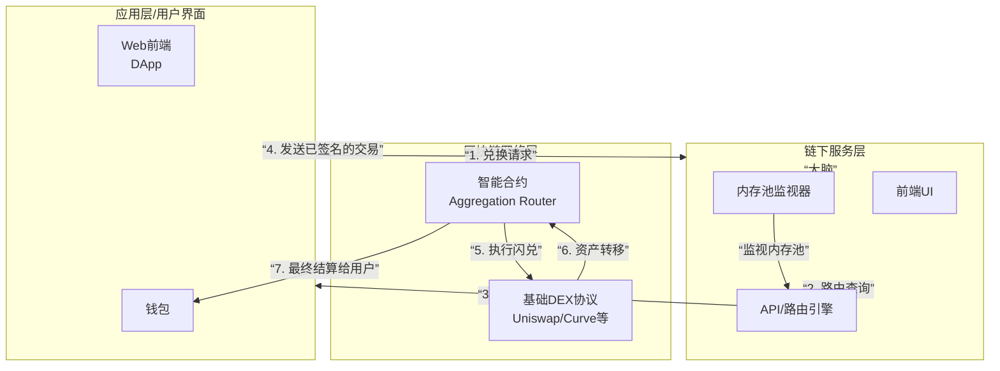

# 闪兑的技术体系

### 闪兑技术体系架构图

首先，我们可以通过下面这张图来宏观地理解闪兑技术体系的全貌及其核心工作流程：

### 各技术层详解

#### 1. 应用层 / 用户界面层
- **技术栈**：标准的 Web 技术，如 React, Vue.js, HTML, CSS。
- **核心功能**：
  - 提供用户交互界面，接收用户的兑换输入。
  - 与钱包（如 MetaMask）集成，调用 `window.ethereum` 或 WalletConnect 等标准。
  - 将用户请求发送给**链下服务层**的 API，并展示返回的路由方案和报价。
  - 构建交易参数，引导用户签名并广播交易。

#### 2. 链下服务层 - “系统的大脑”
这是聚合器的“指挥中心”，完全在链下运行，负责复杂的计算和决策。

**a. 路由引擎**
- **技术实现**：高性能的后端服务（通常用 Go, Rust, Node.js 编写）。
- **核心算法**：
  - **路径查找算法**：使用图像学中的**最短路径算法**（如 Dijkstra）的变种，将每个流动性池视为一个节点，将兑换率视为边的权重，在整个流动性图谱中寻找最优路径。
  - **拆分算法**：对于大额交易，算法会将订单拆分成 N 份，通过 M 条不同的路径执行，以求解**全局滑点最低**的最优解。这通常涉及复杂的优化计算。

**b. 内存池监视器**
- **技术实现**：连接到区块链节点的 WebSocket 服务，实时监听待处理的交易（内存池）。
- **目的**：
  - **发现套利机会**：为搜索者提供信息。
  - **实时价格更新**：确保返回给用户的报价是最新的，避免因网络延迟导致交易失败。

**c. Gas 价格预言机**
- **技术实现**：从多个来源（如 Etherscan Gas Tracker、节点估算、自有历史数据）获取并预测最优的 Gas 价格。
- **目的**：为用户提供准确的 Gas 费估算，并可能提供“快速”、“标准”、“慢速”等选项。

#### 3. 智能合约层 - “系统的骨骼”
这是整个体系在链上的核心，负责最终的资金结算和业务逻辑。其代码是公开且不可变的。

**a. 聚合路由合约**
- **核心逻辑**：实现 `swap` 函数的入口合约。
- **关键技术**：
  - **原子性组合**：在一个交易内，按预定的路径依次调用多个 DEX 的合约。如果任何一步调用失败（如返还数量不足），整个交易回滚。
  - **余额检查**：在交易最后，检查最终收到的代币数量是否满足用户预设的最小数量 `amountOutMin`。
  - **代理模式**：为了节省 Gas，常使用代理模式（如 DELEGATECALL），将实际的兑换逻辑委托给另一个“逻辑合约”，方便升级。

**b. 解析器/适配器合约**
- **目的**：每个基础 DEX（Uniswap V2, V3, Curve, Balancer）的接口都不尽相同。适配器合约充当了“翻译官”的角色。
- **功能**：将聚合合约发出的标准化兑换指令，翻译成目标 DEX 能理解的特定函数调用（如调用 Uniswap V2 的 `swapExactTokensForTokens`）。

#### 4. 基础协议层 - “系统的肌肉”
- **技术**：提供最基础兑换功能的智能合约系列。
- **示例**：
  - **Uniswap V2**：恒定乘积公式 `x * y = k`。
  - **Uniswap V3**：集中流动性，使用 Tick 和价位区间管理。
  - **Curve**：专为稳定币设计，使用恒定和公式与恒定乘积公式的混合。
- **角色**：它们是实际持有流动性的合约，是闪兑交易的最终执行者。

### 核心技术难点与解决方案

1.  **价格同步与交易失败**
    - **难点**：链下计算的理想价格与链上执行时的真实价格可能因网络延迟而不同。
    - **解决方案**：引入 **滑点容差**。用户预设一个可接受的价格偏差范围（如 0.5%），由智能合约强制执行，保护用户免受不利的价格波动影响。

2.  **Gas 效率优化**
    - **难点**：复杂的多步兑换需要消耗大量 Gas。
    - **解决方案**：
      - **使用代理合约**。
      - **使用底层调用**（如 `call` 而非 `delegatecall`）与外部合约交互。
      - **在合约内使用字节码直接操作**，减少函数调用开销。

3.  **安全性（最大的挑战）**
    - **难点**：智能合约管理着用户授权的资金，是黑客攻击的首要目标。
    - **解决方案**：
      - **全面的代码审计**：由多家专业安全公司进行多次审计。
      - **漏洞赏金计划**：激励白帽黑客发现并上报漏洞。
      - **严格的访问控制与暂停机制**：在发现漏洞时，团队有能力暂停合约以保护资金。

### 总结

闪兑的技术体系是一个典型的 **“链下计算，链上验证”** 的架构：

- **链下**：利用服务器的强大算力，进行**路径查找、价格计算、订单拆分**等复杂、高成本的运算，生成一个**最优的执行计划**。
- **链上**：利用智能合约的**原子性和确定性**，忠实地执行这个计划，并确保在执行条件不满足时**完全回滚**，保证用户资金安全。

这种设计巧妙地平衡了**计算复杂性**和**结算信任**，将繁重的计算工作放在链下，而将最关键的资金结算放在安全、去信任的链上环境中，共同构成了一个高效、安全且强大的去中心化金融基础设施。