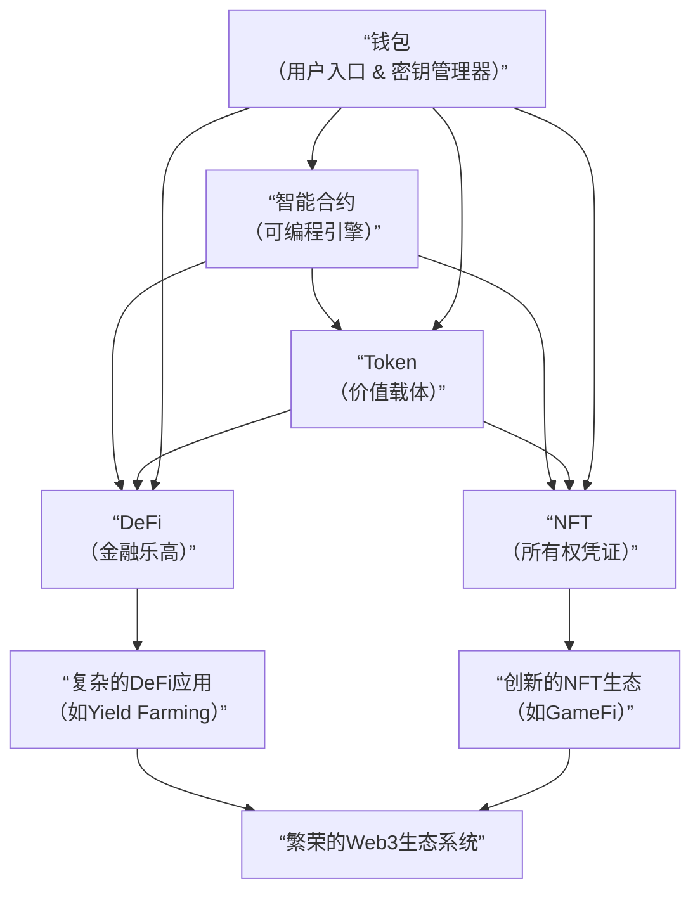

# Token-钱包-智能合约-NFT-Defi解析

---

### 一、 Token - 价值的数字化载体

**1. 核心定义**
Token 是在区块链上发行的、代表某种价值或权益的**数字资产凭证**。它可以被理解为区块链网络上的"价值单元"。

**2. 主要分类**

*   **同质化通证**：
    *   **特点**：每个Token完全一样，可以互相替换和分割。就像一张100元人民币和另一张100元人民币价值相同。
    *   **标准**：以太坊上的 **ERC-20** 是最主流的标准。
    *   **用例**：
        *   **货币**：如比特币、以太币。
        *   **实用通证**：用于访问特定服务或网络，如Chainlink。
        *   **治理通证**：用于对项目决策进行投票，如UNI。
        *   **稳定币**：价值与法币（如美元）锚定，如USDC。

*   **非同质化通证**：
    *   **特点**：每个Token都是**独一无二**的，不可分割和互换。就像一件艺术品和你的身份证，彼此价值不同。
    *   **标准**：以太坊上的 **ERC-721** 和 **ERC-1155**。
    *   **用例**：数字艺术、收藏品、游戏物品、虚拟地产、身份认证等。

**3. 核心价值**
Token实现了价值的**可编程性**和**全球化流动**，为新的经济模型奠定了基础。

---

### 二、 钱包 - 数字资产的入口与管家

**1. 核心定义**
钱包是管理区块链账户（地址）、进行交易签名和与去中心化应用交互的工具。**钱包并不直接存储资产，而是存储和管理访问资产的钥匙——私钥。**

**2. 关键分类**
*   **托管 vs. 非托管**：
    *   **托管钱包**：私钥由第三方（如交易所）掌管。用户体验好，但"Not your keys, not your coins"。
    *   **非托管钱包**：用户自己掌握私钥，对资产拥有完全控制权。

*   **热钱包 vs. 冷钱包**：
    *   **热钱包**：连接互联网，方便但风险较高。如手机App、浏览器插件钱包。
    *   **冷钱包**：完全离线，安全性极高，适合大额存储。如硬件钱包。

*   **EOA vs. 智能合约钱包**：
    *   **外部账户**：由私钥控制，如MetaMask。
    *   **智能合约钱包**：由代码逻辑控制，支持社交恢复、多签等高级功能，是未来趋势。

**3. 核心价值**
钱包是用户进入Web3世界的**数字身份入口**和**价值交互枢纽**。

---

### 三、 智能合约 - 区块链的"可编程引擎"

**1. 核心定义**
智能合约是**存储在区块链上的、在预定条件被满足时自动执行的程序**。它就像一台永不停机、无人能干预的自动售货机。

**2. 核心特性**
*   **确定性**：给定相同的输入，永远产生相同的输出。
*   **去中心化执行**：在区块链网络的所有节点上运行，结果由共识确认。
*   **不可篡改性**：一旦部署，代码无法修改（除非预设了升级机制）。
*   **透明性**：代码和执行记录对所有人公开。

**3. 核心价值**
智能合约将**信任代码化**，使得在无需可信第三方的情况下进行复杂的协作和价值交换成为可能。它是整个DeFi和NFT生态的**技术基石**。

---

### 四、 NFT - 独一无二的数字所有权证明

**1. 核心定义**
NFT是一种特殊的、**不可互换的Token**，它利用区块链技术来证明某个数字（或实物）资产的唯一所有权。

**2. 超越图片**
虽然最初因数字艺术出名，但NFT的潜力远不止于此：
*   **身份与会员资格**：如ENS域名、BAYC会员卡。
*   **游戏资产**：真正由玩家拥有的游戏道具和角色。
*   **票务与认证**：防伪的门票、学历证书。
*   **现实资产上链**：房地产、奢侈品所有权的数字凭证。

**3. 核心价值**
NFT解决了数字世界的**稀缺性**和**所有权**问题，为"数字物权"奠定了技术基础。

---

### 五、 DeFi - 重构全球金融系统

**1. 核心定义**
DeFi 是在区块链上，通过智能合约重建的、**无需任何中央机构**（如银行、交易所）的开放式金融生态系统。

**2. 核心组件**
*   **去中心化交易所**：通过自动做市商模型实现代币兑换，如Uniswap。
*   **借贷协议**：允许用户存入资产赚取利息，或超额抵押借出资产，如Aave。
*   **稳定币**：价值相对稳定的加密货币，如DAI。
*   **衍生品与合成资产**：创造追踪股票、黄金等价格的合成资产，如Synthetix。
*   **聚合器与收益农场**：自动寻找最高收益策略的平台，如Yearn Finance。

**3. 核心价值**
DeFi实现了金融服务的**无需许可、全球化和透明化**，让任何人只要有网络就能访问先进的金融工具。

---

### 六、 内在逻辑：五大概念的共生关系

这五大概念并非孤立存在，而是构成了一个紧密相连、相互依存的生态系统。它们之间的关系可以通过下图清晰地展现：

从上图可以看出：

1.  **智能合约是基石**：它创造了Token（包括NFT），并驱动着整个DeFi世界的运转。
2.  **Token是价值血液**：同质化Token是DeFi的燃料，NFT则代表了独特的资产。它们都是智能合约的具体表现形式。
3.  **DeFi是价值网络**：它由一系列可组合的智能合约构成，处理着Token的流转、增值和创造。
4.  **NFT是产权基石**：作为一种特殊的Token，它通过智能合约明确了独特资产的所有权。
5.  **钱包是总入口**：用户通过钱包与上述所有组件进行安全交互。它是整个系统的**访问控制器和安全边界**。

### 总结：从技术到生态的演进

*   **智能合约** 提供了**技术可能性**。
*   **Token** 创造了**价值载体**。
*   **钱包** 打开了**用户入口**。
*   **NFT** 确立了**数字物权**。
*   **DeFi** 构建了**价值网络**。

它们共同构成了一个从底层技术到上层应用的完整栈，正在重塑我们对货币、金融、资产和所有权的认知，共同构建着一个更加开放、透明和可组合的全球数字经济社会——Web3。