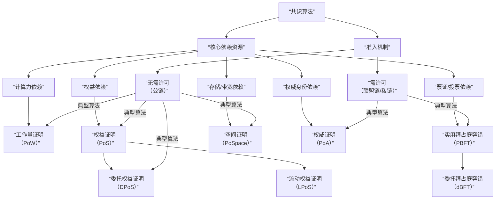

# 全面解析区块链共识算法

共识算法是区块链的灵魂，它解决了在去中心化、无信任环境中如何达成一致的核心问题。

---

### 一、 共识算法的核心目标与面临的挑战

在深入具体算法之前，我们必须理解共识算法要解决的根本问题。

#### 1. 核心目标
在一个由多个互不信任的节点组成的分布式网络中，共识算法旨在确保所有诚实节点对数据的**有效性**和**顺序**达成一致。它必须实现：
*   **一致性**：所有诚实节点最终确认相同的交易序列和区块链状态。
*   **终局性**：一旦交易被确认，它就应该被视为最终结果，不可逆转（或极难逆转）。
*   **活性**：网络能够持续产生新的区块，系统不会停滞。

#### 2. 面临的挑战：分布式系统经典问题
*   **拜占庭将军问题**：在存在叛徒（恶意节点或故障节点）的情况下，如何让所有忠诚的将军达成一致的进攻计划？区块链需要的是**拜占庭容错** 算法。
*   **双花攻击**：防止同一笔钱被花费两次，这本质上是一个数据一致性和排序问题。

#### 3. "不可能三角"的权衡
共识算法的设计始终在**去中心化、安全性、可扩展性** 三者之间进行权衡，难以同时达到极致。

---

### 二、 共识算法分类图谱

我们可以从多个维度对共识算法进行分类。最常见的分类是基于其**核心资源依赖**和**节点准入机制**。

下图清晰地展示了主流共识算法的分类与演进关系：

---

### 三、 主流共识算法深度解析

#### 1. 工作量证明 - 区块链的创世共识

*   **核心思想**：**谁的算力大，谁就有更大的记账权。** 节点通过解决一个计算密集型但易于验证的数学难题来竞争记账权。
*   **工作流程**：
    1.  节点收集交易，构建候选区块。
    2.  不断改变区块头中的随机数，计算其哈希值。
    3.  直到找到满足当前难度目标的哈希值（例如，哈希值前有足够多的零）。
    4.  找到答案的节点立即广播区块，其他节点验证后接受，并在此基础上开始新一轮竞争。
*   **关键特性**：
    *   **优点**：安全性极高、完全开放、经过实践检验。
    *   **缺点**：能耗巨大、性能低下、易产生算力中心化。
*   **代表**：比特币、以太坊。

#### 2. 权益证明 - 能效与安全的进化

*   **核心思想**：**谁持有的代币多且久，谁就有更大的记账权。** 用金融质押替代算力竞争。
*   **工作流程**：
    1.  验证者需要将一定数量的代币作为质押品锁定。
    2.  系统通过伪随机算法（通常会考虑质押量和质押时间）从验证者池中选择一个节点来生产下一个区块。
    3.  其他验证者对新区块进行"认证"。当达到足够多的认证时，区块达成最终性。
    4.  如果验证者作恶，其质押的代币将被罚没。
*   **关键变种**：
    *   **委托权益证明**：持币者投票选出少数代表节点负责生产区块，效率极高，但更中心化。
    *   **流动权益证明**：质押者可以将质押凭证用于DeFi等其他用途，提高了资本效率。
*   **关键特性**：
    *   **优点**：能效高、性能更好、经济安全性强。
    *   **缺点**："富者愈富"、可能更中心化、启动时需要一定的代币分布。
*   **代表**：以太坊2.0、Cardano、Solana。

#### 3. 拜占庭容错类 - 联盟链的支柱

*   **核心思想**：**通过多轮投票和消息交换达成共识。** 不需要挖矿或质押，依赖节点间的通信。
*   **工作流程**：
    1.  一个节点被选为领导者，提出一个区块。
    2.  所有节点进行多轮通信，对提议的区块进行投票。
    3.  当有超过2/3的节点同意时，共识达成。
*   **关键特性**：
    *   **优点**：高性能、高吞吐量、交易即时最终性、低能耗。
    *   **缺点**：节点身份已知、扩展性差、通信开销大。
*   **代表**：Hyperledger Fabric、Stellar。

#### 4. 委托拜占庭容错 - 结合PoS与BFT

*   **核心思想**：通过权益持有者投票选出记账节点，然后在选出的记账节点集合内运行BFT共识协议。
*   **关键特性**：兼具PoS的开放性和BFT的高效与最终性。
*   **代表**：NEO、Internet Computer。

#### 5. 权威证明 - 极致的性能

*   **核心思想**：**由已知的、经过验证的权威节点负责记账。** 节点身份即信誉。
*   **关键特性**：
    *   **优点**：性能极高、能耗极低。
    *   **缺点**：高度中心化，完全依赖于权威节点的诚实。
*   **代表**：VeChain、币安智能链的权威证明层。

#### 6. 空间证明 - 绿色替代方案

*   **核心思想**：**谁的硬盘空间大，谁就有更大的记账权。** 通过分配磁盘空间来存储计算数据，替代重复计算。
*   **关键特性**：比PoW能效高，但可能导致存储资源浪费。
*   **代表**：Chia、Filecoin。

---

### 四、 共识算法对比总结

| 特性             | **工作量证明** | **权益证明**    | **委托权益证明** | **实用拜占庭容错** | **权威证明**    |
| :--------------- | :------------- | :-------------- | :--------------- | :----------------- | :-------------- |
| **能源效率**     | 极低           | 高              | 高               | 高                 | 极高            |
| **交易速度**     | 慢（~7 TPS）   | 中（~1000 TPS） | 快（~10000 TPS） | 快（~10000 TPS）   | 极快            |
| **去中心化程度** | 高             | 中-高           | 中               | 低（需许可）       | 极低（需许可）  |
| **安全模型**     | 算力           | 经济质押        | 经济质押+投票    | 信誉/身份          | 身份/法律合规   |
| **最终性**       | 概率性         | 最终性          | 最终性           | 即时最终性         | 即时最终性      |
| **典型应用**     | 比特币         | 以太坊2.0       | EOS, TRON        | Hyperledger        | 币安链, VeChain |

---

### 五、 前沿发展与趋势

1.  **混合共识**：结合不同共识算法的优点。例如，以太坊2.0使用PoS作为出块共识，在其分片内使用BFT风格的共识进行确认。
2.  **基于DAG的共识**：如IOTA的Tangle和Avalanche共识，通过有向无环图结构实现高并发，理论上可无限扩展。
3.  **共识即服务**：由专业的节点服务商为区块链网络提供共识服务，降低普通用户参与门槛。
4.  **抗量子共识**：研究能够抵抗量子计算机攻击的新型密码学共识算法。

### 总结

没有一种共识算法是完美的。选择哪种算法完全取决于**应用场景的核心需求**：

*   **追求极致安全和去中心化** -> **PoW**
*   **追求平衡、可持续和可扩展** -> **PoS**
*   **追求企业级性能和隐私** -> **PBFT/PoA**
*   **追求极限吞吐量和效率** -> **DPoS/dBFT**

共识算法的演进史，就是一部在"不可能三角"中不断寻找更优平衡点的创新史。未来，我们很可能会看到更多**分层、分片、混合型**的共识模型，以适应日益复杂和多样化的区块链应用生态。