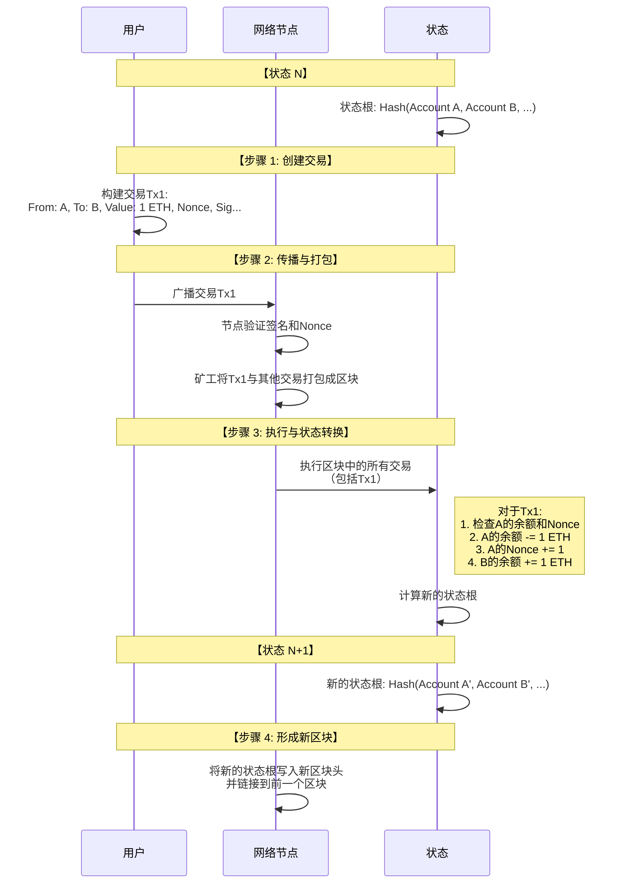

# 区块-账户-交易

这三者构成了区块链运行的基本骨架，理解它们的关系是理解区块链如何工作的关键。

---

### 一、 交易 - 驱动状态变化的动作

交易是区块链上发起的一个**操作指令**，是导致账本状态发生变化的唯一原因。

#### 核心结构：
一个交易通常包含以下字段：
*   **from**： 发送方地址。必须由该地址对应的私钥进行签名。
*   **to**： 接收方地址。如果为空，通常表示这是一个**合约创建**交易。
*   **value**： 转移的价值量（例如，要发送的ETH数量）。
*   **data**： 可选字段。用于调用智能合约函数或部署合约代码。
*   **nonce**： 交易序列号。用于防止重放攻击，确保交易顺序。
*   **gasLimit**： 你愿意为执行此交易支付的最大计算资源单位。
*   **gasPrice** / **maxFeePerGas**： 你愿意为每个Gas单位支付的价格（EIP-1559前后有区别）。
*   **signature**： 由发送方私钥生成的数字签名，用于授权该交易。

**本质**：交易是一个**签了名的信息**，表达了"谁"想"做什么"。

---

### 二、 账户 - 状态的承载者

账户是区块链**世界状态**的组成部分。它代表了区块链上的一个身份（通常是个人、组织或合约）及其当前状态。

#### 账户类型：

**1. 外部账户**
*   **由私钥控制**。由用户通过钱包创建和控制。
*   **拥有余额**：可以持有原生代币（如ETH）。
*   **可以发起交易**：可以发送代币或触发合约调用。
*   **没有代码**。

**2. 合约账户**
*   **由代码控制**。当部署一个智能合约时创建。
*   **拥有余额**：也可以持有原生代币和代币。
*   **不能主动发起交易**：只能通过外部账户的交易来触发其代码执行。
*   **拥有代码**：包含智能合约的代码逻辑和存储空间。

#### 账户状态结构：
每个账户（无论类型）在状态中都包含以下信息：
*   **nonce**：
    *   对于**外部账户**：表示该账户已发出的交易数量。
    *   对于**合约账户**：表示该账户创建的合约数量。
*   **balance**： 该账户地址所拥有的原生代币数量。
*   **storageRoot**： 一个指向存储内容默克尔树根的哈希（仅合约账户有，初始为空）。
*   **codeHash**： 该账户合约代码的哈希值。
    *   对于**外部账户**：此字段为空字符串的哈希。
    *   对于**合约账户**：此字段为合约代码的哈希。

---

### 三、 区块 - 交易和状态的容器

区块是交易的批量打包单元，也是状态演进的历史记录点。它像一个**集装箱**，将一段时间内发生的所有交易和最终的状态变化封装起来。

#### 区块的核心结构：

**1. 区块头 - 区块的"身份证"**
这是区块的元数据，包含了验证和链接所需的所有信息。
*   **parentHash**： **指向前一个区块头的哈希值**。这是形成"链"的关键。
*   **stateRoot**： **世界状态的默克尔树根哈希**。代表了执行完本区块所有交易后，整个区块链的全局状态。
*   **transactionsRoot**： 本区块中所有交易组成的默克尔树的根哈希。
*   **receiptsRoot**： 本区块中所有交易回执组成的默克尔树的根哈希。
*   **timestamp**： 区块的大致生成时间。
*   **number**： 区块高度（创世区块为0，依次加1）。
*   **gasLimit / gasUsed**： 本区块的Gas总量限制和实际消耗。
*   **nonce**： 用于工作量证明的随机数（在PoW链中）。
*   **difficulty**： 当前区块的挖矿难度。

**2. 区块体 - 区块的"内容"**
*   **交易列表**： 包含本区块打包的所有交易。
*   **其他数据**： 在一些区块链中，可能还包含叔块列表等。

---

### 三者的协同工作与内在联系

为了更直观地理解交易、区块和账户如何协同工作，驱动区块链状态机不断前进，我们可以参考下面的序列图：

从上图可以看出：
1.  用户通过**交易**发起一个改变状态的**动作**。
2.  网络节点收集并验证交易，将其打包进一个**区块**。
3.  在执行区块时，系统按顺序处理每笔交易，更新相关**账户**的状态（如余额和Nonce）。
4.  所有交易执行完毕后，计算出一个新的**状态根**，并将其记录在**区块头**中，最终形成一个新的、不可篡改的状态快照。

### 总结：一个生动的比喻

*   **账户** 像是银行里的**账户信息**（户名、余额）。
*   **交易** 像是你填写的**转账支票**（付款人、收款人、金额、签名）。
*   **区块** 像是银行在一天结束时整理的**账页**，记录了今天所有有效的支票交易，并计算出了所有账户的新余额。
*   **区块链** 就是所有这些**账页**按顺序装订成的一本**完整的总账**。
*   **状态根** 就像是这页账页的一个**防伪摘要**，任何对账户余额的篡改都会导致这个摘要对不上。

**交易驱动变化，账户记录状态，区块封装历史**——这三者环环相扣，共同维护着区块链这个去中心化、不可篡改的分布式状态机。