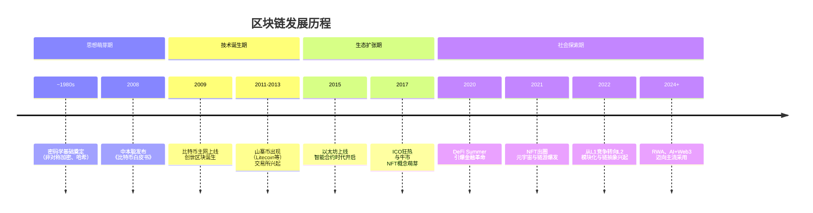

# 区块链的发展历史分析

### 区块链发展史：从密码学朋克到Web3新纪元

区块链的发展并非一蹴而就，它经历了从思想萌芽、技术诞生、生态扩张到社会探索的多个阶段。其波澜壮阔的历程可以通过下图一览：

---

下面，我们来详细解析每个阶段的核心特征与驱动因素。

#### 第一阶段：思想萌芽与技术奠基（2008年之前）

在“区块链”这个词出现之前，其核心思想早已在密码学领域孕育。

*   **密码学基础**：非对称加密（1976）、哈希算法等为数字货币提供了技术可能。
*   **思想先驱**：
    *   **大卫·乔姆**：提出注重隐私的密码学支付系统Ecash。
    *   **尼克·萨博**：提出“比特金”概念，描述了工作量证明的雏形。
    *   **戴伟**：发明B-money，首次提出分布式共识概念。
*   **核心特征**：这些尝试都依赖于一个中心化的第三方，或未能解决双花问题，但为比特币的诞生奠定了坚实的理论和思想基础。

#### 第二阶段：比特币与价值存储时代（2008 - 2013）

这是区块链1.0时代，主题是**“价值存储”**。

*   **里程碑事件**：
    *   **2008年**：化名“中本聪”的个人或团体发布《比特币：一种点对点的电子现金系统》白皮书，首次提出**工作量证明** 和**链式结构** 的完美结合，解决了双花问题。
    *   **2009年1月3日**：比特币创世区块诞生，中本聪在区块中留下泰晤士报头版标题：“财政大臣正处于实施第二轮银行紧急援助的边缘”，彰显了比特币的抗审查与去中心化精神。
*   **核心驱动**：
    *   **2008年金融危机**：催生了人们对去中心化、不依赖可信第三方的金融体系的渴望。
    *   **密码学朋克运动**：主张用密码学技术保护个人隐私和自由，对抗强权。
*   **生态发展**：
    *   **第一个比特币交易所**诞生。
    *   **“山寨币”** 出现，如莱特币，尝试不同的算法和参数。
*   **时代局限**：比特币脚本语言图灵不完备，功能单一，主要定位于“数字黄金”。

#### 第三阶段：以太坊与智能合约时代（2014 - 2017）

这是区块链2.0时代，主题是**“可编程合约”**。

*   **里程碑事件**：
    *   **2013年**：维塔利克·布特林发布以太坊白皮书，提出“下一代智能合约和去中心化应用平台”。
    *   **2015年**：以太坊主网上线，引入了**以太坊虚拟机** 和**智能合约**，使区块链变成了一个可编程的通用计算平台。
*   **核心创新**：
    *   **智能合约**：允许开发者在链上部署复杂的业务逻辑，催生了DApp的诞生。
    *   **ERC-20标准**：为代币发行提供了统一模板，极大地降低了发币门槛。
*   **生态爆发与泡沫**：
    *   **ICO** 成为项目融资的主要方式，引发了2017年的超级大牛市，但也伴随着巨大的投机泡沫和欺诈项目。
    *   **加密猫** 游戏的火爆，暴露了以太坊早期的可扩展性瓶颈。
*   **意义**：区块链的应用场景从单一的“货币”扩展到几乎所有需要“信任”的领域。

#### 第四阶段：金融深化与范式扩展（2018 - 2021）

这是生态大规模深化和探索的时期，主题是**“开放金融”**与**“数字资产”**。

*   **DeFi之夏**：
    *   **时间**：2020年夏季。
    *   **核心**：以**Compound**的流动性挖矿为起点，引爆了去中心化金融生态。
    *   **基石**：**DEX、借贷、稳定币、收益农场** 等乐高积木般的DeFi组件构建了一个开放、可组合的金融系统。
*   **NFT与元宇宙**：
    *   **2021年**：NFT成功出圈，** CryptoPunks, BAYC, Art Blocks** 等带动了数字艺术和收藏品市场。
    *   **“元宇宙”** 概念爆发，区块链被视为其经济系统的基石。
*   **可扩展性解决方案竞争**：
    *   **Layer 1**：Solana, Avalanche, BSC等“以太坊杀手”崛起，以高性能为卖点。
    *   **Layer 2**：Optimistic Rollup 和 ZK-Rollup 等扩容方案开始落地，以太坊进入“Rollup-centric”路线图。

#### 第五阶段：主流化、阵痛与未来（2022 - 至今）

这是行业在经历阵痛后，走向成熟、合规和基础设施完善的关键阶段。

*   **阵痛与出清**：
    *   **2022年**：Terra/Luna崩盘、三箭资本破产、FTX暴雷等一系列黑天鹅事件，暴露了行业在杠杆、风控和中心化机构治理上的巨大缺陷。
    *   **结果**：行业重心从投机炒作回归技术建设，监管呼声空前高涨。
*   **技术前沿**：
    *   **模块化区块链**：将执行、共识、数据可用性和结算分层，成为新的技术范式。
    *   **账户抽象**：旨在彻底改善钱包用户体验，让Web3应用能够像Web2一样易用。
    *   **零知识证明**：不仅用于扩容，更在隐私保护领域展现出巨大潜力。
    *   **真实世界资产**：将传统金融资产引入链上，探索区块链更大的应用空间。
*   **未来趋势**：
    *   **链抽象**：用户无需感知底层链的存在，实现无缝的跨链交互。
    *   **AI + Web3**：探索去中心化AI和数据市场。
    *   **监管框架清晰化**：各国正逐步建立明确的加密货币监管法规。

### 总结：历史演进的驱动力与未来展望

区块链的发展史，是一部 **“问题驱动”** 的演进史：

1.  **比特币** 解决了**去中心化货币**的问题。
2.  **以太坊** 解决了**去中心化计算**的问题。
3.  **DeFi** 解决了**去中心化金融**的问题。
4.  **Layer2 & 模块化** 正在解决**可扩展性**的问题。
5.  **账户抽象 & 链抽象** 正在解决**用户体验**的问题。

从最初的密码学实验，到构建全球性的信任机器和价值互联网，区块链技术正在从边缘走向主流，从金融基础设施演变为可能重塑整个互联网和社会协作模式的底层协议。其未来，依然充满了无限的想象力和挑战。