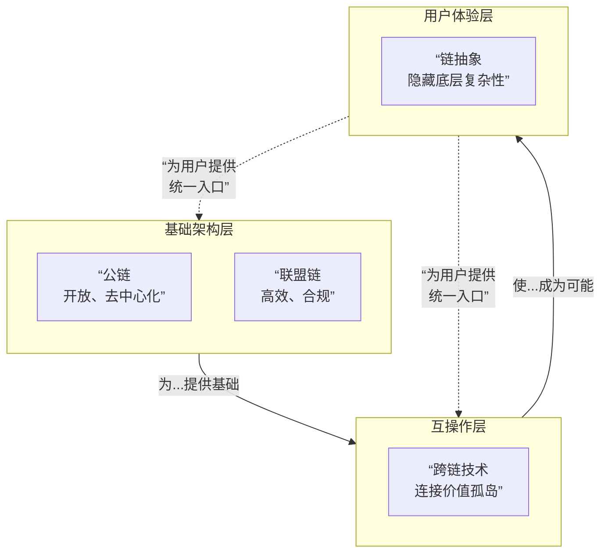

# 联盟链-公链-跨链和链抽象

它们代表了区块链技术在不同应用场景、不同发展阶段的关键形态和方向。

---

### 一、 联盟链 - 效率与合规的平衡

#### 1. 核心定义
联盟链是一种**需授权**的区块链，其共识过程由预先选定的、数量有限的节点集合控制。它介于去中心化的公链和中心化的私有链之间，可视为“部分去中心化”。

#### 2. 核心特征
*   **准入机制**：参与者必须经过认证和许可才能加入网络。
*   **性能高效**：节点数量有限且可信，通常采用高效的共识机制（如PBFT、Raft），因此交易处理速度更快，延迟更低。
*   **成本可控**：无挖矿竞争，交易费用极低甚至为零。
*   **隐私与合规**：数据可见性可以控制（仅对参与者可见），更容易满足数据隐私法规（如GDPR）。
*   **治理明确**：由联盟成员共同决策，升级和治理效率高。

#### 3. 典型架构与参与者
*   **参与者角色**：
    *   **记账节点**：负责运行共识算法，打包交易。
    *   **监管节点**：通常由监管机构运行，具有观察和审计权限。
    *   **普通节点**：参与交易和查询，但不参与记账。
*   **技术栈**：Hyperledger Fabric, FISCO BCOS, Corda。

#### 4. 应用场景
*   **供应链金融**：银行、核心企业、供应商构成联盟，共享账本，提高资金流转效率。
*   **贸易融资**：连接进口商、出口商、银行、物流、海关，实现单据无纸化。
*   **数字身份**：政府、银行、认证机构共同维护公民数字身份。
*   **存证与溯源**：法院、公证处、企业共同维护电子证据链。

---

### 二、 公链 - 去中心化与信任的基石

#### 1. 核心定义
公链是一种**无需许可**的区块链，任何人都可以随时加入、参与共识、读取数据、发送交易。它是完全去中心化的。

#### 2. 核心特征
*   **开放性与无需许可**：全球任何节点均可自由加入和退出。
*   **抗审查**：只要遵守协议规则，任何交易都无法被单一实体阻止。
*   **以信任最小化为目标**：通过密码学和经济学激励，实现无需可信第三方的协作。
*   **通证经济**：通常有原生加密通证，用于激励矿工/验证者和支付网络费用。
*   **安全性代价**：为了达成全球共识，通常牺牲了性能（低TPS、高延迟）。

#### 3. 典型架构与参与者
*   **共识机制**：工作量证明（比特币）、权益证明（以太坊2.0+）等。
*   **参与者**：矿工/验证者、全节点、轻节点、DApp开发者、用户。
*   **技术栈**：Bitcoin, Ethereum, Solana, Cosmos。

#### 4. 应用场景
*   **加密货币**：如比特币，作为价值存储和点对点现金。
*   **去中心化金融**：如借贷、交易，构建开放金融系统。
*   **NFT与数字艺术**：创造独一无二的数字资产和收藏品。
*   **去中心化自治组织**：基于代码和通证的全新人类协作模式。

---

### 三、 跨链 - 价值孤岛的桥梁

#### 1. 核心定义
跨链技术旨在实现不同区块链网络之间的**互操作性**，允许资产和数据在各个独立的链上自由流转。

#### 2. 核心目标
*   **资产跨链**：将A链上的资产转移到B链上使用（如将ETH转移到Polygon网络）。
*   **信息跨链**：使一条链能够验证和读取另一条链的状态信息。
*   **合约互调用**：A链上的智能合约能够触发B链上合约的执行。

#### 3. 主要技术方案
*   **公证人机制**：依赖一组可信的中间人进行跨链操作。中心化程度高，但实现简单。
*   **侧链/中继链**：
    *   **侧链**：一条拥有独立共识的区块链，通过双向锚定与主链连接（如Polygon PoS）。
    *   **中继链**：一条专门为跨链通信设计的链，其他链连接到它（如Polkadot, Cosmos）。
*   **哈希时间锁定合约**：用于跨链原子交换，无需信任第三方。适合简单的资产互换。
*   **轻客户端/状态证明**：通过默克尔证明等技术，让一条链能够验证另一条链的状态。这是最去信任化的方式，Rollup也使用类似思想。

#### 4. 应用场景
*   **资产桥**：将主流资产（如ETH, BTC）转移到其他公链上，参与其DeFi生态。
*   **多链DApp**：一个DApp部署在多个链上，通过跨链消息实现状态同步。
*   **链间可组合性**：A链上的DeFi协议可以与B链上的协议进行组合，创造新的金融产品。

---

### 四、 链抽象 - 用户体验的终极简化

#### 1. 核心定义
链抽象是一种**设计和架构理念**，旨在让终端用户在与区块链交互时**完全感知不到底层链的存在**。用户无需关心他们在使用哪条链、用什么Gas币、如何切换网络。

#### 2. 核心目标
*   **统一的账户体系**：一个账户地址通行所有链，无需为不同链创建不同账户。
*   **Gas费抽象**：用户可以使用任意代币支付手续费，或由DApp赞助，无需持有每条链的原生代币。
*   **无缝的链间交互**：在执行涉及多条链的操作时，用户只需进行一次签名确认，背后的复杂流程由基础设施自动完成。

#### 3. 关键实现技术
*   **账户抽象**：特别是ERC-4337标准，允许智能合约作为主导账户，实现社交恢复、批量交易和灵活的Gas支付。
*   **意图为中心的架构**：用户只需表达“想要什么”（如“我想用100 USDT买最佳价格的ETH”），而非“如何执行”，由专业的“求解器”网络竞争完成。
*   **统一的开发接口**：为开发者提供单一的SDK，使其能够轻松构建跨链应用，而无需处理多链的复杂性。
*   **MPC与智能合约钱包结合**：通过MPC技术为用户生成统一地址，并结合AA钱包的灵活策略。

#### 4. 应用场景与愿景
*   **一键参与多链DeFi**：用户在一个界面点击“质押”，系统自动选择收益最高的链和协议，并处理所有跨链操作。
*   **游戏资产无缝流转**：游戏道具在不同链上的游戏世界中可以自由使用，用户无感。
*   **真正的Web3大众化**：将区块链的复杂性完全封装，让数十亿Web2用户能够无门槛地使用Web3应用。

---

### 总结：演进关系与对比

为了更清晰地展示这四者如何从基础架构演进到用户体验，我们可以通过下图来理解它们的关系：

**关系解读**：

1.  **公链与联盟链**是区块链的两种**根本性架构选择**，服务于不同场景（开放金融 vs. 企业协作）。
2.  **跨链技术**是在多条链（无论是公链还是联盟链）并存的基础上，为解决**“价值孤岛”** 问题而生的**互操作解决方案**。
3.  **链抽象**是站在**用户体验的终点**，将底层的复杂性（包括使用的是公链还是联盟链，以及跨链过程）全部封装起来，是区块链技术走向主流采用的**必然演进方向**。

**简单比喻**：
*   **公链**像**公共互联网**。
*   **联盟链**像**企业内网/政务网**。
*   **跨链**像**路由器/网关**，连接不同的网络。
*   **链抽象**像**今天的Web浏览器**，用户只需输入网址，无需关心数据是通过哪些路由、哪些协议传输的。

未来，一个成熟的Web3世界很可能是一个**公链、联盟链并存，通过跨链技术互联，并由链抽象界面为用户提供统一入口**的复杂而和谐的生态系统。